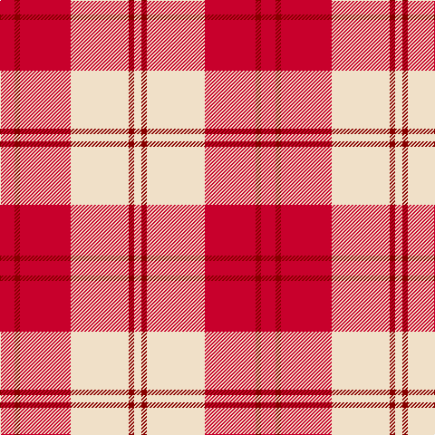

In pattern [RRRWRW](/patterns/rrrwrw/).

This was sourced from tartans-authority.  It is a [6 stripes tartan](/stripes/stripes6/).

Original link http://www.tartansauthority.com/tartan-ferret/display/7571/

## Attestations

This cloth appears in 2 source records; the oldest owns this page.

- March 2008 — Ailsa, Red V2 (Dance) (tartans-authority, [record](http://www.tartansauthority.com/tartan-ferret/display/7571/))
- undated — Ailsa Red (register-of-tartans, [record](https://www.tartanregister.gov.uk/tartanDetails.aspx?ref=5595))

## Thread count
R/16 DR6 R56 W64 DR6 W/8

## Palette
Each colour and its ΔE from the base-6 reference it is a variant of.

| Colour | Shade | Base | ΔE (OKLab) |
|---|---|---|---|
| DR | <code style="background-color:#880000;">#880000</code> `#880000` | R <code style="background-color:#C80000;">#C80000</code> | 0.14 |
| R | <code style="background-color:#C8002C;">#C8002C</code> `#C8002C` | R <code style="background-color:#C80000;">#C80000</code> | 0.03 |
| W | <code style="background-color:#F0E0C8;">#F0E0C8</code> `#F0E0C8` | W <code style="background-color:#F4F4F0;">#F4F4F0</code> | 0.06 |

# Sample pattern

ID: /setts/s6/r16ra6r56w64ra6w8-rc8002c-ra880000-wf0e0c8/
