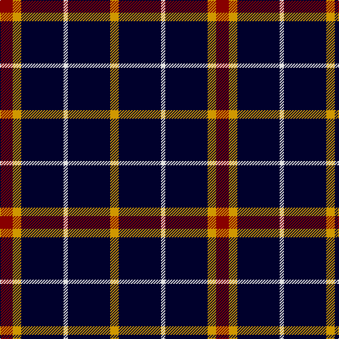

In pattern [RYKWKY](/patterns/rykwky/).

This was sourced from register-of-tartans.  It is a [6 stripes tartan](/stripes/stripes6/).

Original link https://www.tartanregister.gov.uk/tartanDetails.aspx?ref=3889

## Thread count
DR/18 DY12 DBa60 LN6 DBa60 DY/12

## Palette
Each colour and its ΔE from the base-6 reference it is a variant of.

| Colour | Shade | Base | ΔE (OKLab) |
|---|---|---|---|
| DB | <code style="background-color:#1C0070;">#1C0070</code> `#1C0070` | B <code style="background-color:#2C4084;">#2C4084</code> | 0.14 |
| DBa | <code style="background-color:#00002C;">#00002C</code> `#00002C` | K <code style="background-color:#000000;">#000000</code> | 0.16 |
| DR | <code style="background-color:#880000;">#880000</code> `#880000` | R <code style="background-color:#C80000;">#C80000</code> | 0.14 |
| DY | <code style="background-color:#D09800;">#D09800</code> `#D09800` | Y <code style="background-color:#E8C000;">#E8C000</code> | 0.11 |
| LN | <code style="background-color:#E0E0E0;">#E0E0E0</code> `#E0E0E0` | W <code style="background-color:#F4F4F0;">#F4F4F0</code> | 0.06 |
| N | <code style="background-color:#C0C0C0;">#C0C0C0</code> `#C0C0C0` | W <code style="background-color:#F4F4F0;">#F4F4F0</code> | 0.16 |

# Sample pattern

## Nearest tartans

The nearest existing variants by ΔTartan distance.

1. [Cowe (Personal)](/setts/s7/k16b6k64ba28w6k50b6-b5c8ca8-ba1474b4-k101010-wfcfcfc/) — ΔT 0.95
1. [Black 1990 (Name)](/setts/s6/k34r12k4w12k34y4-k101010-r880000-we0e0e0-ybc8c00/) — ΔT 1.15
1. [Black Clan/Family Tartan Tartan Number: 2761. Earliest known date: pre 1945 In 1990, taken to a TECA stand at one of the US Highland Games by a Timothy Wood, who explained that his faher had 'found' it in a shop in northern England during World War II. See products available Copyright © Blair Urquhart, Comrie, 2015](/setts/s6/k34r12k4w12k34y4-k101010-r880000-wc0c0c0-yd09800/) — ΔT 1.18
1. [Black (symmetrical)](/setts/s6/k34r12k4w12k34y4-k101010-r880000-wc0c0c0-ybc8c00/) — ΔT 1.18
1. [Anzac (Fashion)](/setts/s8/k84w8k16w16b8w16k52g8-b4c3428-g006818-k101010-wc0c0c0/) — ΔT 1.29
1. [Benson (New England)](/setts/s7/k32b4k16r6y6r6k16-b1474b4-k101010-rc80000-yb8b8b8/) — ΔT 1.33
1. [Burberry Blue](/setts/s5/y18k18y18k60r6-k000034-r8c0000-yb0b0b0/) — ΔT 1.39
1. [C-Tec N.I. Ltd](/setts/s4/k124b30w12y8-b000080-k1c1714-wf8f8f8-yfccc00/) — ΔT 1.44
1. [London Fog Black 2 (fashion)](/setts/s10/k18b9k18w2k2w2k18y9k18w2-b2888c4-k101010-wd4d4c4-yccc0a4/) — ΔT 1.47
1. [Burberry Black](/setts/s5/y18k18y18k60r6-k000000-rc80000-yb0b0b0/) — ΔT 1.49

## Neighbour map

Every grey dot is one of 15726 variants placed by the first two principal components of the ΔTartan feature space (44% of its variance). Red is this tartan; blue dots are its nearest — click one to open its page.

<svg viewBox="0 0 640 380" role="img" style="max-width:100%;height:auto;border:1px solid #e0e0e0;border-radius:4px;display:block" xmlns="http://www.w3.org/2000/svg"><image href="/nn/cloud.v1.png" width="640" height="380"/><a href="/setts/s7/k16b6k64ba28w6k50b6-b5c8ca8-ba1474b4-k101010-wfcfcfc/"><circle cx="411.4" cy="211.8" r="4" fill="#3465a4"><title>Cowe (Personal)</title></circle></a><a href="/setts/s6/k34r12k4w12k34y4-k101010-r880000-we0e0e0-ybc8c00/"><circle cx="372.3" cy="223.6" r="4" fill="#3465a4"><title>Black 1990 (Name)</title></circle></a><a href="/setts/s6/k34r12k4w12k34y4-k101010-r880000-wc0c0c0-yd09800/"><circle cx="380.4" cy="227.2" r="4" fill="#3465a4"><title>Black Clan/Family Tartan Tartan Number: 2761. Earliest known date: pre 1945 In 1990, taken to a TECA stand at one of the US Highland Games by a Timothy Wood, who explained that his faher had 'found' it in a shop in northern England during World War II. See products available Copyright © Blair Urquhart, Comrie, 2015</title></circle></a><a href="/setts/s6/k34r12k4w12k34y4-k101010-r880000-wc0c0c0-ybc8c00/"><circle cx="381.7" cy="227.9" r="4" fill="#3465a4"><title>Black (symmetrical)</title></circle></a><a href="/setts/s8/k84w8k16w16b8w16k52g8-b4c3428-g006818-k101010-wc0c0c0/"><circle cx="401.8" cy="189.0" r="4" fill="#3465a4"><title>Anzac (Fashion)</title></circle></a><a href="/setts/s7/k32b4k16r6y6r6k16-b1474b4-k101010-rc80000-yb8b8b8/"><circle cx="403.9" cy="228.2" r="4" fill="#3465a4"><title>Benson (New England)</title></circle></a><a href="/setts/s5/y18k18y18k60r6-k000034-r8c0000-yb0b0b0/"><circle cx="350.8" cy="237.1" r="4" fill="#3465a4"><title>Burberry Blue</title></circle></a><a href="/setts/s4/k124b30w12y8-b000080-k1c1714-wf8f8f8-yfccc00/"><circle cx="423.4" cy="199.4" r="4" fill="#3465a4"><title>C-Tec N.I. Ltd</title></circle></a><a href="/setts/s10/k18b9k18w2k2w2k18y9k18w2-b2888c4-k101010-wd4d4c4-yccc0a4/"><circle cx="383.2" cy="206.9" r="4" fill="#3465a4"><title>London Fog Black 2 (fashion)</title></circle></a><a href="/setts/s5/y18k18y18k60r6-k000000-rc80000-yb0b0b0/"><circle cx="348.5" cy="235.8" r="4" fill="#3465a4"><title>Burberry Black</title></circle></a><circle cx="375.7" cy="216.0" r="5" fill="#c00000"/></svg>

ID: /setts/s6/r18y12k60w6k60y12-k00002c-r880000-we0e0e0-yd09800/
