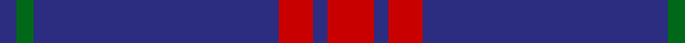
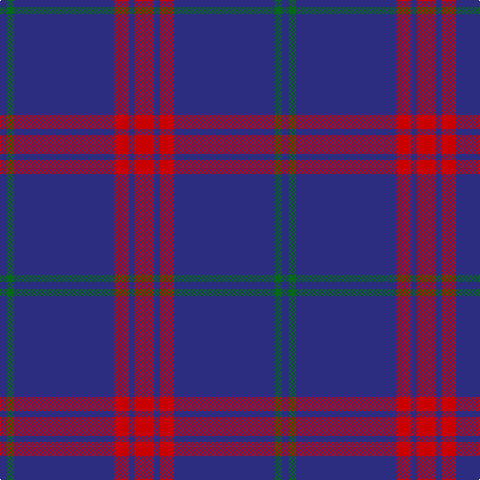

In pattern [BGBRBR](/patterns/bgbrbr/).

This was sourced from house-of-tartan.  It is a [6 stripes tartan](/stripes/stripes6/).

Original link http://www.house-of-tartan.scotland.net/house/TartanViewjs.asp?colr=Def&tnam=2163

## Thread count
DB/7 G7 DB101 R14 DB6 R/19

## Palette
Each colour and its ΔE from the base-6 reference it is a variant of.

| Colour | Shade | Base | ΔE (OKLab) |
|---|---|---|---|
| DB | <code style="background-color:#2C2C80;">#2C2C80</code> `#2C2C80` | B <code style="background-color:#2A418A;">#2A418A</code> | 0.06 |
| G | <code style="background-color:#006818;">#006818</code> `#006818` | G <code style="background-color:#006100;">#006100</code> | 0.02 |
| R | <code style="background-color:#C80000;">#C80000</code> `#C80000` | R <code style="background-color:#CC0000;">#CC0000</code> | 0.01 |

# Sample pattern

## Nearest tartans

The nearest existing variants by ΔTartan distance.

1. [Lynch](/setts/s6/r12b8r4b72g4b8-b2c2c80-g007c00-rc80000/) — ΔT 1.21
1. [Lynch](/setts/s6/r38b12r14b202g12b14-b304080-g006030-rc00000/) — ΔT 1.30
1. [Steffen, Morris (Personal)](/setts/s6/b140w16b40r12ra12r12-b2c2c80-r901c38-rac80000-we0e0e0/) — ΔT 1.35
1. [GulfMark](/setts/s5/b144ba12b24ba34w12-b3c4266-ba6675a0-wffffff/) — ΔT 1.49
1. [McCallie](/setts/s4/r8k24b132w8-b2c2c80-k101010-rc80000-wfcfcfc/) — ΔT 1.62
1. [Balmer (Personal)](/setts/s6/w4b98r10y4r10y4-b2c2c80-rc80000-we0e0e0-ye8c000/) — ΔT 1.62
1. [United French Freemasons (Corporate](/setts/s6/b144r9ba44b4ba4b4-b202060-ba2888c4-r880000/) — ΔT 1.65
1. [Waugh (Name)](/setts/s5/b100ba10k5ba10r8-b1c0070-ba7098b0-k101010-r980000/) — ΔT 1.67
1. [Gulfmark (Corporate)](/setts/s5/b144ba12b24ba34w12-b2c2c80-ba2888c4-we0e0e0/) — ΔT 1.69
1. [Newton Primary School, Dunblane](/setts/s9/b104r12b12w8b12r12b24r24y8-b304080-rc00000-we0e0e0-yf0c000/) — ΔT 1.73

## Neighbour map

Every grey dot is one of 15726 variants placed by the first two principal components of the ΔTartan feature space (44% of its variance). Red is this tartan; blue dots are its nearest — click one to open its page.

<svg viewBox="0 0 640 380" role="img" style="max-width:100%;height:auto;border:1px solid #e0e0e0;border-radius:4px;display:block" xmlns="http://www.w3.org/2000/svg"><image href="/nn/cloud.v1.png" width="640" height="380"/><a href="/setts/s6/r12b8r4b72g4b8-b2c2c80-g007c00-rc80000/"><circle cx="601.5" cy="201.2" r="4" fill="#3465a4"><title>Lynch</title></circle></a><a href="/setts/s6/r38b12r14b202g12b14-b304080-g006030-rc00000/"><circle cx="593.8" cy="205.9" r="4" fill="#3465a4"><title>Lynch</title></circle></a><a href="/setts/s6/b140w16b40r12ra12r12-b2c2c80-r901c38-rac80000-we0e0e0/"><circle cx="493.7" cy="194.5" r="4" fill="#3465a4"><title>Steffen, Morris (Personal)</title></circle></a><a href="/setts/s5/b144ba12b24ba34w12-b3c4266-ba6675a0-wffffff/"><circle cx="511.5" cy="233.0" r="4" fill="#3465a4"><title>GulfMark</title></circle></a><a href="/setts/s4/r8k24b132w8-b2c2c80-k101010-rc80000-wfcfcfc/"><circle cx="506.2" cy="202.3" r="4" fill="#3465a4"><title>McCallie</title></circle></a><a href="/setts/s6/w4b98r10y4r10y4-b2c2c80-rc80000-we0e0e0-ye8c000/"><circle cx="506.8" cy="139.6" r="4" fill="#3465a4"><title>Balmer (Personal)</title></circle></a><a href="/setts/s6/b144r9ba44b4ba4b4-b202060-ba2888c4-r880000/"><circle cx="555.0" cy="171.3" r="4" fill="#3465a4"><title>United French Freemasons (Corporate</title></circle></a><a href="/setts/s5/b100ba10k5ba10r8-b1c0070-ba7098b0-k101010-r980000/"><circle cx="509.8" cy="180.0" r="4" fill="#3465a4"><title>Waugh (Name)</title></circle></a><a href="/setts/s5/b144ba12b24ba34w12-b2c2c80-ba2888c4-we0e0e0/"><circle cx="495.2" cy="229.5" r="4" fill="#3465a4"><title>Gulfmark (Corporate)</title></circle></a><a href="/setts/s9/b104r12b12w8b12r12b24r24y8-b304080-rc00000-we0e0e0-yf0c000/"><circle cx="435.2" cy="164.9" r="4" fill="#3465a4"><title>Newton Primary School, Dunblane</title></circle></a><circle cx="530.0" cy="195.2" r="5" fill="#c00000"/></svg>

ID: /setts/s6/r19b6r14b101g7b7-b2c2c80-g006818-rc80000/
