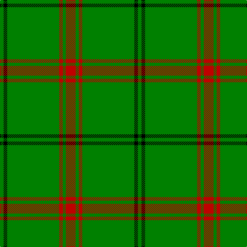

In pattern [GKGRGR](/patterns/gkgrgr/).

This was sourced from weddslist.  It is a [6 stripes tartan](/stripes/stripes6/).

Original link http://www.weddslist.com/cgi-bin/tartans/pg.pl?source=sts

## Thread count
G/7 K7 G101 R7 G6 R/19

## Palette
Each colour and its ΔE from the base-6 reference it is a variant of.

| Colour | Shade | Base | ΔE (OKLab) |
|---|---|---|---|
| G | <code style="background-color:#008000;">#008000</code> `#008000` | G <code style="background-color:#006100;">#006100</code> | 0.10 |
| K | <code style="background-color:#000000;">#000000</code> `#000000` | K <code style="background-color:#000000;">#000000</code> | 0.00 |
| R | <code style="background-color:#C00000;">#C00000</code> `#C00000` | R <code style="background-color:#CC0000;">#CC0000</code> | 0.03 |

# Sample pattern

## Nearest tartans

The nearest existing variants by ΔTartan distance.

1. [Loch Laggan (District)](/setts/s6/r16g8r4g80k4g4-g289c18-k101010-rc80000/) — ΔT 0.92
1. [Welsh, National](/setts/s5/r16g8r8g88w8-g008000-rc00000-we0e0e0/) — ΔT 1.03
1. [Loch Laggan District Tartan Tartan Number: 796. Earliest known date: pre 1820 Loch Laggan lies on the historic route between Lochaber and the Great Glen and the Central Highlands of Badenoch at the head of Glen Spean. See products available Copyright © Blair Urquhart, Comrie, 2015](/setts/s6/r19g6r7g101k7g7-g006818-k101010-rc80000/) — ΔT 1.18
1. [Mar, (Tribe of..)](/setts/s5/r2k4g45k3y2-g008000-k000000-rc00000-yf0c000/) — ΔT 1.50
1. [Menzies, hunting](/setts/s8/g96r8g4r8g12r4g6r18-g008000-rc00000/) — ΔT 1.50
1. [Mar (Tribe of..) District Tartan Tartan Number: 1586. Earliest known date: 1978 There is much debate over the true representation of the Mar District tartan. In order that the matter should be settled and the design be "known and recognised as the proper tartan of the Tribe of Mar", the Rt Hon Margaret of Mar, Countess of Mar, made a petition to the Lord Lyon to record this sett. The designer is unknown and the date is possibly pre 1850. Frank Adam called the sett Skene, and said it came from the Duke of Fife whose ancestors owned Mar Lodge. Both Skenes and Robertsons lived in the Mar district in the north east of Scotland. See products available Copyright © Blair Urquhart, Comrie, 2015](/setts/s5/r2k4g45k3y2-g006818-k101010-rc80000-ye8c000/) — ΔT 1.53
1. [Marshall University](/setts/s8/g50w2ga4w2g12k4w4ga6-g146400-ga003c14-k101010-wffffff/) — ΔT 1.63
1. [Mar, Tribe of (Clan)](/setts/s5/r4k8g90k6y4-g006818-k101010-r880000-ye8c000/) — ΔT 1.63
1. [Mar Tribe](/setts/s5/r2k3g45k3y2-g006818-k101010-rc80000-ye8c000/) — ΔT 1.64
1. [Welsh National (District)](/setts/s5/r16g6r8g88w8-g00643c-rc8002c-we0e0e0/) — ΔT 1.64

## Neighbour map

Every grey dot is one of 15726 variants placed by the first two principal components of the ΔTartan feature space (44% of its variance). Red is this tartan; blue dots are its nearest — click one to open its page.

<svg viewBox="0 0 640 380" role="img" style="max-width:100%;height:auto;border:1px solid #e0e0e0;border-radius:4px;display:block" xmlns="http://www.w3.org/2000/svg"><image href="/nn/cloud.v1.png" width="640" height="380"/><a href="/setts/s6/r16g8r4g80k4g4-g289c18-k101010-rc80000/"><circle cx="555.4" cy="181.8" r="4" fill="#3465a4"><title>Loch Laggan (District)</title></circle></a><a href="/setts/s5/r16g8r8g88w8-g008000-rc00000-we0e0e0/"><circle cx="491.9" cy="218.5" r="4" fill="#3465a4"><title>Welsh, National</title></circle></a><a href="/setts/s6/r19g6r7g101k7g7-g006818-k101010-rc80000/"><circle cx="560.3" cy="200.7" r="4" fill="#3465a4"><title>Loch Laggan District Tartan Tartan Number: 796. Earliest known date: pre 1820 Loch Laggan lies on the historic route between Lochaber and the Great Glen and the Central Highlands of Badenoch at the head of Glen Spean. See products available Copyright © Blair Urquhart, Comrie, 2015</title></circle></a><a href="/setts/s5/r2k4g45k3y2-g008000-k000000-rc00000-yf0c000/"><circle cx="524.1" cy="162.1" r="4" fill="#3465a4"><title>Mar, (Tribe of..)</title></circle></a><a href="/setts/s8/g96r8g4r8g12r4g6r18-g008000-rc00000/"><circle cx="575.5" cy="181.8" r="4" fill="#3465a4"><title>Menzies, hunting</title></circle></a><a href="/setts/s5/r2k4g45k3y2-g006818-k101010-rc80000-ye8c000/"><circle cx="571.5" cy="180.7" r="4" fill="#3465a4"><title>Mar (Tribe of..) District Tartan Tartan Number: 1586. Earliest known date: 1978 There is much debate over the true representation of the Mar District tartan. In order that the matter should be settled and the design be &quot;known and recognised as the proper tartan of the Tribe of Mar&quot;, the Rt Hon Margaret of Mar, Countess of Mar, made a petition to the Lord Lyon to record this sett. The designer is unknown and the date is possibly pre 1850. Frank Adam called the sett Skene, and said it came from the Duke of Fife whose ancestors owned Mar Lodge. Both Skenes and Robertsons lived in the Mar district in the north east of Scotland. See products available Copyright © Blair Urquhart, Comrie, 2015</title></circle></a><a href="/setts/s8/g50w2ga4w2g12k4w4ga6-g146400-ga003c14-k101010-wffffff/"><circle cx="469.7" cy="142.0" r="4" fill="#3465a4"><title>Marshall University</title></circle></a><a href="/setts/s5/r4k8g90k6y4-g006818-k101010-r880000-ye8c000/"><circle cx="575.9" cy="183.2" r="4" fill="#3465a4"><title>Mar, Tribe of (Clan)</title></circle></a><a href="/setts/s5/r2k3g45k3y2-g006818-k101010-rc80000-ye8c000/"><circle cx="588.2" cy="181.0" r="4" fill="#3465a4"><title>Mar Tribe</title></circle></a><a href="/setts/s5/r16g6r8g88w8-g00643c-rc8002c-we0e0e0/"><circle cx="504.4" cy="206.5" r="4" fill="#3465a4"><title>Welsh National (District)</title></circle></a><circle cx="528.4" cy="188.0" r="5" fill="#c00000"/></svg>

ID: /setts/s6/r19g6r7g101k7g7-g008000-k000000-rc00000/
