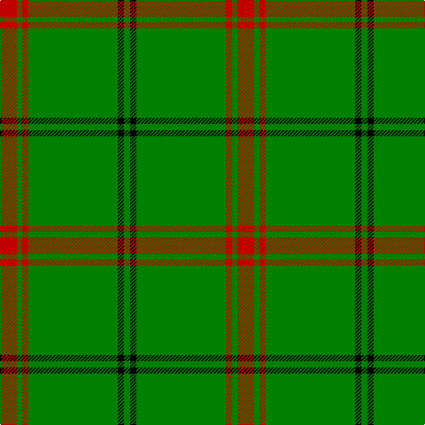

In pattern [GKGRGR](/stripes/gkgrgr/).

This was sourced from weddslist.  It is a [6 stripe tartan](/stripes/stripes6/).

Original link http://www.weddslist.com/cgi-bin/tartans/pg.pl?source=sts

## Attestations

This cloth appears in 2 source records; the oldest owns this page.

- undated — Loch Laggan (weddslist, [record](http://www.weddslist.com/cgi-bin/tartans/pg.pl?source=sts))
- undated — Loch Laggan District Tartan Tartan Number: 796. Earliest known date: pre 1820 Loch Laggan lies on the historic route between Lochaber and the Great Glen and the Central Highlands of Badenoch at the head of Glen Spean. See products available Copyright © Blair Urquhart, Comrie, 2015 (house-of-tartan, [record](http://www.house-of-tartan.scotland.net/house/TartanViewjs.asp?colr=Def&tnam=796))

## Thread count
R/19 G6 R7 G101 K7 G/7

## Palette
Each colour and the base-6 reference it is a variant of.

| Colour | Shade | Base |
|---|---|---|
| G | <code style="background-color:#008000;">#008000</code> `oklch(52.0% 0.177 142.5)` <small>#008000</small> | G <code style="background-color:#006100;">#006100</code> |
| K | <code style="background-color:#000000;">#000000</code> `oklch(0.0% 0.000 0.0)` <small>#000000</small> | K <code style="background-color:#000000;">#000000</code> |
| R | <code style="background-color:#C00000;">#C00000</code> `oklch(50.7% 0.208 29.2)` <small>#C00000</small> | R <code style="background-color:#CC0000;">#CC0000</code> |

# Sample pattern

## Nearest tartans

The nearest existing variants by ΔTartan distance, with this tartan at the top so the swatches line up against it.

ΔTartan

Tartan

Sett

—

<a href="/ttd/edit/#slug=r19g6r7g101k7g7">Loch Laggan</a> <a class="nn-out" href="/setts/s6/r19g6r7g101k7g7/" title="open its dictionary page">↗</a>

0.92

<a href="/ttd/edit/#slug=r4g2r1g20k1g1~x4">Loch Laggan (District)</a> <a class="nn-out" href="/setts/s6/r4g2r1g20k1g1~x4/" title="open its dictionary page">↗</a>

1.04

<a href="/ttd/edit/#slug=r2g1r1g11w1~x8">Welsh, National</a> <a class="nn-out" href="/setts/s5/r2g1r1g11w1~x8/" title="open its dictionary page">↗</a>

1.51

<a href="/ttd/edit/#slug=r2k4g45k3ly2">Mar, (Tribe of..)</a> <a class="nn-out" href="/setts/s5/r2k4g45k3ly2/" title="open its dictionary page">↗</a>

1.63

<a href="/ttd/edit/#slug=g25w1dg2w1g6k2w2dg3~x2">Marshall University</a> <a class="nn-out" href="/setts/s8/g25w1dg2w1g6k2w2dg3~x2/" title="open its dictionary page">↗</a>

1.64

<a href="/ttd/edit/#slug=r2k4g45k3ly2~x2">Mar, Tribe of (Clan)</a> <a class="nn-out" href="/setts/s5/r2k4g45k3ly2~x2/" title="open its dictionary page">↗</a>

1.65

<a href="/ttd/edit/#slug=r8g3r4g44w4~x2">Welsh National (District)</a> <a class="nn-out" href="/setts/s5/r8g3r4g44w4~x2/" title="open its dictionary page">↗</a>

1.65

<a href="/ttd/edit/#slug=r2k3g45k3ly2">Mar Tribe</a> <a class="nn-out" href="/setts/s5/r2k3g45k3ly2/" title="open its dictionary page">↗</a>

1.67

<a href="/ttd/edit/#slug=dg10o1dg1o1lr2dg1o1~x4">Green Watch</a> <a class="nn-out" href="/setts/s7/dg10o1dg1o1lr2dg1o1~x4/" title="open its dictionary page">↗</a>

1.68

<a href="/ttd/edit/#slug=g51dp3g5lo3g5dp5g5dp5g5lo3~x2">Highland Hospice (Fashion)</a> <a class="nn-out" href="/setts/s10/g51dp3g5lo3g5dp5g5dp5g5lo3~x2/" title="open its dictionary page">↗</a>

1.77

<a href="/ttd/edit/#slug=g48r4g2r4g6r2g3r9~x2">Menzies</a> <a class="nn-out" href="/setts/s8/g48r4g2r4g6r2g3r9~x2/" title="open its dictionary page">↗</a>

## Neighbour map

Every grey dot is one of 14299 variants placed by the first two principal components of the ΔTartan feature space (44% of its variance). Red is this tartan; blue dots are its nearest — click one to open its page.

<svg viewBox="0 0 640 380" role="img" style="max-width:100%;height:auto;border:1px solid #e0e0e0;border-radius:4px;display:block" xmlns="http://www.w3.org/2000/svg"><image href="/nn/cloud.v1.png" width="640" height="380"/><a href="/setts/s6/r4g2r1g20k1g1~x4/"><circle cx="555.3" cy="183.2" r="4" fill="#3465a4"><title>Loch Laggan (District)</title></circle></a><a href="/setts/s5/r2g1r1g11w1~x8/"><circle cx="491.4" cy="219.6" r="4" fill="#3465a4"><title>Welsh, National</title></circle></a><a href="/setts/s5/r2k4g45k3ly2/"><circle cx="525.2" cy="162.5" r="4" fill="#3465a4"><title>Mar, (Tribe of..)</title></circle></a><a href="/setts/s8/g25w1dg2w1g6k2w2dg3~x2/"><circle cx="472.2" cy="144.1" r="4" fill="#3465a4"><title>Marshall University</title></circle></a><a href="/setts/s5/r2k4g45k3ly2~x2/"><circle cx="577.2" cy="187.3" r="4" fill="#3465a4"><title>Mar, Tribe of (Clan)</title></circle></a><a href="/setts/s5/r8g3r4g44w4~x2/"><circle cx="504.5" cy="208.0" r="4" fill="#3465a4"><title>Welsh National (District)</title></circle></a><a href="/setts/s5/r2k3g45k3ly2/"><circle cx="589.4" cy="184.8" r="4" fill="#3465a4"><title>Mar Tribe</title></circle></a><a href="/setts/s7/dg10o1dg1o1lr2dg1o1~x4/"><circle cx="459.3" cy="214.5" r="4" fill="#3465a4"><title>Green Watch</title></circle></a><a href="/setts/s10/g51dp3g5lo3g5dp5g5dp5g5lo3~x2/"><circle cx="559.5" cy="179.0" r="4" fill="#3465a4"><title>Highland Hospice (Fashion)</title></circle></a><a href="/setts/s8/g48r4g2r4g6r2g3r9~x2/"><circle cx="584.5" cy="188.4" r="4" fill="#3465a4"><title>Menzies</title></circle></a><circle cx="528.6" cy="189.3" r="5" fill="#c00000"/></svg>

ID: /setts/s6/r19g6r7g101k7g7/
