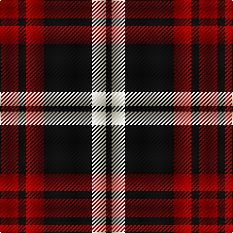

In pattern [KWKRKR](/patterns/kwkrkr/).

This was sourced from register-of-tartans.  It is a [6 stripes tartan](/stripes/stripes6/).

Original link https://www.tartanregister.gov.uk/tartanDetails.aspx?ref=10616

## Attestations

This cloth appears in 2 source records; the oldest owns this page.

- 14/05/2012 — Knights Breton (register-of-tartans, [record](https://www.tartanregister.gov.uk/tartanDetails.aspx?ref=10616))
- undated — Knights Breton Commemorative Tartan Tartan Number: 10616. Earliest known date: 14/05/2012 A woven sample of this tartan has been received by the Scottish Register of Tartans for permanent preservation in the National Records of Scotland. See products available Copyright © Blair Urquhart, Comrie, 2015 (house-of-tartan, [record](http://www.house-of-tartan.scotland.net/house/TartanViewjs.asp?colr=Def&tnam=10616))

## Thread count
DR/19 K8 DR18 K50 LY14 K/6

## Palette
Each colour and its ΔE from the base-6 reference it is a variant of.

| Colour | Shade | Base | ΔE (OKLab) |
|---|---|---|---|
| DR | <code style="background-color:#A60202;">#A60202</code> `#A60202` | R <code style="background-color:#C80000;">#C80000</code> | 0.07 |
| K | <code style="background-color:#101010;">#101010</code> `#101010` | K <code style="background-color:#000000;">#000000</code> | 0.17 |
| LY | <code style="background-color:#FFF8D2;">#FFF8D2</code> `#FFF8D2` | W <code style="background-color:#F4F4F0;">#F4F4F0</code> | 0.05 |

# Sample pattern

## Nearest tartans

The nearest existing variants by ΔTartan distance.

1. [Bodog.com](/setts/s5/r6k50r50k20w6-k101010-rc80000-wc0c0c0/) — ΔT 1.00
1. [Unidentified Plaid #3](/setts/s5/b24r3b16r33w4-b002814-rc82828-we0e0e0/) — ΔT 1.13
1. [MacQueen](/setts/s6/k8r24k8r24k48y4-k101010-rc80000-ye8c000/) — ΔT 1.13
1. [MacQueen Clan Tartan Tartan Number: 1209. Earliest known date: 1842 The tartan of the Clan Revan, so called after Revan MacMulmor MacAngus MacQueen, who led kinsmen of the MacDonald bride for the 10th Chief of the Mackintoshes, to take protection from Clan Chattan. The sett was unnamed, as far as we know, before publication in the Vestiarium Scoticum (1842), but this source is unreliable. It has much in common with the Fraser and the Gunn tartans, both of which have four bold stripes, but the origin is more likely to have come from a combination of the MacDonald and the Mackintosh. Many MacQueens stayed in Skye, and the name there, is often spelt MacSween or MacSwan. The Skye stronghold was known as Garafadon. See products available Copyright © Blair Urquhart, Comrie, 2015](/setts/s6/k4r12k4r12k24y2-k101010-rc80000-ye8c000/) — ΔT 1.13
1. [Swanstrom (Personal)](/setts/s6/k32r4k32r44y4r4-k101010-rc80000-ye8c000/) — ΔT 1.14
1. [Tartan TV](/setts/s6/r38k6r38k64g6k16-g006818-k00002c-rc80000/) — ΔT 1.16
1. [Brodie (Clan)](/setts/s6/k6r30k22y4k8r6-k101010-rc80000-ye8c000/) — ΔT 1.26
1. [Munro (Black and Red)](/setts/s5/k36r8k36r64w6-k101010-rc80000-wfcfcfc/) — ΔT 1.30
1. [Brodie](/setts/s6/k6r30k22y4k8r6-k000000-rc00000-yf0c000/) — ΔT 1.31
1. [Haig & Haig Whisky](/setts/s8/r52k36r14k8y8k8r14k36-k101010-rc80000-ye8c000/) — ΔT 1.31

## Neighbour map

Every grey dot is one of 15726 variants placed by the first two principal components of the ΔTartan feature space (44% of its variance). Red is this tartan; blue dots are its nearest — click one to open its page.

<svg viewBox="0 0 640 380" role="img" style="max-width:100%;height:auto;border:1px solid #e0e0e0;border-radius:4px;display:block" xmlns="http://www.w3.org/2000/svg"><image href="/nn/cloud.v1.png" width="640" height="380"/><a href="/setts/s5/r6k50r50k20w6-k101010-rc80000-wc0c0c0/"><circle cx="318.6" cy="239.2" r="4" fill="#3465a4"><title>Bodog.com</title></circle></a><a href="/setts/s5/b24r3b16r33w4-b002814-rc82828-we0e0e0/"><circle cx="309.1" cy="232.6" r="4" fill="#3465a4"><title>Unidentified Plaid #3</title></circle></a><a href="/setts/s6/k8r24k8r24k48y4-k101010-rc80000-ye8c000/"><circle cx="343.2" cy="218.3" r="4" fill="#3465a4"><title>MacQueen</title></circle></a><a href="/setts/s6/k4r12k4r12k24y2-k101010-rc80000-ye8c000/"><circle cx="343.2" cy="218.3" r="4" fill="#3465a4"><title>MacQueen Clan Tartan Tartan Number: 1209. Earliest known date: 1842 The tartan of the Clan Revan, so called after Revan MacMulmor MacAngus MacQueen, who led kinsmen of the MacDonald bride for the 10th Chief of the Mackintoshes, to take protection from Clan Chattan. The sett was unnamed, as far as we know, before publication in the Vestiarium Scoticum (1842), but this source is unreliable. It has much in common with the Fraser and the Gunn tartans, both of which have four bold stripes, but the origin is more likely to have come from a combination of the MacDonald and the Mackintosh. Many MacQueens stayed in Skye, and the name there, is often spelt MacSween or MacSwan. The Skye stronghold was known as Garafadon. See products available Copyright © Blair Urquhart, Comrie, 2015</title></circle></a><a href="/setts/s6/k32r4k32r44y4r4-k101010-rc80000-ye8c000/"><circle cx="337.2" cy="216.4" r="4" fill="#3465a4"><title>Swanstrom (Personal)</title></circle></a><a href="/setts/s6/r38k6r38k64g6k16-g006818-k00002c-rc80000/"><circle cx="311.5" cy="224.6" r="4" fill="#3465a4"><title>Tartan TV</title></circle></a><a href="/setts/s6/k6r30k22y4k8r6-k101010-rc80000-ye8c000/"><circle cx="289.0" cy="230.0" r="4" fill="#3465a4"><title>Brodie (Clan)</title></circle></a><a href="/setts/s5/k36r8k36r64w6-k101010-rc80000-wfcfcfc/"><circle cx="302.9" cy="229.7" r="4" fill="#3465a4"><title>Munro (Black and Red)</title></circle></a><a href="/setts/s6/k6r30k22y4k8r6-k000000-rc00000-yf0c000/"><circle cx="272.9" cy="227.7" r="4" fill="#3465a4"><title>Brodie</title></circle></a><a href="/setts/s8/r52k36r14k8y8k8r14k36-k101010-rc80000-ye8c000/"><circle cx="284.9" cy="229.5" r="4" fill="#3465a4"><title>Haig &amp; Haig Whisky</title></circle></a><circle cx="289.3" cy="225.8" r="5" fill="#c00000"/></svg>

ID: /setts/s6/r19k8r18k50w14k6-k101010-ra60202-wfff8d2/
