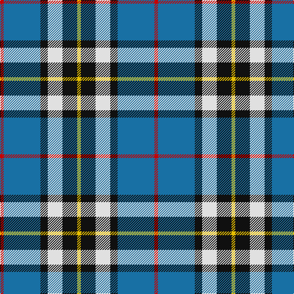

In pattern [RBKWKY](/stripes/rbkwky/).

This was sourced from register-of-tartans.  It is a [6 stripe tartan](/stripes/stripes6/).

Original link https://www.tartanregister.gov.uk/tartanDetails.aspx?ref=4123

## Attestations

This cloth appears in 2 source records; the oldest owns this page.

- 01/01/1965 — Thomson Dress (Blue) (register-of-tartans, [record](https://www.tartanregister.gov.uk/tartanDetails.aspx?ref=4123))
- 1965 — Thomson Dress (Clan) (tartans-authority, [record](http://www.tartansauthority.com/tartan-ferret/display/5130/))

## Register references

External register numbers recorded for this tartan.

- Scottish Register of Tartans: [4123](https://www.tartanregister.gov.uk/tartanDetails.aspx?ref=4123)
- Scottish Tartans Authority (ITI): 5130

## Thread count
R/6 B60 K12 LN24 K24 Y/6

## Palette
Each colour and the base-6 reference it is a variant of.

| Colour | Shade | Base |
|---|---|---|
| B | <code style="background-color:#1870A4;">#1870A4</code> `oklch(52.2% 0.113 241.2)` <small>#1870A4</small> | B <code style="background-color:#2A418A;">#2A418A</code> |
| K | <code style="background-color:#101010;">#101010</code> `oklch(17.3% 0.000 89.9)` <small>#101010</small> | K <code style="background-color:#000000;">#000000</code> |
| LN | <code style="background-color:#E0E0E0;">#E0E0E0</code> `oklch(90.7% 0.000 89.9)` <small>#E0E0E0</small> | W <code style="background-color:#F7F7F7;">#F7F7F7</code> |
| R | <code style="background-color:#C80000;">#C80000</code> `oklch(52.3% 0.215 29.2)` <small>#C80000</small> | R <code style="background-color:#CC0000;">#CC0000</code> |
| Y | <code style="background-color:#E8C000;">#E8C000</code> `oklch(81.9% 0.168 93.7)` <small>#E8C000</small> | Y <code style="background-color:#F2BF00;">#F2BF00</code> |

# Sample pattern

## Nearest tartans

The nearest existing variants by ΔTartan distance.

1. [MacTavish Dress](/setts/s6/r4t28k6lb12k12lo3~x2/) — ΔT 0.66
1. [Afternoon Tea / Earl Grey](/setts/s6/r15t98db72ly25db8w15/) — ΔT 0.70
1. [MacTavish / Thom(p)son, dress](/setts/s6/r4t28k6w12k12ly3~x2/) — ΔT 0.72
1. [Bahamas District Tartan Tartan Number: 2089. Earliest known date: 1966 Designed by Gordon Rees of the Scottish Shop in Nassau, now owned by Colin and Beverley Honnes. It was intended to perpetuate the memory of early Scottish settlers in the Bahamas including Thompson, Sands, Forsythe, Munroe, Johnston, Russell, Christie, Roberts, Kelly, MacKinney, Saunders, Malcolm, Crawford, MacPherson, Clark and Rae. The tartan was formally approved by the Bahamas Government in 1966. See products available Copyright © Blair Urquhart, Comrie, 2015](/setts/s8/db6ly2db22g7r2w11g11db3~x2/) — ΔT 0.79
1. [Loyalhanna](/setts/s8/db15lb2g2ly15r3db21r3g15~x2/) — ΔT 0.86
1. [Clunie (Name)](/setts/s6/w6db24k7o11k2ly6~x2/) — ΔT 0.88
1. [Loch Ness (Fashion)](/setts/s7/r2t2r2t21lg11k17lb2~x2/) — ΔT 0.90
1. [Sinclair dress](/setts/s7/db2r1db16k5g2w11g1~x4/) — ΔT 1.02
1. [Clunie (Personal)](/setts/s6/w12db48k13o22k3ly6/) — ΔT 1.02
1. [Bahamas](/setts/s8/db3g11w11r2g7db22ly2db2~x2/) — ΔT 1.04

## Neighbour map

Every grey dot is one of 14299 variants placed by the first two principal components of the ΔTartan feature space (44% of its variance). Red is this tartan; blue dots are its nearest — click one to open its page.

<svg viewBox="0 0 640 380" role="img" style="max-width:100%;height:auto;border:1px solid #e0e0e0;border-radius:4px;display:block" xmlns="http://www.w3.org/2000/svg"><image href="/nn/cloud.v1.png" width="640" height="380"/><a href="/setts/s6/r4t28k6lb12k12lo3~x2/"><circle cx="168.3" cy="187.2" r="4" fill="#3465a4"><title>MacTavish Dress</title></circle></a><a href="/setts/s6/r15t98db72ly25db8w15/"><circle cx="186.0" cy="168.3" r="4" fill="#3465a4"><title>Afternoon Tea / Earl Grey</title></circle></a><a href="/setts/s6/r4t28k6w12k12ly3~x2/"><circle cx="148.3" cy="177.9" r="4" fill="#3465a4"><title>MacTavish / Thom(p)son, dress</title></circle></a><a href="/setts/s8/db6ly2db22g7r2w11g11db3~x2/"><circle cx="200.9" cy="174.4" r="4" fill="#3465a4"><title>Bahamas District Tartan Tartan Number: 2089. Earliest known date: 1966 Designed by Gordon Rees of the Scottish Shop in Nassau, now owned by Colin and Beverley Honnes. It was intended to perpetuate the memory of early Scottish settlers in the Bahamas including Thompson, Sands, Forsythe, Munroe, Johnston, Russell, Christie, Roberts, Kelly, MacKinney, Saunders, Malcolm, Crawford, MacPherson, Clark and Rae. The tartan was formally approved by the Bahamas Government in 1966. See products available Copyright © Blair Urquhart, Comrie, 2015</title></circle></a><a href="/setts/s8/db15lb2g2ly15r3db21r3g15~x2/"><circle cx="176.0" cy="176.8" r="4" fill="#3465a4"><title>Loyalhanna</title></circle></a><a href="/setts/s6/w6db24k7o11k2ly6~x2/"><circle cx="154.7" cy="176.3" r="4" fill="#3465a4"><title>Clunie (Name)</title></circle></a><a href="/setts/s7/r2t2r2t21lg11k17lb2~x2/"><circle cx="169.5" cy="170.4" r="4" fill="#3465a4"><title>Loch Ness (Fashion)</title></circle></a><a href="/setts/s7/db2r1db16k5g2w11g1~x4/"><circle cx="210.0" cy="139.2" r="4" fill="#3465a4"><title>Sinclair dress</title></circle></a><a href="/setts/s6/w12db48k13o22k3ly6/"><circle cx="197.6" cy="160.5" r="4" fill="#3465a4"><title>Clunie (Personal)</title></circle></a><a href="/setts/s8/db3g11w11r2g7db22ly2db2~x2/"><circle cx="192.2" cy="166.3" r="4" fill="#3465a4"><title>Bahamas</title></circle></a><circle cx="179.9" cy="178.2" r="5" fill="#c00000"/></svg>

ID: /setts/s6/r1b10k2w4k4ly1~x6/
