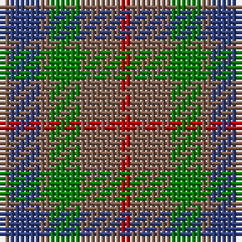

In pattern [RBRGRR](/patterns/rbrgrr/).

This was sourced from weddslist.  It is a [6 stripes tartan](/stripes/stripes6/).

Original link http://www.weddslist.com/cgi-bin/tartans/pg.pl?source=sts

## Thread count
LT/2 B6 LT2 G6 LT8 R/2

## Palette
Each colour and its ΔE from the base-6 reference it is a variant of.

| Colour | Shade | Base | ΔE (OKLab) |
|---|---|---|---|
| B | <code style="background-color:#304080;">#304080</code> `#304080` | B <code style="background-color:#2A418A;">#2A418A</code> | 0.02 |
| G | <code style="background-color:#008000;">#008000</code> `#008000` | G <code style="background-color:#006100;">#006100</code> | 0.10 |
| LT | <code style="background-color:#806050;">#806050</code> `#806050` | R <code style="background-color:#CC0000;">#CC0000</code> | 0.17 |
| R | <code style="background-color:#C00000;">#C00000</code> `#C00000` | R <code style="background-color:#CC0000;">#CC0000</code> | 0.03 |

# Sample pattern

## Nearest tartans

The nearest existing variants by ΔTartan distance.

1. [Dorward](/setts/s7/r7ra3r9g15b19r14ra4x2~b304080-g008000-r806050-rac00000/) — ΔT 0.88
1. [MacKay - 1800 (Reay Coat) (Artefact)](/setts/s7/g9ga9y2ga9g9b9g3x2~b1474b4-g604000-ga408060-ye8c000/) — ΔT 1.10
1. [Dorward/Dogwood](/setts/s7/g7r3g9ga15b19g14r4x2~b2c2c80-g604000-ga006818-rc80000/) — ΔT 1.15
1. [Fraser Hunting #2](/setts/s6/g1b3g1ga3g4r1x2~b2c4084-g503c14-ga005020-rdc0000/) — ΔT 1.34
1. [Harbour Town Hilton Head, The](/setts/s6/b3g11b3ba11b18y3x2~b003c64-ba680028-g006818-ya08858/) — ΔT 1.56
1. [Dewar (WCWM)](/setts/s6/b1g1b7g5ga7y1x4~b084848-g604000-ga8c7038-yb8b8b8/) — ΔT 1.58
1. [Gleneagles Group Corporate Tartan Tartan Number: 2107. Earliest known date: 1989 Designed for a range of tartan goods called the Gleneagles Collection. See products available Copyright © Blair Urquhart, Comrie, 2015](/setts/s7/b5g6ga1g6b5ba6b1x2~b680028-ba2c2c80-g006818-ga604000/) — ΔT 1.58
1. [Trinity Bicycles](/setts/s5/g4y11g14r30ra4x2~g6b4226-r8b7355-racd0000-y6ca6cd/) — ΔT 1.66
1. [Tennant (Yules)](/setts/s7/r1b7g7b7g7ga7r1x8~b2c2c80-g006818-ga604000-rc80000/) — ΔT 1.66
1. [Scottish Airports (Corporate)](/setts/s6/b4g18b3k17b18ba4x2~b3c505c-ba780078-g006818-k101010/) — ΔT 1.69

## Neighbour map

Every grey dot is one of 15726 variants placed by the first two principal components of the ΔTartan feature space (44% of its variance). Red is this tartan; blue dots are its nearest — click one to open its page.

<svg viewBox="0 0 640 380" role="img" style="max-width:100%;height:auto;border:1px solid #e0e0e0;border-radius:4px;display:block" xmlns="http://www.w3.org/2000/svg"><image href="/nn/cloud.v1.png" width="640" height="380"/><a href="/setts/s7/r7ra3r9g15b19r14ra4x2~b304080-g008000-r806050-rac00000/"><circle cx="229.0" cy="270.0" r="4" fill="#3465a4"><title>Dorward</title></circle></a><a href="/setts/s7/g9ga9y2ga9g9b9g3x2~b1474b4-g604000-ga408060-ye8c000/"><circle cx="209.5" cy="304.5" r="4" fill="#3465a4"><title>MacKay - 1800 (Reay Coat) (Artefact)</title></circle></a><a href="/setts/s7/g7r3g9ga15b19g14r4x2~b2c2c80-g604000-ga006818-rc80000/"><circle cx="228.1" cy="271.9" r="4" fill="#3465a4"><title>Dorward/Dogwood</title></circle></a><a href="/setts/s6/g1b3g1ga3g4r1x2~b2c4084-g503c14-ga005020-rdc0000/"><circle cx="269.8" cy="311.6" r="4" fill="#3465a4"><title>Fraser Hunting #2</title></circle></a><a href="/setts/s6/b3g11b3ba11b18y3x2~b003c64-ba680028-g006818-ya08858/"><circle cx="275.8" cy="270.3" r="4" fill="#3465a4"><title>Harbour Town Hilton Head, The</title></circle></a><a href="/setts/s6/b1g1b7g5ga7y1x4~b084848-g604000-ga8c7038-yb8b8b8/"><circle cx="254.8" cy="261.8" r="4" fill="#3465a4"><title>Dewar (WCWM)</title></circle></a><a href="/setts/s7/b5g6ga1g6b5ba6b1x2~b680028-ba2c2c80-g006818-ga604000/"><circle cx="211.0" cy="277.3" r="4" fill="#3465a4"><title>Gleneagles Group Corporate Tartan Tartan Number: 2107. Earliest known date: 1989 Designed for a range of tartan goods called the Gleneagles Collection. See products available Copyright © Blair Urquhart, Comrie, 2015</title></circle></a><a href="/setts/s5/g4y11g14r30ra4x2~g6b4226-r8b7355-racd0000-y6ca6cd/"><circle cx="317.1" cy="261.5" r="4" fill="#3465a4"><title>Trinity Bicycles</title></circle></a><a href="/setts/s7/r1b7g7b7g7ga7r1x8~b2c2c80-g006818-ga604000-rc80000/"><circle cx="205.9" cy="272.9" r="4" fill="#3465a4"><title>Tennant (Yules)</title></circle></a><a href="/setts/s6/b4g18b3k17b18ba4x2~b3c505c-ba780078-g006818-k101010/"><circle cx="220.3" cy="272.4" r="4" fill="#3465a4"><title>Scottish Airports (Corporate)</title></circle></a><circle cx="241.3" cy="294.7" r="5" fill="#c00000"/></svg>

ID: /setts/s6/r1b3r1g3r4ra1x2~b304080-g008000-r806050-rac00000/
