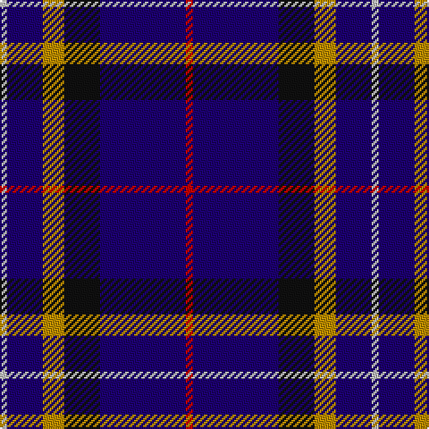

This page is one **sett** — a single exact thread-count. It belongs to the [tartan](/tartans/r1db12k5lo3db5lb1/)
(the same proportion at any scale), whose colour order is pattern [RBKYBW](/stripes/rbkybw/).

Sourced from register-of-tartans.  It is a [6 stripe tartan](/stripes/stripes6/).

Original link https://www.tartanregister.gov.uk/tartanDetails.aspx?ref=2850

## Register references

External register numbers recorded for this tartan.

- Scottish Register of Tartans: [2850](https://www.tartanregister.gov.uk/tartanDetails.aspx?ref=2850)
- Scottish Tartans Authority (ITI): 2676
- Scottish Tartans World Register: 2676

## Thread count
N/4 DB20 DY12 K20 DB48 R/4

## Palette

Palette: <strong>Tartan Register</strong>
<table><thead><tr><th>Colour</th><th>Threads</th><th>Shade</th><th>Base</th><th>OKLCh</th></tr></thead><tbody><tr><td>N/</td><td style="text-align:right;font-variant-numeric:tabular-nums">4</td><td><code style="background-color:#C0C0C0;">#C0C0C0</code> <small style="color:#888">#C0C0C0</small></td><td>W <code style="background-color:#F7F7F7;">#F7F7F7</code></td><td><small style="color:#888">oklch(80.8% 0.000 89.9)</small></td></tr><tr><td>DB</td><td style="text-align:right;font-variant-numeric:tabular-nums">20</td><td><code style="background-color:#1C0070;">#1C0070</code> <small style="color:#888">#1C0070</small></td><td>B <code style="background-color:#2A418A;">#2A418A</code></td><td><small style="color:#888">oklch(26.3% 0.162 277.1)</small></td></tr><tr><td>DY</td><td style="text-align:right;font-variant-numeric:tabular-nums">12</td><td><code style="background-color:#BC8C00;">#BC8C00</code> <small style="color:#888">#BC8C00</small></td><td>Y <code style="background-color:#F2BF00;">#F2BF00</code></td><td><small style="color:#888">oklch(66.8% 0.137 84.1)</small></td></tr><tr><td>K</td><td style="text-align:right;font-variant-numeric:tabular-nums">20</td><td><code style="background-color:#101010;">#101010</code> <small style="color:#888">#101010</small></td><td>K <code style="background-color:#000000;">#000000</code></td><td><small style="color:#888">oklch(17.3% 0.000 89.9)</small></td></tr><tr><td>DB</td><td style="text-align:right;font-variant-numeric:tabular-nums">48</td><td><code style="background-color:#1C0070;">#1C0070</code> <small style="color:#888">#1C0070</small></td><td>B <code style="background-color:#2A418A;">#2A418A</code></td><td><small style="color:#888">oklch(26.3% 0.162 277.1)</small></td></tr><tr><td>R/</td><td style="text-align:right;font-variant-numeric:tabular-nums">4</td><td><code style="background-color:#C80000;">#C80000</code> <small style="color:#888">#C80000</small></td><td>R <code style="background-color:#CC0000;">#CC0000</code></td><td><small style="color:#888">oklch(52.3% 0.215 29.2)</small></td></tr></tbody></table>

# Sample pattern

## Nearest tartans

The nearest existing variants by ΔTartan distance, with this tartan at the top so the swatches line up against it.

ΔTartan

Tartan

Sett

—

<a href="/ttd/edit/#slug=r1db12k5lo3db5lb1~x4">Massachusetts (Unofficial)</a> <a class="nn-out" href="/setts/s6/r1db12k5lo3db5lb1~x4/" title="open its dictionary page">↗</a>

0.68

<a href="/ttd/edit/#slug=r1db12k5o3db5w1~x4">Massachusetts</a> <a class="nn-out" href="/setts/s6/r1db12k5o3db5w1~x4/" title="open its dictionary page">↗</a>

1.04

<a href="/ttd/edit/#slug=g20lr6db20ly3db48r6db4r6~x2">Warren Wilson College (Corporate)</a> <a class="nn-out" href="/setts/s8/g20lr6db20ly3db48r6db4r6~x2/" title="open its dictionary page">↗</a>

1.04

<a href="/ttd/edit/#slug=r3db21r3db3k13db13t3db3w2~x2">Fitzgerald, Blue</a> <a class="nn-out" href="/setts/s9/r3db21r3db3k13db13t3db3w2~x2/" title="open its dictionary page">↗</a>

1.11

<a href="/ttd/edit/#slug=db40w7db60k10r25ly4">Stradling (Name)</a> <a class="nn-out" href="/setts/s6/db40w7db60k10r25ly4/" title="open its dictionary page">↗</a>

1.14

<a href="/ttd/edit/#slug=o3k15r2k15n15p3~x2">H.M.S. DUNCAN</a> <a class="nn-out" href="/setts/s6/o3k15r2k15n15p3~x2/" title="open its dictionary page">↗</a>

1.22

<a href="/ttd/edit/#slug=db30dp9dg6dp9r4db17w5~x2">Woodcock (2014)</a> <a class="nn-out" href="/setts/s7/db30dp9dg6dp9r4db17w5~x2/" title="open its dictionary page">↗</a>

1.26

<a href="/ttd/edit/#slug=r4k21w2k20db21k2db2~x2">St. Georges, Edgbaston</a> <a class="nn-out" href="/setts/s7/r4k21w2k20db21k2db2~x2/" title="open its dictionary page">↗</a>

1.36

<a href="/ttd/edit/#slug=db36r4db6g18db15k18w4~x2">Grainger (Name)</a> <a class="nn-out" href="/setts/s7/db36r4db6g18db15k18w4~x2/" title="open its dictionary page">↗</a>

1.36

<a href="/ttd/edit/#slug=r5db26k12w2~x4">Mirror (Corporate)</a> <a class="nn-out" href="/setts/s4/r5db26k12w2~x4/" title="open its dictionary page">↗</a>

1.42

<a href="/ttd/edit/#slug=k1ly2k3n12k18w1~x2">Jon's Theme</a> <a class="nn-out" href="/setts/s6/k1ly2k3n12k18w1~x2/" title="open its dictionary page">↗</a>

## Neighbour map

Every grey dot is one of 14359 variants placed by the first two principal components of the ΔTartan feature space (44% of its variance). Red is this tartan; blue dots are its nearest — click one to open its page.

<svg viewBox="0 0 640 380" role="img" style="max-width:100%;height:auto;border:1px solid #e0e0e0;border-radius:4px;display:block" xmlns="http://www.w3.org/2000/svg"><image href="/nn/cloud.v1.png" width="640" height="380"/><a href="/setts/s6/r1db12k5o3db5w1~x4/"><circle cx="316.5" cy="194.5" r="4" fill="#3465a4"><title>Massachusetts</title></circle></a><a href="/setts/s8/g20lr6db20ly3db48r6db4r6~x2/"><circle cx="350.6" cy="165.9" r="4" fill="#3465a4"><title>Warren Wilson College (Corporate)</title></circle></a><a href="/setts/s9/r3db21r3db3k13db13t3db3w2~x2/"><circle cx="305.8" cy="175.2" r="4" fill="#3465a4"><title>Fitzgerald, Blue</title></circle></a><a href="/setts/s6/db40w7db60k10r25ly4/"><circle cx="385.1" cy="194.5" r="4" fill="#3465a4"><title>Stradling (Name)</title></circle></a><a href="/setts/s6/o3k15r2k15n15p3~x2/"><circle cx="251.7" cy="222.3" r="4" fill="#3465a4"><title>H.M.S. DUNCAN</title></circle></a><a href="/setts/s7/db30dp9dg6dp9r4db17w5~x2/"><circle cx="268.6" cy="209.2" r="4" fill="#3465a4"><title>Woodcock (2014)</title></circle></a><a href="/setts/s7/r4k21w2k20db21k2db2~x2/"><circle cx="347.6" cy="223.2" r="4" fill="#3465a4"><title>St. Georges, Edgbaston</title></circle></a><a href="/setts/s7/db36r4db6g18db15k18w4~x2/"><circle cx="263.7" cy="214.7" r="4" fill="#3465a4"><title>Grainger (Name)</title></circle></a><a href="/setts/s4/r5db26k12w2~x4/"><circle cx="329.8" cy="227.6" r="4" fill="#3465a4"><title>Mirror (Corporate)</title></circle></a><a href="/setts/s6/k1ly2k3n12k18w1~x2/"><circle cx="366.0" cy="187.5" r="4" fill="#3465a4"><title>Jon's Theme</title></circle></a><circle cx="324.0" cy="199.7" r="5" fill="#c00000"/></svg>

ID: /setts/s6/r1db12k5lo3db5lb1~x4/
