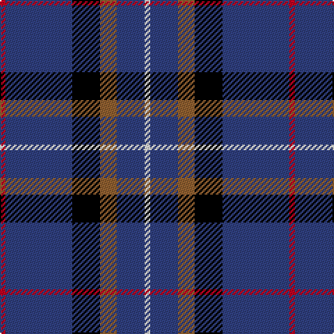

In pattern [RBKRBW](/stripes/rbkrbw/).

This was sourced from weddslist.  It is a [6 stripe tartan](/stripes/stripes6/).

Original link http://www.weddslist.com/cgi-bin/tartans/pg.pl?source=sts

## Thread count
R/4 B48 K20 LT12 B20 LN/4

## Palette
Each colour and the base-6 reference it is a variant of.

| Colour | Shade | Base |
|---|---|---|
| B | <code style="background-color:#304080;">#304080</code> `oklch(39.4% 0.109 270.2)` <small>#304080</small> | B <code style="background-color:#2A418A;">#2A418A</code> |
| K | <code style="background-color:#000000;">#000000</code> `oklch(0.0% 0.000 0.0)` <small>#000000</small> | K <code style="background-color:#000000;">#000000</code> |
| LN | <code style="background-color:#E0E0E0;">#E0E0E0</code> `oklch(90.7% 0.000 89.9)` <small>#E0E0E0</small> | W <code style="background-color:#F7F7F7;">#F7F7F7</code> |
| LT | <code style="background-color:#906030;">#906030</code> `oklch(53.1% 0.089 63.7)` <small>#906030</small> | R <code style="background-color:#CC0000;">#CC0000</code> |
| R | <code style="background-color:#C00020;">#C00020</code> `oklch(50.9% 0.206 24.5)` <small>#C00020</small> | R <code style="background-color:#CC0000;">#CC0000</code> |

# Sample pattern

## Nearest tartans

The nearest existing variants by ΔTartan distance, with this tartan at the top so the swatches line up against it.

ΔTartan

Tartan

Sett

—

<a href="/ttd/edit/#slug=r1db12k5o3db5w1~x4">Massachusetts</a> <a class="nn-out" href="/setts/s6/r1db12k5o3db5w1~x4/" title="open its dictionary page">↗</a>

0.68

<a href="/ttd/edit/#slug=r1db12k5lo3db5lb1~x4">Massachusetts (Unofficial)</a> <a class="nn-out" href="/setts/s6/r1db12k5lo3db5lb1~x4/" title="open its dictionary page">↗</a>

0.90

<a href="/ttd/edit/#slug=r3db21r3db3k13db13t3db3w2~x2">Fitzgerald, Blue</a> <a class="nn-out" href="/setts/s9/r3db21r3db3k13db13t3db3w2~x2/" title="open its dictionary page">↗</a>

1.09

<a href="/ttd/edit/#slug=g20lr6db20ly3db48r6db4r6~x2">Warren Wilson College (Corporate)</a> <a class="nn-out" href="/setts/s8/g20lr6db20ly3db48r6db4r6~x2/" title="open its dictionary page">↗</a>

1.13

<a href="/ttd/edit/#slug=o3k15r2k15n15p3~x2">H.M.S. DUNCAN</a> <a class="nn-out" href="/setts/s6/o3k15r2k15n15p3~x2/" title="open its dictionary page">↗</a>

1.16

<a href="/ttd/edit/#slug=db30dp9dg6dp9r4db17w5~x2">Woodcock (2014)</a> <a class="nn-out" href="/setts/s7/db30dp9dg6dp9r4db17w5~x2/" title="open its dictionary page">↗</a>

1.21

<a href="/ttd/edit/#slug=db40w7db60k10r25ly4">Stradling (Name)</a> <a class="nn-out" href="/setts/s6/db40w7db60k10r25ly4/" title="open its dictionary page">↗</a>

1.21

<a href="/ttd/edit/#slug=db36r4db6g18db15k18w4~x2">Grainger (Name)</a> <a class="nn-out" href="/setts/s7/db36r4db6g18db15k18w4~x2/" title="open its dictionary page">↗</a>

1.21

<a href="/ttd/edit/#slug=db30r3db3ly3db3g30db36w5~x2">De Nardi Hunting (Personal)</a> <a class="nn-out" href="/setts/s8/db30r3db3ly3db3g30db36w5~x2/" title="open its dictionary page">↗</a>

1.29

<a href="/ttd/edit/#slug=w1db6dy5k1db6ly1~x4">Ancient Atlantic</a> <a class="nn-out" href="/setts/s6/w1db6dy5k1db6ly1~x4/" title="open its dictionary page">↗</a>

1.38

<a href="/ttd/edit/#slug=r4g2r2k5dt22w2~x4">Reese (Personal)</a> <a class="nn-out" href="/setts/s6/r4g2r2k5dt22w2~x4/" title="open its dictionary page">↗</a>

## Neighbour map

Every grey dot is one of 14299 variants placed by the first two principal components of the ΔTartan feature space (44% of its variance). Red is this tartan; blue dots are its nearest — click one to open its page.

<svg viewBox="0 0 640 380" role="img" style="max-width:100%;height:auto;border:1px solid #e0e0e0;border-radius:4px;display:block" xmlns="http://www.w3.org/2000/svg"><image href="/nn/cloud.v1.png" width="640" height="380"/><a href="/setts/s6/r1db12k5lo3db5lb1~x4/"><circle cx="324.5" cy="198.6" r="4" fill="#3465a4"><title>Massachusetts (Unofficial)</title></circle></a><a href="/setts/s9/r3db21r3db3k13db13t3db3w2~x2/"><circle cx="306.4" cy="174.3" r="4" fill="#3465a4"><title>Fitzgerald, Blue</title></circle></a><a href="/setts/s8/g20lr6db20ly3db48r6db4r6~x2/"><circle cx="351.1" cy="165.1" r="4" fill="#3465a4"><title>Warren Wilson College (Corporate)</title></circle></a><a href="/setts/s6/o3k15r2k15n15p3~x2/"><circle cx="252.0" cy="221.0" r="4" fill="#3465a4"><title>H.M.S. DUNCAN</title></circle></a><a href="/setts/s7/db30dp9dg6dp9r4db17w5~x2/"><circle cx="269.1" cy="208.0" r="4" fill="#3465a4"><title>Woodcock (2014)</title></circle></a><a href="/setts/s6/db40w7db60k10r25ly4/"><circle cx="385.8" cy="193.6" r="4" fill="#3465a4"><title>Stradling (Name)</title></circle></a><a href="/setts/s7/db36r4db6g18db15k18w4~x2/"><circle cx="264.0" cy="213.6" r="4" fill="#3465a4"><title>Grainger (Name)</title></circle></a><a href="/setts/s8/db30r3db3ly3db3g30db36w5~x2/"><circle cx="343.2" cy="175.3" r="4" fill="#3465a4"><title>De Nardi Hunting (Personal)</title></circle></a><a href="/setts/s6/w1db6dy5k1db6ly1~x4/"><circle cx="271.9" cy="229.3" r="4" fill="#3465a4"><title>Ancient Atlantic</title></circle></a><a href="/setts/s6/r4g2r2k5dt22w2~x4/"><circle cx="322.4" cy="176.9" r="4" fill="#3465a4"><title>Reese (Personal)</title></circle></a><circle cx="317.1" cy="193.6" r="5" fill="#c00000"/></svg>

ID: /setts/s6/r1db12k5o3db5w1~x4/
