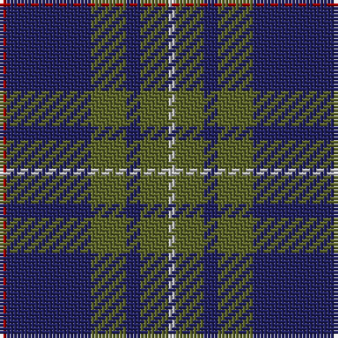

This page is one **sett** — a single exact thread-count. It belongs to the [tartan](/tartans/r1db12y5db2y4lb1/)
(the same proportion at any scale), whose colour order is pattern [RBGBGW](/stripes/rbgbgw/).

Sourced from register-of-tartans.  It is a [6 stripe tartan](/stripes/stripes6/).

Original link https://www.tartanregister.gov.uk/tartanDetails.aspx?ref=740

## Register references

External register numbers recorded for this tartan.

- Scottish Register of Tartans: [740](https://www.tartanregister.gov.uk/tartanDetails.aspx?ref=740)
- Scottish Tartans Authority (ITI): 4485

## Thread count
DR/2 DB24 G10 DB4 G8 N/2

## Palette

Palette: <strong>Tartan Register</strong>
<table><thead><tr><th>Colour</th><th>Threads</th><th>Shade</th><th>Base</th><th>OKLCh</th></tr></thead><tbody><tr><td>DR/</td><td style="text-align:right;font-variant-numeric:tabular-nums">2</td><td><code style="background-color:#A00000;">#A00000</code> <small style="color:#888">#A00000</small></td><td>R <code style="background-color:#CC0000;">#CC0000</code></td><td><small style="color:#888">oklch(44.3% 0.182 29.2)</small></td></tr><tr><td>DB</td><td style="text-align:right;font-variant-numeric:tabular-nums">24</td><td><code style="background-color:#202060;">#202060</code> <small style="color:#888">#202060</small></td><td>B <code style="background-color:#2A418A;">#2A418A</code></td><td><small style="color:#888">oklch(28.9% 0.111 276.9)</small></td></tr><tr><td>G</td><td style="text-align:right;font-variant-numeric:tabular-nums">10</td><td><code style="background-color:#5C6428;">#5C6428</code> <small style="color:#888">#5C6428</small></td><td>G <code style="background-color:#006100;">#006100</code></td><td><small style="color:#888">oklch(48.3% 0.084 116.0)</small></td></tr><tr><td>DB</td><td style="text-align:right;font-variant-numeric:tabular-nums">4</td><td><code style="background-color:#202060;">#202060</code> <small style="color:#888">#202060</small></td><td>B <code style="background-color:#2A418A;">#2A418A</code></td><td><small style="color:#888">oklch(28.9% 0.111 276.9)</small></td></tr><tr><td>G</td><td style="text-align:right;font-variant-numeric:tabular-nums">8</td><td><code style="background-color:#5C6428;">#5C6428</code> <small style="color:#888">#5C6428</small></td><td>G <code style="background-color:#006100;">#006100</code></td><td><small style="color:#888">oklch(48.3% 0.084 116.0)</small></td></tr><tr><td>N/</td><td style="text-align:right;font-variant-numeric:tabular-nums">2</td><td><code style="background-color:#C0C0C0;">#C0C0C0</code> <small style="color:#888">#C0C0C0</small></td><td>W <code style="background-color:#F7F7F7;">#F7F7F7</code></td><td><small style="color:#888">oklch(80.8% 0.000 89.9)</small></td></tr></tbody></table>

# Sample pattern

## Nearest tartans

The nearest existing variants by ΔTartan distance, with this tartan at the top so the swatches line up against it.

ΔTartan

Tartan

Sett

—

<a href="/ttd/edit/#slug=r1db12y5db2y4lb1~x2">Connaught Green</a> <a class="nn-out" href="/setts/s6/r1db12y5db2y4lb1~x2/" title="open its dictionary page">↗</a>

0.77

<a href="/ttd/edit/#slug=o11dbi1o3db1dbi9r1~x4">Dege, of Saville Row</a> <a class="nn-out" href="/setts/s6/o11dbi1o3db1dbi9r1~x4/" title="open its dictionary page">↗</a>

0.88

<a href="/ttd/edit/#slug=do15r5do30b32do4lo3~x2">Cameron Hunting</a> <a class="nn-out" href="/setts/s6/do15r5do30b32do4lo3~x2/" title="open its dictionary page">↗</a>

0.97

<a href="/ttd/edit/#slug=db26r6g16db8g3r2~x2">Perthshire (New) District Tartan Tartan Number: 2188. Earliest known date: 1992 The New Perthshire District tartan has established itself through use and wont since 1992. It provides a useful alternative to the Drummond pattern which was always closely associated with Perthshire. See products available Copyright © Blair Urquhart, Comrie, 2015</a> <a class="nn-out" href="/setts/s6/db26r6g16db8g3r2~x2/" title="open its dictionary page">↗</a>

1.04

<a href="/ttd/edit/#slug=dg4db12r3db12dg32w4~x2">MacIntyre</a> <a class="nn-out" href="/setts/s6/dg4db12r3db12dg32w4~x2/" title="open its dictionary page">↗</a>

1.04

<a href="/ttd/edit/#slug=w4y15db8k4db28k2db4w2">Kelvinside Academy (School)</a> <a class="nn-out" href="/setts/s8/w4y15db8k4db28k2db4w2/" title="open its dictionary page">↗</a>

1.10

<a href="/ttd/edit/#slug=db3r3g18db16w2db26r3g3~x2">MacHardy</a> <a class="nn-out" href="/setts/s8/db3r3g18db16w2db26r3g3~x2/" title="open its dictionary page">↗</a>

1.10

<a href="/ttd/edit/#slug=dg20db2g6db2dg4db27lo2db8~x2">Kinross (Fashion)</a> <a class="nn-out" href="/setts/s8/dg20db2g6db2dg4db27lo2db8~x2/" title="open its dictionary page">↗</a>

1.18

<a href="/ttd/edit/#slug=db2ly1db18g7r7db1g1~x2">Unnamed C20th - USA</a> <a class="nn-out" href="/setts/s7/db2ly1db18g7r7db1g1~x2/" title="open its dictionary page">↗</a>

1.18

<a href="/ttd/edit/#slug=k32b2k6b2k13n30w2~x2">Mountain Rescue Association Honor Guard</a> <a class="nn-out" href="/setts/s7/k32b2k6b2k13n30w2~x2/" title="open its dictionary page">↗</a>

1.19

<a href="/ttd/edit/#slug=k3w2n27k31p3~x2">Kelley Oliphint</a> <a class="nn-out" href="/setts/s5/k3w2n27k31p3~x2/" title="open its dictionary page">↗</a>

## Neighbour map

Every grey dot is one of 14359 variants placed by the first two principal components of the ΔTartan feature space (44% of its variance). Red is this tartan; blue dots are its nearest — click one to open its page.

<svg viewBox="0 0 640 380" role="img" style="max-width:100%;height:auto;border:1px solid #e0e0e0;border-radius:4px;display:block" xmlns="http://www.w3.org/2000/svg"><image href="/nn/cloud.v1.png" width="640" height="380"/><a href="/setts/s6/o11dbi1o3db1dbi9r1~x4/"><circle cx="328.7" cy="209.2" r="4" fill="#3465a4"><title>Dege, of Saville Row</title></circle></a><a href="/setts/s6/do15r5do30b32do4lo3~x2/"><circle cx="348.6" cy="235.1" r="4" fill="#3465a4"><title>Cameron Hunting</title></circle></a><a href="/setts/s6/db26r6g16db8g3r2~x2/"><circle cx="352.7" cy="237.6" r="4" fill="#3465a4"><title>Perthshire (New) District Tartan Tartan Number: 2188. Earliest known date: 1992 The New Perthshire District tartan has established itself through use and wont since 1992. It provides a useful alternative to the Drummond pattern which was always closely associated with Perthshire. See products available Copyright © Blair Urquhart, Comrie, 2015</title></circle></a><a href="/setts/s6/dg4db12r3db12dg32w4~x2/"><circle cx="323.1" cy="226.7" r="4" fill="#3465a4"><title>MacIntyre</title></circle></a><a href="/setts/s8/w4y15db8k4db28k2db4w2/"><circle cx="351.5" cy="187.3" r="4" fill="#3465a4"><title>Kelvinside Academy (School)</title></circle></a><a href="/setts/s8/db3r3g18db16w2db26r3g3~x2/"><circle cx="360.0" cy="198.8" r="4" fill="#3465a4"><title>MacHardy</title></circle></a><a href="/setts/s8/dg20db2g6db2dg4db27lo2db8~x2/"><circle cx="333.9" cy="198.5" r="4" fill="#3465a4"><title>Kinross (Fashion)</title></circle></a><a href="/setts/s7/db2ly1db18g7r7db1g1~x2/"><circle cx="349.9" cy="173.6" r="4" fill="#3465a4"><title>Unnamed C20th - USA</title></circle></a><a href="/setts/s7/k32b2k6b2k13n30w2~x2/"><circle cx="376.9" cy="203.4" r="4" fill="#3465a4"><title>Mountain Rescue Association Honor Guard</title></circle></a><a href="/setts/s5/k3w2n27k31p3~x2/"><circle cx="340.7" cy="207.7" r="4" fill="#3465a4"><title>Kelley Oliphint</title></circle></a><circle cx="353.3" cy="220.4" r="5" fill="#c00000"/></svg>

ID: /setts/s6/r1db12y5db2y4lb1~x2/
