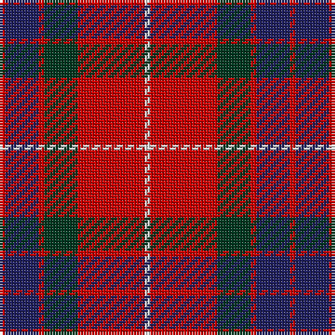

In pattern [RBRGRW](/stripes/rbrgrw/).

This was sourced from house-of-tartan.  It is a [6 stripe tartan](/stripes/stripes6/).

Original link http://www.house-of-tartan.scotland.net/house/TartanViewjs.asp?colr=Def&tnam=1424

## Thread count
R/2 DB12 R2 DG12 R24 LN/2

## Palette
Each colour and the base-6 reference it is a variant of.

| Colour | Shade | Base |
|---|---|---|
| DB | <code style="background-color:#202060;">#202060</code> `oklch(28.9% 0.111 276.9)` <small>#202060</small> | B <code style="background-color:#2A418A;">#2A418A</code> |
| DG | <code style="background-color:#003820;">#003820</code> `oklch(30.0% 0.070 158.3)` <small>#003820</small> | G <code style="background-color:#006100;">#006100</code> |
| LN | <code style="background-color:#E0E0E0;">#E0E0E0</code> `oklch(90.7% 0.000 89.9)` <small>#E0E0E0</small> | W <code style="background-color:#F7F7F7;">#F7F7F7</code> |
| R | <code style="background-color:#C80000;">#C80000</code> `oklch(52.3% 0.215 29.2)` <small>#C80000</small> | R <code style="background-color:#CC0000;">#CC0000</code> |

# Sample pattern

## Nearest tartans

The nearest existing variants by ΔTartan distance.

1. [Fraser VS](/setts/s6/r1db6r1dg6r12lb1/) — ΔT 0.47
1. [Finnigan (Estimated threadcount)](/setts/s6/r3db15r3g8r20k2~x2/) — ΔT 0.60
1. [Carrick (Strathmore) District Tartan Tartan Number: 3216. Earliest known date: c.1999 Sales help Princess Diana Memorial Trust See products available Copyright © Blair Urquhart, Comrie, 2015](/setts/s7/r28db12r3dg20t2dg2r7~x2/) — ΔT 0.62
1. [MacDuff #4](/setts/s7/r4k2r24k6db6dg16r3~x2/) — ΔT 0.64
1. [Fraser VS](/setts/s6/r1db6r1dg6r12lr1~x2/) — ΔT 0.64
1. [Grant of Lurg](/setts/s6/r2db10r2g10r25w2~x2/) — ΔT 0.78
1. [Suntan (Masai Shuka) (District?)](/setts/s6/k3r11db3w1db3w1~x4/) — ΔT 0.85
1. [MacBean/MacElvain](/setts/s7/k2r12db6r3dg12r4db1~x2/) — ΔT 0.93
1. [Fraser Gathering, Red (1997)](/setts/s9/r2db12r2g11r4db5g2r24w2~x2/) — ΔT 0.95
1. [Graham of Menteith (Red)](/setts/s6/r36lb3r5k21db24k3~x2/) — ΔT 0.97

## Neighbour map

Every grey dot is one of 14299 variants placed by the first two principal components of the ΔTartan feature space (44% of its variance). Red is this tartan; blue dots are its nearest — click one to open its page.

<svg viewBox="0 0 640 380" role="img" style="max-width:100%;height:auto;border:1px solid #e0e0e0;border-radius:4px;display:block" xmlns="http://www.w3.org/2000/svg"><image href="/nn/cloud.v1.png" width="640" height="380"/><a href="/setts/s6/r1db6r1dg6r12lb1/"><circle cx="281.5" cy="184.5" r="4" fill="#3465a4"><title>Fraser VS</title></circle></a><a href="/setts/s6/r3db15r3g8r20k2~x2/"><circle cx="286.5" cy="207.5" r="4" fill="#3465a4"><title>Finnigan (Estimated threadcount)</title></circle></a><a href="/setts/s7/r28db12r3dg20t2dg2r7~x2/"><circle cx="308.9" cy="185.2" r="4" fill="#3465a4"><title>Carrick (Strathmore) District Tartan Tartan Number: 3216. Earliest known date: c.1999 Sales help Princess Diana Memorial Trust See products available Copyright © Blair Urquhart, Comrie, 2015</title></circle></a><a href="/setts/s7/r4k2r24k6db6dg16r3~x2/"><circle cx="279.0" cy="182.9" r="4" fill="#3465a4"><title>MacDuff #4</title></circle></a><a href="/setts/s6/r1db6r1dg6r12lr1~x2/"><circle cx="298.9" cy="196.9" r="4" fill="#3465a4"><title>Fraser VS</title></circle></a><a href="/setts/s6/r2db10r2g10r25w2~x2/"><circle cx="328.3" cy="179.0" r="4" fill="#3465a4"><title>Grant of Lurg</title></circle></a><a href="/setts/s6/k3r11db3w1db3w1~x4/"><circle cx="265.9" cy="177.9" r="4" fill="#3465a4"><title>Suntan (Masai Shuka) (District?)</title></circle></a><a href="/setts/s7/k2r12db6r3dg12r4db1~x2/"><circle cx="260.0" cy="198.1" r="4" fill="#3465a4"><title>MacBean/MacElvain</title></circle></a><a href="/setts/s9/r2db12r2g11r4db5g2r24w2~x2/"><circle cx="278.1" cy="162.4" r="4" fill="#3465a4"><title>Fraser Gathering, Red (1997)</title></circle></a><a href="/setts/s6/r36lb3r5k21db24k3~x2/"><circle cx="249.2" cy="194.7" r="4" fill="#3465a4"><title>Graham of Menteith (Red)</title></circle></a><circle cx="293.5" cy="188.1" r="5" fill="#c00000"/></svg>

ID: /setts/s6/r1db6r1dg6r12w1~x2/
