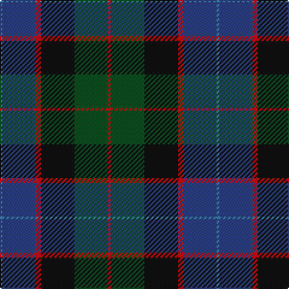

**Bands:** [BBRKGR](/stripes/bbrkgr/) · **Stripes:** [T DB R K DG R](/stripes/stripes6/) T DB R K DG R

This was sourced from register-of-tartans.  It is a [6 band tartan](/bands/bands6/).

Original link https://www.tartanregister.gov.uk/tartanDetails.aspx?ref=4749

## Register references

External register numbers recorded for this tartan.

- Scottish Register of Tartans: [4749](https://www.tartanregister.gov.uk/tartanDetails.aspx?ref=4749)
- Scottish Tartans World Register: 76

## Thread count
B/2 Ba28 R4 K28 G28 R/2

## Palette
Each colour and its ΔE from the base-6 reference it is a variant of.

| Colour | Shade | Base | ΔE (OKLab) |
|---|---|---|---|
| B | <code style="background-color:#3C82AF;">#3C82AF</code> `#3C82AF` | B <code style="background-color:#2A418A;">#2A418A</code> | 0.19 |
| Ba | <code style="background-color:#2C4084;">#2C4084</code> `#2C4084` | B <code style="background-color:#2A418A;">#2A418A</code> | 0.01 |
| G | <code style="background-color:#005020;">#005020</code> `#005020` | G <code style="background-color:#006100;">#006100</code> | 0.07 |
| K | <code style="background-color:#101010;">#101010</code> `#101010` | K <code style="background-color:#000000;">#000000</code> | 0.17 |
| R | <code style="background-color:#DC0000;">#DC0000</code> `#DC0000` | R <code style="background-color:#CC0000;">#CC0000</code> | 0.03 |

# Sample pattern

## Nearest tartans

The nearest existing variants by ΔTartan distance.

1. [MacWilliam Clan Tartan Tartan Number: 1417. Earliest known date: pre 1880 Mentioned in the pattern book 'Clans Originaux' produced in Paris in 1880 by J. Claude Fres Et Cie. It is similar in style and colour to the MacKay tartan both from Sutherland in the North of Scotland See products available Copyright © Blair Urquhart, Comrie, 2015](/setts/s6/dy2g12k10r1db16r2~x2/) — ΔT 0.71
1. [McEwan '1856', The](/setts/s7/db2dy3db16k18g18k2r2~x2/) — ΔT 0.83
1. [MacCaskill (Personal)](/setts/s7/k2ly1db15k15dg15r1k2~x2/) — ΔT 0.84
1. [Russell or Mitchell or Hunter or Galbraith](/setts/s6/k2dg12k12r1db12w2~x2/) — ΔT 0.94
1. [MacPhail Hunting](/setts/s6/r2db23k14dg16k2w2~x2/) — ΔT 0.94
1. [Deloughery, Paul](/setts/s7/db20k6o4db3k16g20w2~x2/) — ΔT 0.96
1. [Loudoun's Highlanders - 1747 #1 (Mil](/setts/s6/r4k2db24k20g20lo3~x2/) — ΔT 0.98
1. [MacPhedran/MacFadzean](/setts/s7/dg3db12lb1k12dg13r2dg2~x2/) — ΔT 1.02
1. [Bailies of Bennachie (Corporate)](/setts/s7/g27r2g4r15db26k2db6~x2/) — ΔT 1.12
1. [Scotch House 2000 Original](/setts/s8/db22r3db2r3db2k17g18lo4~x2/) — ΔT 1.13

## Neighbour map

Every grey dot is one of 14313 variants placed by the first two principal components of the ΔTartan feature space (44% of its variance). Red is this tartan; blue dots are its nearest — click one to open its page.

<svg viewBox="0 0 640 380" role="img" style="max-width:100%;height:auto;border:1px solid #e0e0e0;border-radius:4px;display:block" xmlns="http://www.w3.org/2000/svg"><image href="/nn/cloud.v1.png" width="640" height="380"/><a href="/setts/s6/dy2g12k10r1db16r2~x2/"><circle cx="214.1" cy="200.6" r="4" fill="#3465a4"><title>MacWilliam Clan Tartan Tartan Number: 1417. Earliest known date: pre 1880 Mentioned in the pattern book 'Clans Originaux' produced in Paris in 1880 by J. Claude Fres Et Cie. It is similar in style and colour to the MacKay tartan both from Sutherland in the North of Scotland See products available Copyright © Blair Urquhart, Comrie, 2015</title></circle></a><a href="/setts/s7/db2dy3db16k18g18k2r2~x2/"><circle cx="186.4" cy="214.3" r="4" fill="#3465a4"><title>McEwan '1856', The</title></circle></a><a href="/setts/s7/k2ly1db15k15dg15r1k2~x2/"><circle cx="233.9" cy="192.6" r="4" fill="#3465a4"><title>MacCaskill (Personal)</title></circle></a><a href="/setts/s6/k2dg12k12r1db12w2~x2/"><circle cx="180.3" cy="211.0" r="4" fill="#3465a4"><title>Russell or Mitchell or Hunter or Galbraith</title></circle></a><a href="/setts/s6/r2db23k14dg16k2w2~x2/"><circle cx="214.8" cy="209.7" r="4" fill="#3465a4"><title>MacPhail Hunting</title></circle></a><a href="/setts/s7/db20k6o4db3k16g20w2~x2/"><circle cx="167.0" cy="215.8" r="4" fill="#3465a4"><title>Deloughery, Paul</title></circle></a><a href="/setts/s6/r4k2db24k20g20lo3~x2/"><circle cx="173.2" cy="210.5" r="4" fill="#3465a4"><title>Loudoun's Highlanders - 1747 #1 (Mil</title></circle></a><a href="/setts/s7/dg3db12lb1k12dg13r2dg2~x2/"><circle cx="220.4" cy="203.3" r="4" fill="#3465a4"><title>MacPhedran/MacFadzean</title></circle></a><a href="/setts/s7/g27r2g4r15db26k2db6~x2/"><circle cx="240.8" cy="194.8" r="4" fill="#3465a4"><title>Bailies of Bennachie (Corporate)</title></circle></a><a href="/setts/s8/db22r3db2r3db2k17g18lo4~x2/"><circle cx="188.2" cy="189.2" r="4" fill="#3465a4"><title>Scotch House 2000 Original</title></circle></a><circle cx="201.6" cy="210.8" r="5" fill="#c00000"/></svg>

ID: /setts/s6/r1dg14k14r2db14t1~x2/
