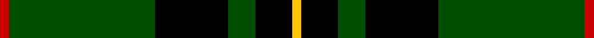
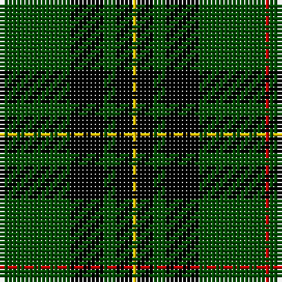

In pattern [RGKGKY](/stripes/rgkgky/).

This was sourced from weddslist.  It is a [6 stripe tartan](/stripes/stripes6/).

Original link http://www.weddslist.com/cgi-bin/tartans/pg.pl?source=rb

## Attestations

This cloth appears in 2 source records; the oldest owns this page.

- undated — Forbes VS (weddslist, [record](http://www.weddslist.com/cgi-bin/tartans/pg.pl?source=rb))
- undated — Forbes VS (weddslist, [record](http://www.weddslist.com/cgi-bin/tartans/pg.pl?source=x))

## Register references

External register numbers recorded for this tartan.

- Scottish Register of Tartans: [1166](https://www.tartanregister.gov.uk/tartanDetails.aspx?ref=1166)
- Scottish Register of Tartans: [1758](https://www.tartanregister.gov.uk/tartanDetails.aspx?ref=1758)
- Scottish Register of Tartans: [2307](https://www.tartanregister.gov.uk/tartanDetails.aspx?ref=2307)
- Scottish Register of Tartans: [2540](https://www.tartanregister.gov.uk/tartanDetails.aspx?ref=2540)
- Scottish Register of Tartans: [2625](https://www.tartanregister.gov.uk/tartanDetails.aspx?ref=2625)
- Scottish Register of Tartans: [2666](https://www.tartanregister.gov.uk/tartanDetails.aspx?ref=2666)
- Scottish Register of Tartans: [2862](https://www.tartanregister.gov.uk/tartanDetails.aspx?ref=2862)
- Scottish Register of Tartans: [3808](https://www.tartanregister.gov.uk/tartanDetails.aspx?ref=3808)
- Scottish Register of Tartans: [982](https://www.tartanregister.gov.uk/tartanDetails.aspx?ref=982)
- Scottish Tartans Authority (ITI): 1429
- Scottish Tartans Authority (ITI): 218
- Scottish Tartans World Register: 1010
- Scottish Tartans World Register: 1042
- Scottish Tartans World Register: 127
- Scottish Tartans World Register: 1429
- Scottish Tartans World Register: 1585
- Scottish Tartans World Register: 218
- Scottish Tartans World Register: 2218
- Scottish Tartans World Register: 737
- Scottish Tartans World Register: 897

## Thread count
R/1 G16 K8 G3 K4 Y/1

## Palette
Each colour and its ΔE from the base-6 reference it is a variant of.

| Colour | Shade | Base | ΔE (OKLab) |
|---|---|---|---|
| G | <code style="background-color:#004C00;">#004C00</code> `#004C00` | G <code style="background-color:#006100;">#006100</code> | 0.07 |
| K | <code style="background-color:#000000;">#000000</code> `#000000` | K <code style="background-color:#000000;">#000000</code> | 0.00 |
| R | <code style="background-color:#C80000;">#C80000</code> `#C80000` | R <code style="background-color:#CC0000;">#CC0000</code> | 0.01 |
| Y | <code style="background-color:#FFC800;">#FFC800</code> `#FFC800` | Y <code style="background-color:#F2BF00;">#F2BF00</code> | 0.03 |

# Sample pattern

## Nearest tartans

The nearest existing variants by ΔTartan distance.

1. [Forbes VS](/setts/s6/r1dg16k8dg3k4ly1~x2/) — ΔT 0.48
1. [MacLean VS](/setts/s8/dg3k6lb1k6dg2k2dg16k1~x2/) — ΔT 1.10
1. [Gunn VS](/setts/s6/dg1k8dg1k8dg15r1~x2/) — ΔT 1.21
1. [Wesley Owen 2010 (Personal)](/setts/s4/k61g10g20w4~x2/) — ΔT 1.24
1. [MacLean VS](/setts/s8/dg3k6lr1k6dg2k2dg16k1~x2/) — ΔT 1.24
1. [Forbes](/setts/s6/r1g16k8g4k4ly1~x2/) — ΔT 1.26
1. [MacArthur (Variant)](/setts/s6/r3g30k12g6k16ly2~x2/) — ΔT 1.31
1. [O'Donoghue](/setts/s5/g62k40ly3k3w3~x2/) — ΔT 1.32
1. [Childers](/setts/s6/k88g17k8g28k8r6~x2/) — ΔT 1.33
1. [Gunn](/setts/s6/r2g12k12g1k12g2~x2/) — ΔT 1.36

## Neighbour map

Every grey dot is one of 14299 variants placed by the first two principal components of the ΔTartan feature space (44% of its variance). Red is this tartan; blue dots are its nearest — click one to open its page.

<svg viewBox="0 0 640 380" role="img" style="max-width:100%;height:auto;border:1px solid #e0e0e0;border-radius:4px;display:block" xmlns="http://www.w3.org/2000/svg"><image href="/nn/cloud.v1.png" width="640" height="380"/><a href="/setts/s6/r1dg16k8dg3k4ly1~x2/"><circle cx="353.3" cy="204.3" r="4" fill="#3465a4"><title>Forbes VS</title></circle></a><a href="/setts/s8/dg3k6lb1k6dg2k2dg16k1~x2/"><circle cx="364.7" cy="202.1" r="4" fill="#3465a4"><title>MacLean VS</title></circle></a><a href="/setts/s6/dg1k8dg1k8dg15r1~x2/"><circle cx="343.8" cy="226.3" r="4" fill="#3465a4"><title>Gunn VS</title></circle></a><a href="/setts/s4/k61g10g20w4~x2/"><circle cx="361.0" cy="211.2" r="4" fill="#3465a4"><title>Wesley Owen 2010 (Personal)</title></circle></a><a href="/setts/s8/dg3k6lr1k6dg2k2dg16k1~x2/"><circle cx="375.9" cy="206.6" r="4" fill="#3465a4"><title>MacLean VS</title></circle></a><a href="/setts/s6/r1g16k8g4k4ly1~x2/"><circle cx="318.7" cy="189.2" r="4" fill="#3465a4"><title>Forbes</title></circle></a><a href="/setts/s6/r3g30k12g6k16ly2~x2/"><circle cx="319.5" cy="213.9" r="4" fill="#3465a4"><title>MacArthur (Variant)</title></circle></a><a href="/setts/s5/g62k40ly3k3w3~x2/"><circle cx="362.9" cy="187.4" r="4" fill="#3465a4"><title>O'Donoghue</title></circle></a><a href="/setts/s6/k88g17k8g28k8r6~x2/"><circle cx="376.4" cy="185.8" r="4" fill="#3465a4"><title>Childers</title></circle></a><a href="/setts/s6/r2g12k12g1k12g2~x2/"><circle cx="324.0" cy="233.3" r="4" fill="#3465a4"><title>Gunn</title></circle></a><circle cx="340.5" cy="198.4" r="5" fill="#c00000"/></svg>

ID: /setts/s6/r1dg16k8dg3k4ly1/
