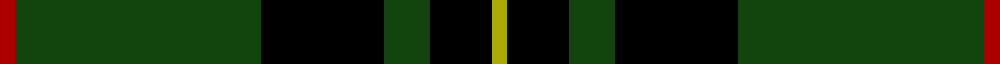
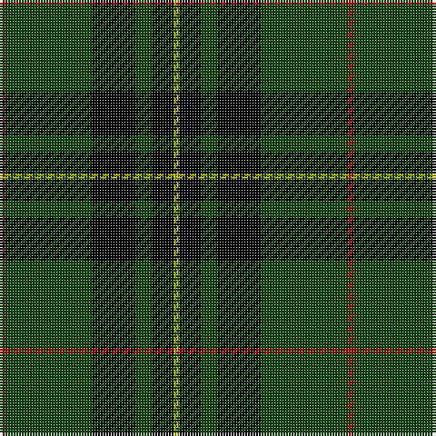

In pattern [RGKGKY](/stripes/rgkgky/).

This was sourced from weddslist.  It is a [6 stripe tartan](/stripes/stripes6/).

Original link http://www.weddslist.com/cgi-bin/tartans/pg.pl?source=tinsel

## Thread count
DR/2 DG32 K16 DG6 K8 LG/2

## Palette
Each colour and the base-6 reference it is a variant of.

| Colour | Shade | Base |
|---|---|---|
| DG | <code style="background-color:#11450D;">#11450D</code> `oklch(34.4% 0.101 142.1)` <small>#11450D</small> | G <code style="background-color:#006100;">#006100</code> |
| DR | <code style="background-color:#AA0000;">#AA0000</code> `oklch(46.3% 0.190 29.2)` <small>#AA0000</small> | R <code style="background-color:#CC0000;">#CC0000</code> |
| K | <code style="background-color:#000000;">#000000</code> `oklch(0.0% 0.000 0.0)` <small>#000000</small> | K <code style="background-color:#000000;">#000000</code> |
| LG | <code style="background-color:#AAAA00;">#AAAA00</code> `oklch(71.4% 0.156 109.8)` <small>#AAAA00</small> | Y <code style="background-color:#F2BF00;">#F2BF00</code> |

# Sample pattern

## Nearest tartans

The nearest existing variants by ΔTartan distance.

1. [Forbes VS](/setts/s6/r1dg16k8dg3k4ly1/) — ΔT 0.48
1. [MacLean VS](/setts/s8/dg3k6lr1k6dg2k2dg16k1~x2/) — ΔT 1.09
1. [Gunn VS](/setts/s6/dg1k8dg1k8dg15r1~x2/) — ΔT 1.09
1. [MacLean VS](/setts/s8/dg3k6lb1k6dg2k2dg16k1~x2/) — ΔT 1.13
1. [Gunn VS](/setts/s6/dg1k8dg1k8dg15r1~x4/) — ΔT 1.17
1. [MacArthur (Variant)](/setts/s6/r3g30k12g6k16ly2~x2/) — ΔT 1.27
1. [MacAulay Hunting](/setts/s8/dg6k16lb1k16dg8k4dg12r2~x2/) — ΔT 1.30
1. [Childers (Personal)](/setts/s6/k44g8k4g13k4w3~x2/) — ΔT 1.33
1. [Wild Highlanders (Corporate)](/setts/s7/k36w3k10w3g28r6k18~x2/) — ΔT 1.33
1. [MacAulay Hunting](/setts/s8/g6k16w1k16g8k4g12r2~x2/) — ΔT 1.34

## Neighbour map

Every grey dot is one of 14299 variants placed by the first two principal components of the ΔTartan feature space (44% of its variance). Red is this tartan; blue dots are its nearest — click one to open its page.

<svg viewBox="0 0 640 380" role="img" style="max-width:100%;height:auto;border:1px solid #e0e0e0;border-radius:4px;display:block" xmlns="http://www.w3.org/2000/svg"><image href="/nn/cloud.v1.png" width="640" height="380"/><a href="/setts/s6/r1dg16k8dg3k4ly1/"><circle cx="340.5" cy="198.4" r="4" fill="#3465a4"><title>Forbes VS</title></circle></a><a href="/setts/s8/dg3k6lr1k6dg2k2dg16k1~x2/"><circle cx="375.9" cy="206.6" r="4" fill="#3465a4"><title>MacLean VS</title></circle></a><a href="/setts/s6/dg1k8dg1k8dg15r1~x2/"><circle cx="343.8" cy="226.3" r="4" fill="#3465a4"><title>Gunn VS</title></circle></a><a href="/setts/s8/dg3k6lb1k6dg2k2dg16k1~x2/"><circle cx="364.7" cy="202.1" r="4" fill="#3465a4"><title>MacLean VS</title></circle></a><a href="/setts/s6/dg1k8dg1k8dg15r1~x4/"><circle cx="353.6" cy="230.5" r="4" fill="#3465a4"><title>Gunn VS</title></circle></a><a href="/setts/s6/r3g30k12g6k16ly2~x2/"><circle cx="319.5" cy="213.9" r="4" fill="#3465a4"><title>MacArthur (Variant)</title></circle></a><a href="/setts/s8/dg6k16lb1k16dg8k4dg12r2~x2/"><circle cx="313.4" cy="214.0" r="4" fill="#3465a4"><title>MacAulay Hunting</title></circle></a><a href="/setts/s6/k44g8k4g13k4w3~x2/"><circle cx="413.5" cy="192.8" r="4" fill="#3465a4"><title>Childers (Personal)</title></circle></a><a href="/setts/s7/k36w3k10w3g28r6k18~x2/"><circle cx="329.2" cy="209.0" r="4" fill="#3465a4"><title>Wild Highlanders (Corporate)</title></circle></a><a href="/setts/s8/g6k16w1k16g8k4g12r2~x2/"><circle cx="326.7" cy="216.4" r="4" fill="#3465a4"><title>MacAulay Hunting</title></circle></a><circle cx="353.3" cy="204.3" r="5" fill="#c00000"/></svg>

ID: /setts/s6/r1dg16k8dg3k4ly1~x2/
