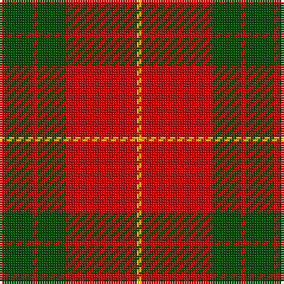

This page is one **sett** — a single exact thread-count. It belongs to the [tartan](/tartans/r1g6r1g6r15y1/)
(the same proportion at any scale), whose colour order is pattern [RGRGRY](/stripes/rgrgry/).

Sourced from weddslist.  It is a [6 stripe tartan](/stripes/stripes6/).

Original link http://www.weddslist.com/cgi-bin/tartans/pg.pl?source=rb

3 attestations — the source records this cloth was collapsed from (oldest owns this page)

<ul>
<li>undated — Cameron Clan D (weddslist, <a href="http://www.weddslist.com/cgi-bin/tartans/pg.pl?source=rb">record</a>)</li>
<li>undated — Cameron Clan D (weddslist, <a href="http://www.weddslist.com/cgi-bin/tartans/pg.pl?source=tinsel">record</a>)</li>
<li>undated — Cameron Clan D (weddslist, <a href="http://www.weddslist.com/cgi-bin/tartans/pg.pl?source=x">record</a>)</li>
</ul>

## Thread count
R/2 G12 R2 G12 R30 Y/2

## Palette
Each colour and the base-6 reference it is a variant of.

| Colour | Shade | Base |
|---|---|---|
| G | <code style="background-color:#004C00;">#004C00</code> `oklch(36.1% 0.123 142.5)` <small>#004C00</small> | G <code style="background-color:#006100;">#006100</code> |
| R | <code style="background-color:#C80000;">#C80000</code> `oklch(52.3% 0.215 29.2)` <small>#C80000</small> | R <code style="background-color:#CC0000;">#CC0000</code> |
| Y | <code style="background-color:#FFC800;">#FFC800</code> `oklch(85.7% 0.175 88.5)` <small>#FFC800</small> | Y <code style="background-color:#F2BF00;">#F2BF00</code> |

# Sample pattern

## Nearest tartans

The nearest existing variants by ΔTartan distance, with this tartan at the top so the swatches line up against it.

ΔTartan

Tartan

Sett

—

<a href="/ttd/edit/#slug=r1dg6r1dg6r15ly1~x2">Cameron Clan D</a> <a class="nn-out" href="/setts/s6/r1dg6r1dg6r15ly1~x2/" title="open its dictionary page">↗</a>

0.50

<a href="/ttd/edit/#slug=r2dg6r2dg6r16ly1~x2">Cameron</a> <a class="nn-out" href="/setts/s6/r2dg6r2dg6r16ly1~x2/" title="open its dictionary page">↗</a>

0.67

<a href="/ttd/edit/#slug=r2g6r2g6r16ly1~x4">Cameron (Clan)</a> <a class="nn-out" href="/setts/s6/r2g6r2g6r16ly1~x4/" title="open its dictionary page">↗</a>

0.67

<a href="/ttd/edit/#slug=r6lb2r30dg12r3dg12r3">Crawford</a> <a class="nn-out" href="/setts/s7/r6lb2r30dg12r3dg12r3/" title="open its dictionary page">↗</a>

0.74

<a href="/ttd/edit/#slug=r2g6r2g6r16ly1~x2">Cameron</a> <a class="nn-out" href="/setts/s6/r2g6r2g6r16ly1~x2/" title="open its dictionary page">↗</a>

0.78

<a href="/ttd/edit/#slug=r1g10r1db4r18g1~x4">Robertson 6</a> <a class="nn-out" href="/setts/s6/r1g10r1db4r18g1~x4/" title="open its dictionary page">↗</a>

0.89

<a href="/ttd/edit/#slug=r6g21k8r28k2r4~x2">Dunbar</a> <a class="nn-out" href="/setts/s6/r6g21k8r28k2r4~x2/" title="open its dictionary page">↗</a>

0.89

<a href="/ttd/edit/#slug=r4g14r5k6r24g2r4~x2">Auld Lang Syne (red) Tartan Tartan Number: 2402. Earliest known date: Threadcount and colours aren't 100% original. Generated manually. See products available Copyright © Blair Urquhart, Comrie, 2015</a> <a class="nn-out" href="/setts/s7/r4g14r5k6r24g2r4~x2/" title="open its dictionary page">↗</a>

0.97

<a href="/ttd/edit/#slug=r6w2r30g12r3g12r3~x2">Crawford</a> <a class="nn-out" href="/setts/s7/r6w2r30g12r3g12r3~x2/" title="open its dictionary page">↗</a>

0.98

<a href="/ttd/edit/#slug=r22db5r2g11r3db1~x2">MacKintosh 1</a> <a class="nn-out" href="/setts/s6/r22db5r2g11r3db1~x2/" title="open its dictionary page">↗</a>

1.00

<a href="/ttd/edit/#slug=r2db1r16db4r1g10r1~x4">Robertson - 1988 (Corporate)</a> <a class="nn-out" href="/setts/s7/r2db1r16db4r1g10r1~x4/" title="open its dictionary page">↗</a>

## Neighbour map

Every grey dot is one of 14299 variants placed by the first two principal components of the ΔTartan feature space (44% of its variance). Red is this tartan; blue dots are its nearest — click one to open its page.

<svg viewBox="0 0 640 380" role="img" style="max-width:100%;height:auto;border:1px solid #e0e0e0;border-radius:4px;display:block" xmlns="http://www.w3.org/2000/svg"><image href="/nn/cloud.v1.png" width="640" height="380"/><a href="/setts/s6/r2dg6r2dg6r16ly1~x2/"><circle cx="414.6" cy="198.6" r="4" fill="#3465a4"><title>Cameron</title></circle></a><a href="/setts/s6/r2g6r2g6r16ly1~x4/"><circle cx="421.8" cy="202.2" r="4" fill="#3465a4"><title>Cameron (Clan)</title></circle></a><a href="/setts/s7/r6lb2r30dg12r3dg12r3/"><circle cx="417.2" cy="193.4" r="4" fill="#3465a4"><title>Crawford</title></circle></a><a href="/setts/s6/r2g6r2g6r16ly1~x2/"><circle cx="416.7" cy="200.8" r="4" fill="#3465a4"><title>Cameron</title></circle></a><a href="/setts/s6/r1g10r1db4r18g1~x4/"><circle cx="397.7" cy="186.3" r="4" fill="#3465a4"><title>Robertson 6</title></circle></a><a href="/setts/s6/r6g21k8r28k2r4~x2/"><circle cx="345.5" cy="207.7" r="4" fill="#3465a4"><title>Dunbar</title></circle></a><a href="/setts/s7/r4g14r5k6r24g2r4~x2/"><circle cx="394.7" cy="205.8" r="4" fill="#3465a4"><title>Auld Lang Syne (red) Tartan Tartan Number: 2402. Earliest known date: Threadcount and colours aren't 100% original. Generated manually. See products available Copyright © Blair Urquhart, Comrie, 2015</title></circle></a><a href="/setts/s7/r6w2r30g12r3g12r3~x2/"><circle cx="411.0" cy="198.0" r="4" fill="#3465a4"><title>Crawford</title></circle></a><a href="/setts/s6/r22db5r2g11r3db1~x2/"><circle cx="425.0" cy="185.2" r="4" fill="#3465a4"><title>MacKintosh 1</title></circle></a><a href="/setts/s7/r2db1r16db4r1g10r1~x4/"><circle cx="375.6" cy="177.4" r="4" fill="#3465a4"><title>Robertson - 1988 (Corporate)</title></circle></a><circle cx="394.4" cy="195.3" r="5" fill="#c00000"/></svg>

ID: /setts/s6/r1dg6r1dg6r15ly1~x2/
