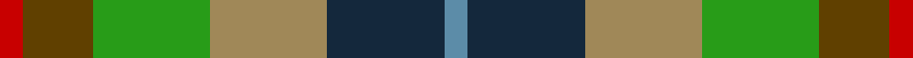
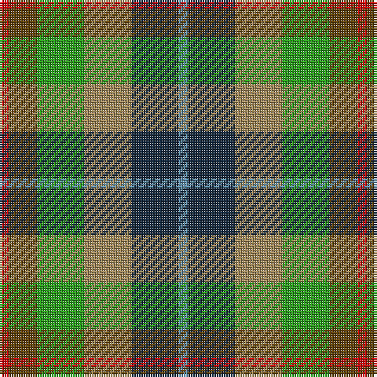

This page is one **sett** — a single exact thread-count. It belongs to the [tartan](/tartans/r1t3g5lt5dn5b1/)
(the same proportion at any scale), whose colour order is pattern [BBYGGR](/stripes/bbyggr/).

Sourced from register-of-tartans.  It is a [6 stripe tartan](/stripes/stripes6/).

Original link https://www.tartanregister.gov.uk/tartanDetails.aspx?ref=2144

2 attestations — the source records this cloth was collapsed from (oldest owns this page)

<ul>
<li>01/12/2005 — Loch Fyne (register-of-tartans, <a href="https://www.tartanregister.gov.uk/tartanDetails.aspx?ref=2144">record</a>)</li>
<li>2005 December — Loch Fyne (District) (tartans-authority, <a href="http://www.tartansauthority.com/tartan-ferret/display/6817/">record</a>)</li>
</ul>

## Register references

External register numbers recorded for this tartan.

- Scottish Register of Tartans: [2144](https://www.tartanregister.gov.uk/tartanDetails.aspx?ref=2144)
- Scottish Tartans Authority (ITI): 6817

## Thread count
R/4 T12 G20 LT20 DN20 B/4

## Palette
Each colour and the base-6 reference it is a variant of.

| Colour | Shade | Base |
|---|---|---|
| B | <code style="background-color:#5C8CA8;">#5C8CA8</code> `oklch(61.7% 0.067 235.0)` <small>#5C8CA8</small> | B <code style="background-color:#2A418A;">#2A418A</code> |
| DN | <code style="background-color:#14283C;">#14283C</code> `oklch(27.1% 0.046 249.9)` <small>#14283C</small> | B <code style="background-color:#2A418A;">#2A418A</code> |
| G | <code style="background-color:#289C18;">#289C18</code> `oklch(60.6% 0.191 141.6)` <small>#289C18</small> | G <code style="background-color:#006100;">#006100</code> |
| LT | <code style="background-color:#A08858;">#A08858</code> `oklch(63.7% 0.071 84.0)` <small>#A08858</small> | Y <code style="background-color:#F2BF00;">#F2BF00</code> |
| R | <code style="background-color:#C80000;">#C80000</code> `oklch(52.3% 0.215 29.2)` <small>#C80000</small> | R <code style="background-color:#CC0000;">#CC0000</code> |
| T | <code style="background-color:#604000;">#604000</code> `oklch(39.8% 0.083 76.8)` <small>#604000</small> | G <code style="background-color:#006100;">#006100</code> |

# Sample pattern

## Nearest tartans

The nearest existing variants by ΔTartan distance, with this tartan at the top so the swatches line up against it.

ΔTartan

Tartan

Sett

—

<a href="/ttd/edit/#slug=r1dy3g5lo5dt5t1~x4">Loch Fyne</a> <a class="nn-out" href="/setts/s6/r1dy3g5lo5dt5t1~x4/" title="open its dictionary page">↗</a>

1.10

<a href="/ttd/edit/#slug=y5g4w1g4o4dg4ly1~x4">Devon, Original</a> <a class="nn-out" href="/setts/s7/y5g4w1g4o4dg4ly1~x4/" title="open its dictionary page">↗</a>

1.23

<a href="/ttd/edit/#slug=r3lb8k9g16r12n12lo3~x2">Alabama (Fashion)</a> <a class="nn-out" href="/setts/s7/r3lb8k9g16r12n12lo3~x2/" title="open its dictionary page">↗</a>

1.24

<a href="/ttd/edit/#slug=lr5g4w1g4o4dg4ly1~x4">Devon Original District Tartan Tartan Number: 1284. Earliest known date: 1984 The Devon Original and Devon Companion owe their origin to the success of the Cornish St Piran sett, which was woven by Coldharbour Mill in the early 1980's. The accreditation certificate was presented to the Mayor of Barnstaple in 1991. In a poem describing the tartan, Miss M. Miles says, &quot;So, in the mind, Devon's beauty is retrieved By contemplating Devon's tartan's weave.&quot; See products available Copyright © Blair Urquhart, Comrie, 2015</a> <a class="nn-out" href="/setts/s7/lr5g4w1g4o4dg4ly1~x4/" title="open its dictionary page">↗</a>

1.29

<a href="/ttd/edit/#slug=g4n12lo2k10y10lo3y2~x2">Rothesay</a> <a class="nn-out" href="/setts/s7/g4n12lo2k10y10lo3y2~x2/" title="open its dictionary page">↗</a>

1.29

<a href="/ttd/edit/#slug=dy19g23ly3db15r11w5~x2">Mekos, The</a> <a class="nn-out" href="/setts/s6/dy19g23ly3db15r11w5~x2/" title="open its dictionary page">↗</a>

1.37

<a href="/ttd/edit/#slug=g8y8t7r5o2k2o2k2o2~x2">Somerset</a> <a class="nn-out" href="/setts/s9/g8y8t7r5o2k2o2k2o2~x2/" title="open its dictionary page">↗</a>

1.40

<a href="/ttd/edit/#slug=g8o8t7r5dy2k2dy2k2dy2~x2">Somerset District Tartan Tartan Number: 831. Earliest known date: 1984 Blue is the river at Chatworthy, brown is the withies at Rhines, black is the peat on Sedgemoor. Grey shows the colour of Glastonbury Abbey and Wells Cathedral and pink represents the Cheddar Pinks which grow in the Cheddar Gorge, favourite of Victorian visitors. Green portrays the Quantock hills and the wilderness of Exmoor. See products available Copyright © Blair Urquhart, Comrie, 2015</a> <a class="nn-out" href="/setts/s9/g8o8t7r5dy2k2dy2k2dy2~x2/" title="open its dictionary page">↗</a>

1.44

<a href="/ttd/edit/#slug=r4g11k11g2n11ly3~x4">Casely (Name)</a> <a class="nn-out" href="/setts/s6/r4g11k11g2n11ly3~x4/" title="open its dictionary page">↗</a>

1.45

<a href="/ttd/edit/#slug=dy5lo20r3dg13dy13dp3lt3~x2">Christmas Hill Game Farm</a> <a class="nn-out" href="/setts/s7/dy5lo20r3dg13dy13dp3lt3~x2/" title="open its dictionary page">↗</a>

1.46

<a href="/ttd/edit/#slug=k1lr1g5dp1g2dy5lr1y3lr1~x4">Corcoran of Sherbrooke (Personal)</a> <a class="nn-out" href="/setts/s9/k1lr1g5dp1g2dy5lr1y3lr1~x4/" title="open its dictionary page">↗</a>

## Neighbour map

Every grey dot is one of 14299 variants placed by the first two principal components of the ΔTartan feature space (44% of its variance). Red is this tartan; blue dots are its nearest — click one to open its page.

<svg viewBox="0 0 640 380" role="img" style="max-width:100%;height:auto;border:1px solid #e0e0e0;border-radius:4px;display:block" xmlns="http://www.w3.org/2000/svg"><image href="/nn/cloud.v1.png" width="640" height="380"/><a href="/setts/s7/y5g4w1g4o4dg4ly1~x4/"><circle cx="69.3" cy="242.8" r="4" fill="#3465a4"><title>Devon, Original</title></circle></a><a href="/setts/s7/r3lb8k9g16r12n12lo3~x2/"><circle cx="25.7" cy="217.5" r="4" fill="#3465a4"><title>Alabama (Fashion)</title></circle></a><a href="/setts/s7/lr5g4w1g4o4dg4ly1~x4/"><circle cx="71.2" cy="234.6" r="4" fill="#3465a4"><title>Devon Original District Tartan Tartan Number: 1284. Earliest known date: 1984 The Devon Original and Devon Companion owe their origin to the success of the Cornish St Piran sett, which was woven by Coldharbour Mill in the early 1980's. The accreditation certificate was presented to the Mayor of Barnstaple in 1991. In a poem describing the tartan, Miss M. Miles says, &quot;So, in the mind, Devon's beauty is retrieved By contemplating Devon's tartan's weave.&quot; See products available Copyright © Blair Urquhart, Comrie, 2015</title></circle></a><a href="/setts/s7/g4n12lo2k10y10lo3y2~x2/"><circle cx="104.8" cy="228.7" r="4" fill="#3465a4"><title>Rothesay</title></circle></a><a href="/setts/s6/dy19g23ly3db15r11w5~x2/"><circle cx="70.6" cy="205.9" r="4" fill="#3465a4"><title>Mekos, The</title></circle></a><a href="/setts/s9/g8y8t7r5o2k2o2k2o2~x2/"><circle cx="14.0" cy="210.5" r="4" fill="#3465a4"><title>Somerset</title></circle></a><a href="/setts/s9/g8o8t7r5dy2k2dy2k2dy2~x2/"><circle cx="29.0" cy="222.8" r="4" fill="#3465a4"><title>Somerset District Tartan Tartan Number: 831. Earliest known date: 1984 Blue is the river at Chatworthy, brown is the withies at Rhines, black is the peat on Sedgemoor. Grey shows the colour of Glastonbury Abbey and Wells Cathedral and pink represents the Cheddar Pinks which grow in the Cheddar Gorge, favourite of Victorian visitors. Green portrays the Quantock hills and the wilderness of Exmoor. See products available Copyright © Blair Urquhart, Comrie, 2015</title></circle></a><a href="/setts/s6/r4g11k11g2n11ly3~x4/"><circle cx="98.5" cy="243.1" r="4" fill="#3465a4"><title>Casely (Name)</title></circle></a><a href="/setts/s7/dy5lo20r3dg13dy13dp3lt3~x2/"><circle cx="134.7" cy="206.2" r="4" fill="#3465a4"><title>Christmas Hill Game Farm</title></circle></a><a href="/setts/s9/k1lr1g5dp1g2dy5lr1y3lr1~x4/"><circle cx="109.2" cy="204.9" r="4" fill="#3465a4"><title>Corcoran of Sherbrooke (Personal)</title></circle></a><circle cx="48.2" cy="236.3" r="5" fill="#c00000"/></svg>

ID: /setts/s6/r1dy3g5lo5dt5t1~x4/
