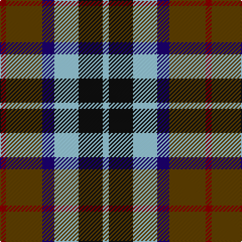

**Bands:** [RGBWKW](/stripes/rgbwkw/) · **Stripes:** [R DY DB LB K LB](/stripes/stripes6/) R DY DB LB K LB

This was sourced from tartans-authority.  It is a [6 band tartan](/bands/bands6/).

Original link http://www.tartansauthority.com/tartan-ferret/display/3595/

## Thread count
DR/6 T36 DB12 LB24 K24 LB/6

## Palette
Each colour and its ΔE from the base-6 reference it is a variant of.

| Colour | Shade | Base | ΔE (OKLab) |
|---|---|---|---|
| DB | <code style="background-color:#1C0070;">#1C0070</code> `#1C0070` | B <code style="background-color:#2A418A;">#2A418A</code> | 0.14 |
| DR | <code style="background-color:#880000;">#880000</code> `#880000` | R <code style="background-color:#CC0000;">#CC0000</code> | 0.15 |
| K | <code style="background-color:#101010;">#101010</code> `#101010` | K <code style="background-color:#000000;">#000000</code> | 0.17 |
| LB | <code style="background-color:#98C8E8;">#98C8E8</code> `#98C8E8` | W <code style="background-color:#F7F7F7;">#F7F7F7</code> | 0.18 |
| T | <code style="background-color:#604000;">#604000</code> `#604000` | G <code style="background-color:#006100;">#006100</code> | 0.14 |

# Sample pattern

## Nearest tartans

The nearest existing variants by ΔTartan distance.

1. [MacCaughan, or MacEachain](/setts/s6/dp2g6k2db6k1r2~x4/) — ΔT 0.74
1. [Wilson's No 148](/setts/s5/k4t3g13p12w2~x2/) — ΔT 0.78
1. [Wilson's, No 176](/setts/s5/k4t3g12p13ly2~x2/) — ΔT 0.78
1. [Nobiliary Fraternity](/setts/s5/dp11t2k10g10ly3~x2/) — ΔT 0.82
1. [Cooke](/setts/s7/k6b2db12g8r5k2g3~x4/) — ΔT 0.85
1. [Friebe (2014)](/setts/s5/g15dg18db23w4r8~x2/) — ΔT 0.86
1. [Thom(p)son's, Fancy](/setts/s6/r2o8db2t4k4t1~x6/) — ΔT 0.88
1. [Wilson's, No 217](/setts/s5/p11t2k10g10ly2~x2/) — ΔT 0.94
1. [Rothesay](/setts/s7/dg3y12ly2k10o10ly3o2~x2/) — ΔT 0.98
1. [Reekie (Name)](/setts/s6/k8r12w8g15db30ly5~x2/) — ΔT 0.99

## Neighbour map

Every grey dot is one of 14299 variants placed by the first two principal components of the ΔTartan feature space (44% of its variance). Red is this tartan; blue dots are its nearest — click one to open its page.

<svg viewBox="0 0 640 380" role="img" style="max-width:100%;height:auto;border:1px solid #e0e0e0;border-radius:4px;display:block" xmlns="http://www.w3.org/2000/svg"><image href="/nn/cloud.v1.png" width="640" height="380"/><a href="/setts/s6/dp2g6k2db6k1r2~x4/"><circle cx="94.2" cy="225.7" r="4" fill="#3465a4"><title>MacCaughan, or MacEachain</title></circle></a><a href="/setts/s5/k4t3g13p12w2~x2/"><circle cx="132.5" cy="215.8" r="4" fill="#3465a4"><title>Wilson's No 148</title></circle></a><a href="/setts/s5/k4t3g12p13ly2~x2/"><circle cx="135.6" cy="215.8" r="4" fill="#3465a4"><title>Wilson's, No 176</title></circle></a><a href="/setts/s5/dp11t2k10g10ly3~x2/"><circle cx="88.0" cy="245.8" r="4" fill="#3465a4"><title>Nobiliary Fraternity</title></circle></a><a href="/setts/s7/k6b2db12g8r5k2g3~x4/"><circle cx="81.8" cy="219.3" r="4" fill="#3465a4"><title>Cooke</title></circle></a><a href="/setts/s5/g15dg18db23w4r8~x2/"><circle cx="91.2" cy="249.9" r="4" fill="#3465a4"><title>Friebe (2014)</title></circle></a><a href="/setts/s6/r2o8db2t4k4t1~x6/"><circle cx="135.4" cy="210.8" r="4" fill="#3465a4"><title>Thom(p)son's, Fancy</title></circle></a><a href="/setts/s5/p11t2k10g10ly2~x2/"><circle cx="80.0" cy="232.2" r="4" fill="#3465a4"><title>Wilson's, No 217</title></circle></a><a href="/setts/s7/dg3y12ly2k10o10ly3o2~x2/"><circle cx="67.8" cy="201.3" r="4" fill="#3465a4"><title>Rothesay</title></circle></a><a href="/setts/s6/k8r12w8g15db30ly5~x2/"><circle cx="84.4" cy="199.6" r="4" fill="#3465a4"><title>Reekie (Name)</title></circle></a><circle cx="87.7" cy="218.9" r="5" fill="#c00000"/></svg>

ID: /setts/s6/r1dy6db2lb4k4lb1~x6/
