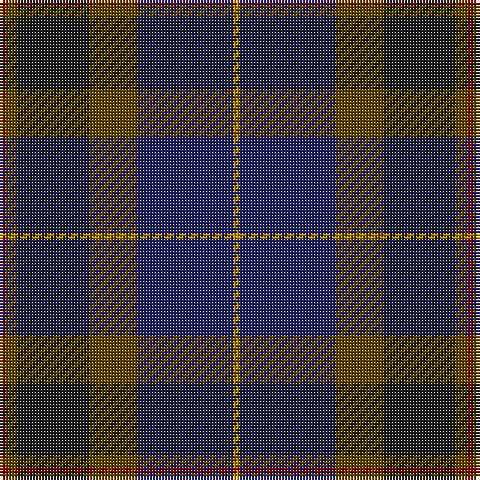

In pattern [RGBGBY](/patterns/rgbgby/).

This was sourced from tartans-authority.  It is a [6 stripes tartan](/stripes/stripes6/).

Original link http://www.tartansauthority.com/tartan-ferret/display/3711/

## Thread count
DR/2 T4 K24 T16 DB32 DY/2

## Palette
Each colour and its ΔE from the base-6 reference it is a variant of.

| Colour | Shade | Base | ΔE (OKLab) |
|---|---|---|---|
| DB | <code style="background-color:#202060;">#202060</code> `#202060` | B <code style="background-color:#2A418A;">#2A418A</code> | 0.11 |
| DR | <code style="background-color:#880000;">#880000</code> `#880000` | R <code style="background-color:#CC0000;">#CC0000</code> | 0.15 |
| DY | <code style="background-color:#BC8C00;">#BC8C00</code> `#BC8C00` | Y <code style="background-color:#F2BF00;">#F2BF00</code> | 0.16 |
| K | <code style="background-color:#1C1C1C;">#1C1C1C</code> `#1C1C1C` | B <code style="background-color:#2A418A;">#2A418A</code> | 0.21 |
| T | <code style="background-color:#604000;">#604000</code> `#604000` | G <code style="background-color:#006100;">#006100</code> | 0.14 |

# Sample pattern

## Nearest tartans

The nearest existing variants by ΔTartan distance.

1. [Bobby Jones (Personal)](/setts/s6/r1g2k12g8b16y1~b202060-g604000-k101010-r880000-ybc8c00~x2/) — ΔT 0.85
1. [Passion of Scotland, Pewter (Fashion](/setts/s5/b8r3ba34k34bb3~b5c5c5c-ba484848-bb481c40-k101010-r6c0000~x2/) — ΔT 0.93
1. [Bouncing Blackie (Personal)](/setts/s7/b5ba8bb13g21ba34bb55r3~b700070-ba24246c-bb1c1c1c-g007040-r742800/) — ΔT 1.08
1. [Passion of Scotland (Fashion)](/setts/s7/b6r4b2ba25k30g2k2~b344054-ba1c1c50-g408060-k101010-r888888~x2/) — ΔT 1.11
1. [Bennett, John Paul (Personal)](/setts/s7/g4ga62k41b6k4b38r4~b5b5758-g715937-ga1a4014-k101010-rb93e5a/) — ΔT 1.27
1. [Aisteach](/setts/s7/b32g16r14k4r6b7k2~b3d2e60-g005020-k1c1714-r97342f~x2/) — ΔT 1.33
1. [Sanix Modern](/setts/s5/r1b8k6ba10y1~b003c64-ba202060-k101010-r880000-yd09800~x4/) — ΔT 1.42
1. [Andover](/setts/s6/r1b12k6ka1ba10r1~b5c5c5c-ba4c3428-k101010-ka000000-rc80000~x4/) — ΔT 1.46
1. [Dallard (Personal)](/setts/s5/k37g37b8ka3ba5~b5c5c5c-ba5c005c-g003820-k00002c-ka101010~x2/) — ΔT 1.48
1. [Dempster Family Tartan Tartan Number: 2219. Earliest known date: 2001 Designed by Claire Donaldson of the House of Edgar. See products available Copyright © Blair Urquhart, Comrie, 2015](/setts/s7/b4g2ba16ba10g10b32bb3~b14283c-ba4c0000-bb5c5c5c-g285800~x2/) — ΔT 1.52

## Neighbour map

Every grey dot is one of 15726 variants placed by the first two principal components of the ΔTartan feature space (44% of its variance). Red is this tartan; blue dots are its nearest — click one to open its page.

<svg viewBox="0 0 640 380" role="img" style="max-width:100%;height:auto;border:1px solid #e0e0e0;border-radius:4px;display:block" xmlns="http://www.w3.org/2000/svg"><image href="/nn/cloud.v1.png" width="640" height="380"/><a href="/setts/s6/r1g2k12g8b16y1~b202060-g604000-k101010-r880000-ybc8c00~x2/"><circle cx="284.0" cy="208.2" r="4" fill="#3465a4"><title>Bobby Jones (Personal)</title></circle></a><a href="/setts/s5/b8r3ba34k34bb3~b5c5c5c-ba484848-bb481c40-k101010-r6c0000~x2/"><circle cx="312.2" cy="235.5" r="4" fill="#3465a4"><title>Passion of Scotland, Pewter (Fashion</title></circle></a><a href="/setts/s7/b5ba8bb13g21ba34bb55r3~b700070-ba24246c-bb1c1c1c-g007040-r742800/"><circle cx="342.5" cy="206.9" r="4" fill="#3465a4"><title>Bouncing Blackie (Personal)</title></circle></a><a href="/setts/s7/b6r4b2ba25k30g2k2~b344054-ba1c1c50-g408060-k101010-r888888~x2/"><circle cx="332.6" cy="198.7" r="4" fill="#3465a4"><title>Passion of Scotland (Fashion)</title></circle></a><a href="/setts/s7/g4ga62k41b6k4b38r4~b5b5758-g715937-ga1a4014-k101010-rb93e5a/"><circle cx="289.4" cy="199.7" r="4" fill="#3465a4"><title>Bennett, John Paul (Personal)</title></circle></a><a href="/setts/s7/b32g16r14k4r6b7k2~b3d2e60-g005020-k1c1714-r97342f~x2/"><circle cx="350.7" cy="225.0" r="4" fill="#3465a4"><title>Aisteach</title></circle></a><a href="/setts/s5/r1b8k6ba10y1~b003c64-ba202060-k101010-r880000-yd09800~x4/"><circle cx="259.2" cy="258.0" r="4" fill="#3465a4"><title>Sanix Modern</title></circle></a><a href="/setts/s6/r1b12k6ka1ba10r1~b5c5c5c-ba4c3428-k101010-ka000000-rc80000~x4/"><circle cx="253.8" cy="208.2" r="4" fill="#3465a4"><title>Andover</title></circle></a><a href="/setts/s5/k37g37b8ka3ba5~b5c5c5c-ba5c005c-g003820-k00002c-ka101010~x2/"><circle cx="293.2" cy="235.0" r="4" fill="#3465a4"><title>Dallard (Personal)</title></circle></a><a href="/setts/s7/b4g2ba16ba10g10b32bb3~b14283c-ba4c0000-bb5c5c5c-g285800~x2/"><circle cx="382.8" cy="237.2" r="4" fill="#3465a4"><title>Dempster Family Tartan Tartan Number: 2219. Earliest known date: 2001 Designed by Claire Donaldson of the House of Edgar. See products available Copyright © Blair Urquhart, Comrie, 2015</title></circle></a><circle cx="304.3" cy="216.5" r="5" fill="#c00000"/></svg>

ID: /setts/s6/r1g2b12g8ba16y1~b1c1c1c-ba202060-g604000-r880000-ybc8c00~x2/
