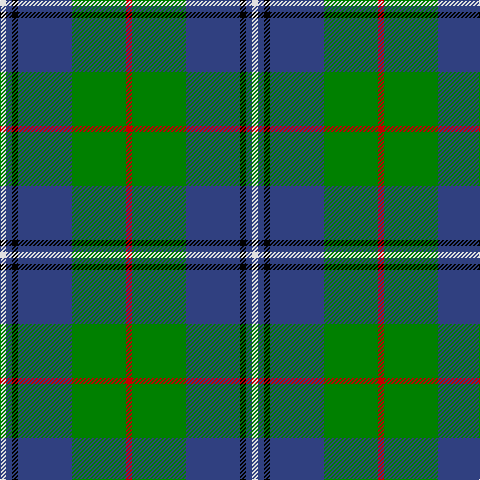

In pattern [RGBKBW](/patterns/rgbkbw/).

This was sourced from weddslist.  It is a [6 stripes tartan](/stripes/stripes6/).

Original link http://www.weddslist.com/cgi-bin/tartans/pg.pl?source=sts

## Thread count
LN/6 B6 K6 B54 G54 R/6

## Palette
Each colour and its ΔE from the base-6 reference it is a variant of.

| Colour | Shade | Base | ΔE (OKLab) |
|---|---|---|---|
| B | <code style="background-color:#304080;">#304080</code> `#304080` | B <code style="background-color:#2A418A;">#2A418A</code> | 0.02 |
| G | <code style="background-color:#008000;">#008000</code> `#008000` | G <code style="background-color:#006100;">#006100</code> | 0.10 |
| K | <code style="background-color:#000000;">#000000</code> `#000000` | K <code style="background-color:#000000;">#000000</code> | 0.00 |
| LN | <code style="background-color:#E0E0E0;">#E0E0E0</code> `#E0E0E0` | W <code style="background-color:#F7F7F7;">#F7F7F7</code> | 0.07 |
| R | <code style="background-color:#C00000;">#C00000</code> `#C00000` | R <code style="background-color:#CC0000;">#CC0000</code> | 0.03 |

# Sample pattern

## Nearest tartans

The nearest existing variants by ΔTartan distance.

1. [Irving of Bonshaw Tower](/setts/s6/r1g1k1g9b9w1x6~b304080-g008000-k000000-rc00000-we0e0e0/) — ΔT 0.25
1. [Douglas](/setts/s5/k1b1g8ba8w1x4~b5480b0-ba304080-g008000-k000000-we0e0e0/) — ΔT 0.69
1. [Carmichael](/setts/s6/k5g32b32r3b3y3x2~b2c2c80-g006818-k000000-rc80000-ye8c000/) — ΔT 0.77
1. [Irving of Glentulchan Family Tartan Tartan Number: 1460. Earliest known date: 1987 Glentulchan is situated north of Perth on the river Almond. The sett combines elements of the Irvine and the Malcolm tartans. The design by John Irving, Glenalmond, was accredited by the Scottish Tartans Society in 1987. See products available Copyright © Blair Urquhart, Comrie, 2015](/setts/s6/r1g9b9k1b1w1x6~b2c2c80-g006818-k101010-rc80000-we0e0e0/) — ΔT 0.79
1. [Turnbull Hunting (1983) #2](/setts/s5/k2y1g10b10w1x6~b2c2c80-g006818-k101010-wfcfcfc-ye8c000/) — ΔT 0.83
1. [Pride of Yorkland (Fashion)](/setts/s6/g35k3b26k4ba4w3x2~b2c2c80-ba1c0070-g006818-k101010-wfcfcfc/) — ΔT 0.84
1. [Turnbull Hunting (Name)](/setts/s5/r2y1g10b10w1x6~b2c2c80-g006818-rc80000-we0e0e0-ye8c000/) — ΔT 0.85
1. [Highlander, Highland Laddie Kilts](/setts/s5/k7r3g29b29w3x2~b304080-g008000-k000000-r802040-we0e0e0/) — ΔT 0.89
1. [Gamba (Commemorative)](/setts/s5/g5r3ga30b30w3x2~b2c2c80-g003820-ga006818-rc80000-wfcfcfc/) — ΔT 0.89
1. [Douglas, Green (Wilsons)](/setts/s5/k1b1g8ba8w1x4~b2c2c80-ba202060-g006818-k101010-wfcfcfc/) — ΔT 0.96

## Neighbour map

Every grey dot is one of 15726 variants placed by the first two principal components of the ΔTartan feature space (44% of its variance). Red is this tartan; blue dots are its nearest — click one to open its page.

<svg viewBox="0 0 640 380" role="img" style="max-width:100%;height:auto;border:1px solid #e0e0e0;border-radius:4px;display:block" xmlns="http://www.w3.org/2000/svg"><image href="/nn/cloud.v1.png" width="640" height="380"/><a href="/setts/s6/r1g1k1g9b9w1x6~b304080-g008000-k000000-rc00000-we0e0e0/"><circle cx="235.1" cy="188.9" r="4" fill="#3465a4"><title>Irving of Bonshaw Tower</title></circle></a><a href="/setts/s5/k1b1g8ba8w1x4~b5480b0-ba304080-g008000-k000000-we0e0e0/"><circle cx="206.9" cy="210.0" r="4" fill="#3465a4"><title>Douglas</title></circle></a><a href="/setts/s6/k5g32b32r3b3y3x2~b2c2c80-g006818-k000000-rc80000-ye8c000/"><circle cx="247.5" cy="186.4" r="4" fill="#3465a4"><title>Carmichael</title></circle></a><a href="/setts/s6/r1g9b9k1b1w1x6~b2c2c80-g006818-k101010-rc80000-we0e0e0/"><circle cx="250.3" cy="194.5" r="4" fill="#3465a4"><title>Irving of Glentulchan Family Tartan Tartan Number: 1460. Earliest known date: 1987 Glentulchan is situated north of Perth on the river Almond. The sett combines elements of the Irvine and the Malcolm tartans. The design by John Irving, Glenalmond, was accredited by the Scottish Tartans Society in 1987. See products available Copyright © Blair Urquhart, Comrie, 2015</title></circle></a><a href="/setts/s5/k2y1g10b10w1x6~b2c2c80-g006818-k101010-wfcfcfc-ye8c000/"><circle cx="212.1" cy="203.0" r="4" fill="#3465a4"><title>Turnbull Hunting (1983) #2</title></circle></a><a href="/setts/s6/g35k3b26k4ba4w3x2~b2c2c80-ba1c0070-g006818-k101010-wfcfcfc/"><circle cx="249.3" cy="185.0" r="4" fill="#3465a4"><title>Pride of Yorkland (Fashion)</title></circle></a><a href="/setts/s5/r2y1g10b10w1x6~b2c2c80-g006818-rc80000-we0e0e0-ye8c000/"><circle cx="217.9" cy="201.2" r="4" fill="#3465a4"><title>Turnbull Hunting (Name)</title></circle></a><a href="/setts/s5/k7r3g29b29w3x2~b304080-g008000-k000000-r802040-we0e0e0/"><circle cx="194.8" cy="203.9" r="4" fill="#3465a4"><title>Highlander, Highland Laddie Kilts</title></circle></a><a href="/setts/s5/g5r3ga30b30w3x2~b2c2c80-g003820-ga006818-rc80000-wfcfcfc/"><circle cx="233.1" cy="207.1" r="4" fill="#3465a4"><title>Gamba (Commemorative)</title></circle></a><a href="/setts/s5/k1b1g8ba8w1x4~b2c2c80-ba202060-g006818-k101010-wfcfcfc/"><circle cx="215.7" cy="214.7" r="4" fill="#3465a4"><title>Douglas, Green (Wilsons)</title></circle></a><circle cx="236.1" cy="188.9" r="5" fill="#c00000"/></svg>

ID: /setts/s6/r1g9b9k1b1w1x6~b304080-g008000-k000000-rc00000-we0e0e0/
