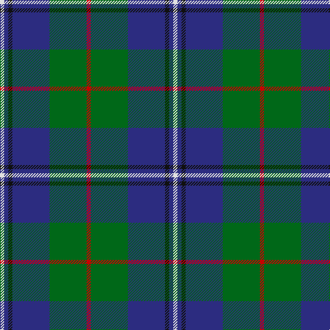

In pattern [RGBKBW](/patterns/rgbkbw/).

This was sourced from house-of-tartan.  It is a [6 stripes tartan](/stripes/stripes6/).

Original link http://www.house-of-tartan.scotland.net/house/TartanViewjs.asp?colr=Def&tnam=1460

## Thread count
LN/6 DB6 K6 DB54 G54 R/6

## Palette
Each colour and its ΔE from the base-6 reference it is a variant of.

| Colour | Shade | Base | ΔE (OKLab) |
|---|---|---|---|
| DB | <code style="background-color:#2C2C80;">#2C2C80</code> `#2C2C80` | B <code style="background-color:#2A418A;">#2A418A</code> | 0.06 |
| G | <code style="background-color:#006818;">#006818</code> `#006818` | G <code style="background-color:#006100;">#006100</code> | 0.02 |
| K | <code style="background-color:#101010;">#101010</code> `#101010` | K <code style="background-color:#000000;">#000000</code> | 0.17 |
| LN | <code style="background-color:#E0E0E0;">#E0E0E0</code> `#E0E0E0` | W <code style="background-color:#F7F7F7;">#F7F7F7</code> | 0.07 |
| R | <code style="background-color:#C80000;">#C80000</code> `#C80000` | R <code style="background-color:#CC0000;">#CC0000</code> | 0.01 |

# Sample pattern

## Nearest tartans

The nearest existing variants by ΔTartan distance.

1. [Carmichael](/setts/s6/k5g32b32r3b3y3~b2c2c80-g006818-k000000-rc80000-ye8c000~x2/) — ΔT 0.43
1. [Pride of Yorkland (Fashion)](/setts/s6/g35k3b26k4ba4w3~b2c2c80-ba1c0070-g006818-k101010-wfcfcfc~x2/) — ΔT 0.64
1. [Gamba (Commemorative)](/setts/s5/g5r3ga30b30w3~b2c2c80-g003820-ga006818-rc80000-wfcfcfc~x2/) — ΔT 0.66
1. [Douglas, Green (Wilsons)](/setts/s5/k1b1g8ba8w1~b2c2c80-ba202060-g006818-k101010-wfcfcfc~x4/) — ΔT 0.77
1. [Irving of Glentulchan](/setts/s6/r1g9b9k1b1w1~b304080-g008000-k000000-rc00000-we0e0e0~x6/) — ΔT 0.79
1. [Douglas Clan Tartan Tartan Number: 1032. Earliest known date: 1831 Wilson's sent a list of tartans to Logan about 1830 stating that 'No 148' had been sold as Douglas for a 'considerable' time. Logan included the Douglas tartan even though he said that no family tartans appeared in his book. The distinction between clans and families is obscure. There are many historic references to the 'Border Clans' which would certainly describe the Douglas'. There is also a black and grey sett for the clan which first appeared in the Vestiarium Scoticum in 1842. The present chiefship is vacant on account of the compound surnames of the eligible claimants. Lord Lyon will not recognise 'double barrel' names. See products available Copyright © Blair Urquhart, Comrie, 2015](/setts/s5/k3b3g23b21w2~b2c2c80-g006818-k101010-we0e0e0~x2/) — ΔT 0.83
1. [DeLoughery (Personal)](/setts/s6/b20k6y4b3g20w2~b38409c-g006818-k101010-wfcfcfc-ya08858~x2/) — ΔT 0.87
1. [Turnbull Hunting (1983) #2](/setts/s5/k2y1g10b10w1~b2c2c80-g006818-k101010-wfcfcfc-ye8c000~x6/) — ΔT 0.87
1. [Turnbull Hunting (Name)](/setts/s5/r2y1g10b10w1~b2c2c80-g006818-rc80000-we0e0e0-ye8c000~x6/) — ΔT 0.88
1. [Heckenberg Htg (Personal)](/setts/s7/b3g13ba1r3ba1b10y1~b2c2c80-ba5c8ca8-g006818-rc80000-yfccc00~x2/) — ΔT 0.91

## Neighbour map

Every grey dot is one of 15726 variants placed by the first two principal components of the ΔTartan feature space (44% of its variance). Red is this tartan; blue dots are its nearest — click one to open its page.

<svg viewBox="0 0 640 380" role="img" style="max-width:100%;height:auto;border:1px solid #e0e0e0;border-radius:4px;display:block" xmlns="http://www.w3.org/2000/svg"><image href="/nn/cloud.v1.png" width="640" height="380"/><a href="/setts/s6/k5g32b32r3b3y3~b2c2c80-g006818-k000000-rc80000-ye8c000~x2/"><circle cx="247.5" cy="186.4" r="4" fill="#3465a4"><title>Carmichael</title></circle></a><a href="/setts/s6/g35k3b26k4ba4w3~b2c2c80-ba1c0070-g006818-k101010-wfcfcfc~x2/"><circle cx="249.3" cy="185.0" r="4" fill="#3465a4"><title>Pride of Yorkland (Fashion)</title></circle></a><a href="/setts/s5/g5r3ga30b30w3~b2c2c80-g003820-ga006818-rc80000-wfcfcfc~x2/"><circle cx="233.1" cy="207.1" r="4" fill="#3465a4"><title>Gamba (Commemorative)</title></circle></a><a href="/setts/s5/k1b1g8ba8w1~b2c2c80-ba202060-g006818-k101010-wfcfcfc~x4/"><circle cx="215.7" cy="214.7" r="4" fill="#3465a4"><title>Douglas, Green (Wilsons)</title></circle></a><a href="/setts/s6/r1g9b9k1b1w1~b304080-g008000-k000000-rc00000-we0e0e0~x6/"><circle cx="236.1" cy="188.9" r="4" fill="#3465a4"><title>Irving of Glentulchan</title></circle></a><a href="/setts/s5/k3b3g23b21w2~b2c2c80-g006818-k101010-we0e0e0~x2/"><circle cx="255.4" cy="208.2" r="4" fill="#3465a4"><title>Douglas Clan Tartan Tartan Number: 1032. Earliest known date: 1831 Wilson's sent a list of tartans to Logan about 1830 stating that 'No 148' had been sold as Douglas for a 'considerable' time. Logan included the Douglas tartan even though he said that no family tartans appeared in his book. The distinction between clans and families is obscure. There are many historic references to the 'Border Clans' which would certainly describe the Douglas'. There is also a black and grey sett for the clan which first appeared in the Vestiarium Scoticum in 1842. The present chiefship is vacant on account of the compound surnames of the eligible claimants. Lord Lyon will not recognise 'double barrel' names. See products available Copyright © Blair Urquhart, Comrie, 2015</title></circle></a><a href="/setts/s6/b20k6y4b3g20w2~b38409c-g006818-k101010-wfcfcfc-ya08858~x2/"><circle cx="203.4" cy="200.0" r="4" fill="#3465a4"><title>DeLoughery (Personal)</title></circle></a><a href="/setts/s5/k2y1g10b10w1~b2c2c80-g006818-k101010-wfcfcfc-ye8c000~x6/"><circle cx="212.1" cy="203.0" r="4" fill="#3465a4"><title>Turnbull Hunting (1983) #2</title></circle></a><a href="/setts/s5/r2y1g10b10w1~b2c2c80-g006818-rc80000-we0e0e0-ye8c000~x6/"><circle cx="217.9" cy="201.2" r="4" fill="#3465a4"><title>Turnbull Hunting (Name)</title></circle></a><a href="/setts/s7/b3g13ba1r3ba1b10y1~b2c2c80-ba5c8ca8-g006818-rc80000-yfccc00~x2/"><circle cx="233.5" cy="175.0" r="4" fill="#3465a4"><title>Heckenberg Htg (Personal)</title></circle></a><circle cx="250.3" cy="194.5" r="5" fill="#c00000"/></svg>

ID: /setts/s6/r1g9b9k1b1w1~b2c2c80-g006818-k101010-rc80000-we0e0e0~x6/
