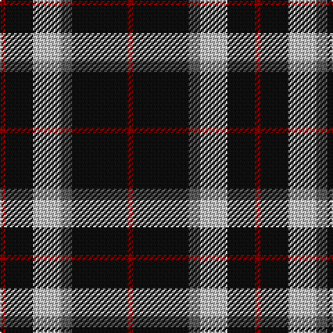

**Bands:** [RKBWKR](/stripes/rkbwkr/) · **Stripes:** [R K N LB K R](/stripes/stripes6/) R K N LB K R

This was sourced from register-of-tartans.  It is a [6 band tartan](/bands/bands6/).

Original link https://www.tartanregister.gov.uk/tartanDetails.aspx?ref=484

## Attestations

This cloth appears in 2 source records; the oldest owns this page.

- 01/01/1997 — Callaway (Corporate) (register-of-tartans, [record](https://www.tartanregister.gov.uk/tartanDetails.aspx?ref=484))
- pre 1997 — Callaway (Corporate) (tartans-authority, [record](http://www.tartansauthority.com/tartan-ferret/display/2313/))

## Register references

External register numbers recorded for this tartan.

- Scottish Register of Tartans: [484](https://www.tartanregister.gov.uk/tartanDetails.aspx?ref=484)
- Scottish Tartans Authority (ITI): 2313
- Scottish Tartans World Register: 2313

## Thread count
DR/4 K20 N20 Na8 K40 DR/4

## Palette
Each colour and its ΔE from the base-6 reference it is a variant of.

| Colour | Shade | Base | ΔE (OKLab) |
|---|---|---|---|
| DR | <code style="background-color:#880000;">#880000</code> `#880000` | R <code style="background-color:#CC0000;">#CC0000</code> | 0.15 |
| K | <code style="background-color:#101010;">#101010</code> `#101010` | K <code style="background-color:#000000;">#000000</code> | 0.17 |
| N | <code style="background-color:#C0C0C0;">#C0C0C0</code> `#C0C0C0` | W <code style="background-color:#F7F7F7;">#F7F7F7</code> | 0.17 |
| Na | <code style="background-color:#5C5C5C;">#5C5C5C</code> `#5C5C5C` | B <code style="background-color:#2A418A;">#2A418A</code> | 0.15 |

# Sample pattern

## Nearest tartans

The nearest existing variants by ΔTartan distance.

1. [Dunfermline Athletic (2008) (Corp)](/setts/s7/k11w1k1w1k4o8r1~x8/) — ΔT 0.80
1. [Sanley-Cantamessa (Personal)](/setts/s7/k16w15k4dt12k22r2k6~x2/) — ΔT 1.01
1. [Wild Highlanders (Corporate)](/setts/s7/k36w3k10w3g28r6k18~x2/) — ΔT 1.01
1. [Sanley-Cantamessa](/setts/s7/k16w15k4db12k22r2k6~x2/) — ΔT 1.01
1. [Perry, Alex (Personal)](/setts/s4/k62n24lo5w8~x2/) — ΔT 1.02
1. [MacSween, Black (Personal)](/setts/s6/k2o6k2o6k12r1~x4/) — ΔT 1.17
1. [St. Eloi (Corporate)](/setts/s4/r3lo2k10w1~x6/) — ΔT 1.19
1. [Callaway Corporate Tartan Tartan Number: 2313. Earliest known date: pre 1997 Designed by Arthur Bell (Scotch Tweeds) for a golf course and golf merchandising company in California. See products available Copyright © Blair Urquhart, Comrie, 2015](/setts/s10/k10n2lb5k5r1k5lb5n2k10r1~x4/) — ΔT 1.19
1. [Bro-Wened](/setts/s6/k43r10w3k3w15db3~x2/) — ΔT 1.28
1. [Calgary Firefighters (Corporate)](/setts/s5/o4k48o16r12db3~x2/) — ΔT 1.29

## Neighbour map

Every grey dot is one of 14313 variants placed by the first two principal components of the ΔTartan feature space (44% of its variance). Red is this tartan; blue dots are its nearest — click one to open its page.

<svg viewBox="0 0 640 380" role="img" style="max-width:100%;height:auto;border:1px solid #e0e0e0;border-radius:4px;display:block" xmlns="http://www.w3.org/2000/svg"><image href="/nn/cloud.v1.png" width="640" height="380"/><a href="/setts/s7/k11w1k1w1k4o8r1~x8/"><circle cx="311.9" cy="182.8" r="4" fill="#3465a4"><title>Dunfermline Athletic (2008) (Corp)</title></circle></a><a href="/setts/s7/k16w15k4dt12k22r2k6~x2/"><circle cx="277.6" cy="211.4" r="4" fill="#3465a4"><title>Sanley-Cantamessa (Personal)</title></circle></a><a href="/setts/s7/k36w3k10w3g28r6k18~x2/"><circle cx="329.2" cy="209.2" r="4" fill="#3465a4"><title>Wild Highlanders (Corporate)</title></circle></a><a href="/setts/s7/k16w15k4db12k22r2k6~x2/"><circle cx="279.0" cy="211.6" r="4" fill="#3465a4"><title>Sanley-Cantamessa</title></circle></a><a href="/setts/s4/k62n24lo5w8~x2/"><circle cx="342.7" cy="212.2" r="4" fill="#3465a4"><title>Perry, Alex (Personal)</title></circle></a><a href="/setts/s6/k2o6k2o6k12r1~x4/"><circle cx="328.1" cy="224.1" r="4" fill="#3465a4"><title>MacSween, Black (Personal)</title></circle></a><a href="/setts/s4/r3lo2k10w1~x6/"><circle cx="322.5" cy="218.6" r="4" fill="#3465a4"><title>St. Eloi (Corporate)</title></circle></a><a href="/setts/s10/k10n2lb5k5r1k5lb5n2k10r1~x4/"><circle cx="308.6" cy="199.5" r="4" fill="#3465a4"><title>Callaway Corporate Tartan Tartan Number: 2313. Earliest known date: pre 1997 Designed by Arthur Bell (Scotch Tweeds) for a golf course and golf merchandising company in California. See products available Copyright © Blair Urquhart, Comrie, 2015</title></circle></a><a href="/setts/s6/k43r10w3k3w15db3~x2/"><circle cx="317.3" cy="162.4" r="4" fill="#3465a4"><title>Bro-Wened</title></circle></a><a href="/setts/s5/o4k48o16r12db3~x2/"><circle cx="336.2" cy="189.0" r="4" fill="#3465a4"><title>Calgary Firefighters (Corporate)</title></circle></a><circle cx="309.4" cy="209.1" r="5" fill="#c00000"/></svg>

ID: /setts/s6/r1k10n2lb5k5r1~x4/
