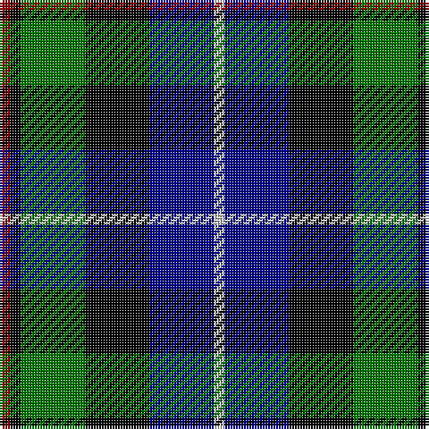

In pattern [RKGKBW](/patterns/rkgkbw/).

This was sourced from register-of-tartans.  It is a [6 stripes tartan](/stripes/stripes6/).

Original link https://www.tartanregister.gov.uk/tartanDetails.aspx?ref=1295

## Attestations

This cloth appears in 2 source records; the oldest owns this page.

- 01/01/1998 — Gaines Center for the Humanities (register-of-tartans, [record](https://www.tartanregister.gov.uk/tartanDetails.aspx?ref=1295))
- 1998 — Gaines Center for Humanities (Corp) (tartans-authority, [record](http://www.tartansauthority.com/tartan-ferret/display/4190/))

## Thread count
DR/4 K4 G24 K24 DB24 N/4

## Palette
Each colour and its ΔE from the base-6 reference it is a variant of.

| Colour | Shade | Base | ΔE (OKLab) |
|---|---|---|---|
| DB | <code style="background-color:#00008C;">#00008C</code> `#00008C` | B <code style="background-color:#2A418A;">#2A418A</code> | 0.13 |
| DR | <code style="background-color:#8C0000;">#8C0000</code> `#8C0000` | R <code style="background-color:#CC0000;">#CC0000</code> | 0.14 |
| G | <code style="background-color:#007800;">#007800</code> `#007800` | G <code style="background-color:#006100;">#006100</code> | 0.07 |
| K | <code style="background-color:#000000;">#000000</code> `#000000` | K <code style="background-color:#000000;">#000000</code> | 0.00 |
| N | <code style="background-color:#C8C8C8;">#C8C8C8</code> `#C8C8C8` | W <code style="background-color:#F7F7F7;">#F7F7F7</code> | 0.14 |

# Sample pattern

## Nearest tartans

The nearest existing variants by ΔTartan distance.

1. [MacNeil of Barra](/setts/s6/w3b14k12g12k2y3~b000064-g004c00-k000000-wd0d0d0-yc8c800/) — ΔT 0.47
1. [MacNiel of Barra](/setts/s6/y3k2g12k12b14ya3x2~b000052-g11450d-k000000-yaaaa00-yaaaaaaa/) — ΔT 0.69
1. [MacNiel of Barra](/setts/s6/y3k2g12k12b14ya3~b000052-g11450d-k000000-yaaaa00-yaaaaaaa/) — ΔT 0.69
1. [Davidson of Tulloch](/setts/s5/r1b6k3g6w1~b00004c-g004c00-k000000-rc80000-wd0d0d0/) — ΔT 0.73
1. [Wellington](/setts/s6/b1r1b6k6g6w1x2~b304080-g008000-k000000-rc00000-we0e0e0/) — ΔT 0.73
1. [Hogarth, of Firhill](/setts/s7/b4g14y2k14ba14k2ba3x2~b5480b0-ba304080-g008000-k000000-yf0c000/) — ΔT 0.73
1. [Hogarth, of Firhill](/setts/s7/b2g6y1k6ba6k1ba1x2~b8080d0-ba304080-g008000-k000000-yf0c000/) — ΔT 0.75
1. [Royal Highland](/setts/s6/y4g17k17b17r3b3x2~b304080-g008000-k000000-rc00000-yb0b0b0/) — ΔT 0.78
1. [Forbo Nairn](/setts/s5/b2g8k7ba12r2x4~b5480b0-ba000050-g008000-k000000-r800000/) — ΔT 0.80
1. [Leslie Hunting](/setts/s6/r2b8k8w1g8k1x2~b000064-g004c00-k000000-rc80000-wd0d0d0/) — ΔT 0.85

## Neighbour map

Every grey dot is one of 15726 variants placed by the first two principal components of the ΔTartan feature space (44% of its variance). Red is this tartan; blue dots are its nearest — click one to open its page.

<svg viewBox="0 0 640 380" role="img" style="max-width:100%;height:auto;border:1px solid #e0e0e0;border-radius:4px;display:block" xmlns="http://www.w3.org/2000/svg"><image href="/nn/cloud.v1.png" width="640" height="380"/><a href="/setts/s6/w3b14k12g12k2y3~b000064-g004c00-k000000-wd0d0d0-yc8c800/"><circle cx="83.3" cy="221.0" r="4" fill="#3465a4"><title>MacNeil of Barra</title></circle></a><a href="/setts/s6/y3k2g12k12b14ya3x2~b000052-g11450d-k000000-yaaaa00-yaaaaaaa/"><circle cx="96.0" cy="226.2" r="4" fill="#3465a4"><title>MacNiel of Barra</title></circle></a><a href="/setts/s6/y3k2g12k12b14ya3~b000052-g11450d-k000000-yaaaa00-yaaaaaaa/"><circle cx="96.0" cy="226.2" r="4" fill="#3465a4"><title>MacNiel of Barra</title></circle></a><a href="/setts/s5/r1b6k3g6w1~b00004c-g004c00-k000000-rc80000-wd0d0d0/"><circle cx="122.0" cy="240.3" r="4" fill="#3465a4"><title>Davidson of Tulloch</title></circle></a><a href="/setts/s6/b1r1b6k6g6w1x2~b304080-g008000-k000000-rc00000-we0e0e0/"><circle cx="97.9" cy="217.0" r="4" fill="#3465a4"><title>Wellington</title></circle></a><a href="/setts/s7/b4g14y2k14ba14k2ba3x2~b5480b0-ba304080-g008000-k000000-yf0c000/"><circle cx="96.9" cy="204.4" r="4" fill="#3465a4"><title>Hogarth, of Firhill</title></circle></a><a href="/setts/s7/b2g6y1k6ba6k1ba1x2~b8080d0-ba304080-g008000-k000000-yf0c000/"><circle cx="78.9" cy="209.0" r="4" fill="#3465a4"><title>Hogarth, of Firhill</title></circle></a><a href="/setts/s6/y4g17k17b17r3b3x2~b304080-g008000-k000000-rc00000-yb0b0b0/"><circle cx="89.4" cy="223.4" r="4" fill="#3465a4"><title>Royal Highland</title></circle></a><a href="/setts/s5/b2g8k7ba12r2x4~b5480b0-ba000050-g008000-k000000-r800000/"><circle cx="120.1" cy="244.6" r="4" fill="#3465a4"><title>Forbo Nairn</title></circle></a><a href="/setts/s6/r2b8k8w1g8k1x2~b000064-g004c00-k000000-rc80000-wd0d0d0/"><circle cx="120.8" cy="216.9" r="4" fill="#3465a4"><title>Leslie Hunting</title></circle></a><circle cx="98.5" cy="221.8" r="5" fill="#c00000"/></svg>

ID: /setts/s6/r1k1g6k6b6w1x4~b00008c-g007800-k000000-r8c0000-wc8c8c8/
