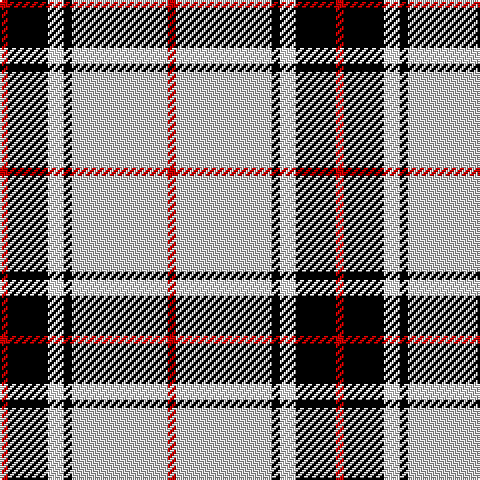

**Bands:** [RKWKWR](/stripes/rkwkwr/) · **Stripes:** [R K W K LB R](/stripes/stripes6/) R K W K LB R

This was sourced from register-of-tartans.  It is a [6 band tartan](/bands/bands6/).

Original link https://www.tartanregister.gov.uk/tartanDetails.aspx?ref=3617

## Attestations

This cloth appears in 2 source records; the oldest owns this page.

- 01/01/1996 — Rui (Personal) (register-of-tartans, [record](https://www.tartanregister.gov.uk/tartanDetails.aspx?ref=3617))
- 1996 — Rui (Personal) (tartans-authority, [record](http://www.tartansauthority.com/tartan-ferret/display/5391/))

## Register references

External register numbers recorded for this tartan.

- Scottish Register of Tartans: [3617](https://www.tartanregister.gov.uk/tartanDetails.aspx?ref=3617)
- Scottish Tartans Authority (ITI): 5391

## Thread count
R/4 N48 K4 W8 K20 R/4

## Palette
Each colour and its ΔE from the base-6 reference it is a variant of.

| Colour | Shade | Base | ΔE (OKLab) |
|---|---|---|---|
| K | <code style="background-color:#000000;">#000000</code> `#000000` | K <code style="background-color:#000000;">#000000</code> | 0.00 |
| N | <code style="background-color:#C8C8C8;">#C8C8C8</code> `#C8C8C8` | W <code style="background-color:#F7F7F7;">#F7F7F7</code> | 0.14 |
| R | <code style="background-color:#C80000;">#C80000</code> `#C80000` | R <code style="background-color:#CC0000;">#CC0000</code> | 0.01 |
| W | <code style="background-color:#FCFCFC;">#FCFCFC</code> `#FCFCFC` | W <code style="background-color:#F7F7F7;">#F7F7F7</code> | 0.01 |

# Sample pattern

## Nearest tartans

The nearest existing variants by ΔTartan distance.

1. [MacPherson Dress (1951)](/setts/s7/w3p3w30k20w3k9ly3~x2/) — ΔT 0.74
1. [MacPherson - 1842 (VS) Dress](/setts/s7/w1m2w17k11w2k4ly1~x4/) — ΔT 0.80
1. [MacPherson #10](/setts/s6/r1w14k6w1k3ly1~x4/) — ΔT 0.84
1. [Brodie (WCWM)](/setts/s6/r2w30k15lo2k15r2~x2/) — ΔT 1.04
1. [Clemens and August (Personal)](/setts/s8/ly35db3r4db3r8db30w3db4~x2/) — ΔT 1.18
1. [Hannay (Clan)](/setts/s10/k9lb4k2lb4k2lb30k9lb4b14lo2~x2/) — ΔT 1.23
1. [Gangs of New York Fashion Check Tartan Tartan Number: 8248. Earliest known date: 8th July 2010 The period was the 1860s, a rather attractive time for men, all frock coats and top hats. Narrow-leg trousers and checks were fashionable. I accentuated Daniel's height and slenderness by extending his top hat, making his trousers thinner and his shoes longer. The other members of his gang were dressed along the same lines but not so finely: no one had the same presence as Bill the Butcher. See products available Copyright © Blair Urquhart, Comrie, 2015](/setts/s6/w5k20w2r5w20r2~x2/) — ΔT 1.23
1. [Virginia Commonwealth University](/setts/s7/k30w2lr4lo10w9k3lr5~x2/) — ΔT 1.24
1. [Lootens Jensen (Personal)](/setts/s8/w26k8w3k5db3r5o3k4~x2/) — ΔT 1.24
1. [MacPherson Dress, Blue (Dance)](/setts/s7/w5r3w26k21w3k8ly3~x2/) — ΔT 1.26

## Neighbour map

Every grey dot is one of 14299 variants placed by the first two principal components of the ΔTartan feature space (44% of its variance). Red is this tartan; blue dots are its nearest — click one to open its page.

<svg viewBox="0 0 640 380" role="img" style="max-width:100%;height:auto;border:1px solid #e0e0e0;border-radius:4px;display:block" xmlns="http://www.w3.org/2000/svg"><image href="/nn/cloud.v1.png" width="640" height="380"/><a href="/setts/s7/w3p3w30k20w3k9ly3~x2/"><circle cx="247.6" cy="163.6" r="4" fill="#3465a4"><title>MacPherson Dress (1951)</title></circle></a><a href="/setts/s7/w1m2w17k11w2k4ly1~x4/"><circle cx="281.9" cy="139.9" r="4" fill="#3465a4"><title>MacPherson - 1842 (VS) Dress</title></circle></a><a href="/setts/s6/r1w14k6w1k3ly1~x4/"><circle cx="301.4" cy="149.5" r="4" fill="#3465a4"><title>MacPherson #10</title></circle></a><a href="/setts/s6/r2w30k15lo2k15r2~x2/"><circle cx="242.9" cy="159.2" r="4" fill="#3465a4"><title>Brodie (WCWM)</title></circle></a><a href="/setts/s8/ly35db3r4db3r8db30w3db4~x2/"><circle cx="227.4" cy="145.3" r="4" fill="#3465a4"><title>Clemens and August (Personal)</title></circle></a><a href="/setts/s10/k9lb4k2lb4k2lb30k9lb4b14lo2~x2/"><circle cx="252.5" cy="131.2" r="4" fill="#3465a4"><title>Hannay (Clan)</title></circle></a><a href="/setts/s6/w5k20w2r5w20r2~x2/"><circle cx="250.9" cy="187.6" r="4" fill="#3465a4"><title>Gangs of New York Fashion Check Tartan Tartan Number: 8248. Earliest known date: 8th July 2010 The period was the 1860s, a rather attractive time for men, all frock coats and top hats. Narrow-leg trousers and checks were fashionable. I accentuated Daniel's height and slenderness by extending his top hat, making his trousers thinner and his shoes longer. The other members of his gang were dressed along the same lines but not so finely: no one had the same presence as Bill the Butcher. See products available Copyright © Blair Urquhart, Comrie, 2015</title></circle></a><a href="/setts/s7/k30w2lr4lo10w9k3lr5~x2/"><circle cx="248.2" cy="152.4" r="4" fill="#3465a4"><title>Virginia Commonwealth University</title></circle></a><a href="/setts/s8/w26k8w3k5db3r5o3k4~x2/"><circle cx="204.0" cy="140.8" r="4" fill="#3465a4"><title>Lootens Jensen (Personal)</title></circle></a><a href="/setts/s7/w5r3w26k21w3k8ly3~x2/"><circle cx="228.5" cy="177.6" r="4" fill="#3465a4"><title>MacPherson Dress, Blue (Dance)</title></circle></a><circle cx="260.8" cy="152.2" r="5" fill="#c00000"/></svg>

ID: /setts/s6/r1lb12k1w2k5r1~x4/
