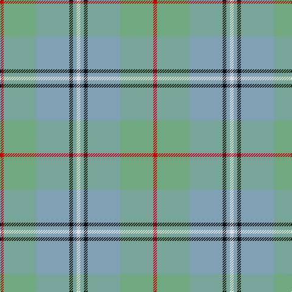

This page is one **sett** — a single exact thread-count. It belongs to the [tartan](/tartans/r1lg9b9k1b1ln1/)
(the same proportion at any scale), whose colour order is pattern [RYYKYW](/stripes/ryykyw/).

Sourced from tartans-authority.  It is a [6 stripe tartan](/stripes/stripes6/).

Original link http://www.tartansauthority.com/tartan-ferret/display/1460/

## Thread count
R/6 LG54 B54 K6 B6 LN/6

## Palette
Each colour and the base-6 reference it is a variant of.

| Colour | Shade | Base |
|---|---|---|
| B | <code style="background-color:#80A0B4;">#80A0B4</code> `oklch(68.9% 0.046 235.8)` <small>#80A0B4</small> | Y <code style="background-color:#F2BF00;">#F2BF00</code> |
| K | <code style="background-color:#101010;">#101010</code> `oklch(17.3% 0.000 89.9)` <small>#101010</small> | K <code style="background-color:#000000;">#000000</code> |
| LG | <code style="background-color:#70A880;">#70A880</code> `oklch(68.1% 0.083 152.7)` <small>#70A880</small> | Y <code style="background-color:#F2BF00;">#F2BF00</code> |
| LN | <code style="background-color:#E0E0E0;">#E0E0E0</code> `oklch(90.7% 0.000 89.9)` <small>#E0E0E0</small> | W <code style="background-color:#F7F7F7;">#F7F7F7</code> |
| R | <code style="background-color:#C80000;">#C80000</code> `oklch(52.3% 0.215 29.2)` <small>#C80000</small> | R <code style="background-color:#CC0000;">#CC0000</code> |

# Sample pattern

## Nearest tartans

The nearest existing variants by ΔTartan distance, with this tartan at the top so the swatches line up against it.

ΔTartan

Tartan

Sett

—

<a href="/ttd/edit/#slug=r1lg9lr9k1lr1w1~x6">Irving of Glentulchan (Personal)</a> <a class="nn-out" href="/setts/s6/r1lg9lr9k1lr1w1~x6/" title="open its dictionary page">↗</a>

1.27

<a href="/ttd/edit/#slug=lg9lr9k1lr1w1lr1k1lr9lg9r1~x6">Irving of Glentulchan (Personal)</a> <a class="nn-out" href="/setts/s10/lg9lr9k1lr1w1lr1k1lr9lg9r1~x6/" title="open its dictionary page">↗</a>

1.34

<a href="/ttd/edit/#slug=g2t15lr5g2t2g7w2~x4">Chambers Bay</a> <a class="nn-out" href="/setts/s7/g2t15lr5g2t2g7w2~x4/" title="open its dictionary page">↗</a>

1.52

<a href="/ttd/edit/#slug=k3lr15t3lr4t3lr4t10y30w3~x2">Highland Road (Fashion)</a> <a class="nn-out" href="/setts/s9/k3lr15t3lr4t3lr4t10y30w3~x2/" title="open its dictionary page">↗</a>

1.54

<a href="/ttd/edit/#slug=ly30g3t2lb2t30lo4~x2">South Aiken Presby Church (Corporate</a> <a class="nn-out" href="/setts/s6/ly30g3t2lb2t30lo4~x2/" title="open its dictionary page">↗</a>

1.61

<a href="/ttd/edit/#slug=y25p3y8p13ly8lr2ly11y2p3~x2">Organic</a> <a class="nn-out" href="/setts/s9/y25p3y8p13ly8lr2ly11y2p3~x2/" title="open its dictionary page">↗</a>

1.71

<a href="/ttd/edit/#slug=lr30w3lr3w3lr12n30o3n5~x2">Dama Classic (Fashion)</a> <a class="nn-out" href="/setts/s8/lr30w3lr3w3lr12n30o3n5~x2/" title="open its dictionary page">↗</a>

1.77

<a href="/ttd/edit/#slug=w1dp1lb7o4lb1w1~x4">Lochnagar Trade Tartan Tartan Number: 1771. Earliest known date: pre 2003 Colours represents the Scottish hills, the water, and the heather. See products available Copyright © Blair Urquhart, Comrie, 2015</a> <a class="nn-out" href="/setts/s6/w1dp1lb7o4lb1w1~x4/" title="open its dictionary page">↗</a>

1.77

<a href="/ttd/edit/#slug=t3k3t21g49t21k3t3w3~x2">Irvine of Drum</a> <a class="nn-out" href="/setts/s8/t3k3t21g49t21k3t3w3~x2/" title="open its dictionary page">↗</a>

1.78

<a href="/ttd/edit/#slug=b5lg2b2lg9k3b9g3b3g25lr2~x2">Un-named (D C Dalgliesh) #2</a> <a class="nn-out" href="/setts/s10/b5lg2b2lg9k3b9g3b3g25lr2~x2/" title="open its dictionary page">↗</a>

1.84

<a href="/ttd/edit/#slug=n10lr3o3r1g1~x10">Bagpipe Shop, The (Corporate)</a> <a class="nn-out" href="/setts/s5/n10lr3o3r1g1~x10/" title="open its dictionary page">↗</a>

## Neighbour map

Every grey dot is one of 14299 variants placed by the first two principal components of the ΔTartan feature space (44% of its variance). Red is this tartan; blue dots are its nearest — click one to open its page.

<svg viewBox="0 0 640 380" role="img" style="max-width:100%;height:auto;border:1px solid #e0e0e0;border-radius:4px;display:block" xmlns="http://www.w3.org/2000/svg"><image href="/nn/cloud.v1.png" width="640" height="380"/><a href="/setts/s10/lg9lr9k1lr1w1lr1k1lr9lg9r1~x6/"><circle cx="315.3" cy="210.1" r="4" fill="#3465a4"><title>Irving of Glentulchan (Personal)</title></circle></a><a href="/setts/s7/g2t15lr5g2t2g7w2~x4/"><circle cx="305.7" cy="243.2" r="4" fill="#3465a4"><title>Chambers Bay</title></circle></a><a href="/setts/s9/k3lr15t3lr4t3lr4t10y30w3~x2/"><circle cx="268.2" cy="201.8" r="4" fill="#3465a4"><title>Highland Road (Fashion)</title></circle></a><a href="/setts/s6/ly30g3t2lb2t30lo4~x2/"><circle cx="305.2" cy="176.8" r="4" fill="#3465a4"><title>South Aiken Presby Church (Corporate</title></circle></a><a href="/setts/s9/y25p3y8p13ly8lr2ly11y2p3~x2/"><circle cx="269.8" cy="190.4" r="4" fill="#3465a4"><title>Organic</title></circle></a><a href="/setts/s8/lr30w3lr3w3lr12n30o3n5~x2/"><circle cx="344.0" cy="207.7" r="4" fill="#3465a4"><title>Dama Classic (Fashion)</title></circle></a><a href="/setts/s6/w1dp1lb7o4lb1w1~x4/"><circle cx="318.5" cy="229.7" r="4" fill="#3465a4"><title>Lochnagar Trade Tartan Tartan Number: 1771. Earliest known date: pre 2003 Colours represents the Scottish hills, the water, and the heather. See products available Copyright © Blair Urquhart, Comrie, 2015</title></circle></a><a href="/setts/s8/t3k3t21g49t21k3t3w3~x2/"><circle cx="367.5" cy="200.7" r="4" fill="#3465a4"><title>Irvine of Drum</title></circle></a><a href="/setts/s10/b5lg2b2lg9k3b9g3b3g25lr2~x2/"><circle cx="286.6" cy="189.6" r="4" fill="#3465a4"><title>Un-named (D C Dalgliesh) #2</title></circle></a><a href="/setts/s5/n10lr3o3r1g1~x10/"><circle cx="364.1" cy="239.3" r="4" fill="#3465a4"><title>Bagpipe Shop, The (Corporate)</title></circle></a><circle cx="299.5" cy="213.9" r="5" fill="#c00000"/></svg>

ID: /setts/s6/r1lg9lr9k1lr1w1~x6/
