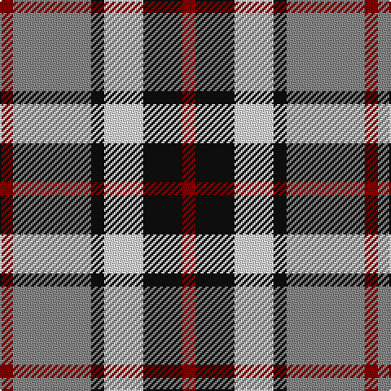

This page is one **sett** — a single exact thread-count. It belongs to the [tartan](/tartans/r1o6k1w3k3r1/)
(the same proportion at any scale), whose colour order is pattern [RKWKRR](/stripes/rkwkrr/).

Sourced from register-of-tartans.  It is a [6 stripe tartan](/stripes/stripes6/).

Original link https://www.tartanregister.gov.uk/tartanDetails.aspx?ref=4111

## Also known as

This cloth is also recorded under:

- Thompson, Grey Dress

2 attestations — the source records this cloth was collapsed from (oldest owns this page)

<ul>
<li>01/01/1984 — Thompson Grey Dress (register-of-tartans, <a href="https://www.tartanregister.gov.uk/tartanDetails.aspx?ref=4111">record</a>)</li>
<li>pre 1986 — Thompson, Grey Dress (Fashion) (tartans-authority, <a href="http://www.tartansauthority.com/tartan-ferret/display/1611/">record</a>)</li>
</ul>

## Register references

External register numbers recorded for this tartan.

- Scottish Register of Tartans: [4111](https://www.tartanregister.gov.uk/tartanDetails.aspx?ref=4111)
- Scottish Tartans Authority (ITI): 1611
- Scottish Tartans World Register: 1611

## Thread count
DR/8 N48 K8 LN24 K24 DR/8

## Palette

Palette: <strong>Tartan Register</strong>
<table><thead><tr><th>Colour</th><th>Threads</th><th>Shade</th><th>Base</th><th>OKLCh</th></tr></thead><tbody><tr><td>DR/</td><td style="text-align:right;font-variant-numeric:tabular-nums">8</td><td><code style="background-color:#880000;">#880000</code> <small style="color:#888">#880000</small></td><td>R <code style="background-color:#CC0000;">#CC0000</code></td><td><small style="color:#888">oklch(39.4% 0.162 29.2)</small></td></tr><tr><td>N</td><td style="text-align:right;font-variant-numeric:tabular-nums">48</td><td><code style="background-color:#888888;">#888888</code> <small style="color:#888">#888888</small></td><td>R <code style="background-color:#CC0000;">#CC0000</code></td><td><small style="color:#888">oklch(62.7% 0.000 89.9)</small></td></tr><tr><td>K</td><td style="text-align:right;font-variant-numeric:tabular-nums">8</td><td><code style="background-color:#101010;">#101010</code> <small style="color:#888">#101010</small></td><td>K <code style="background-color:#000000;">#000000</code></td><td><small style="color:#888">oklch(17.3% 0.000 89.9)</small></td></tr><tr><td>LN</td><td style="text-align:right;font-variant-numeric:tabular-nums">24</td><td><code style="background-color:#E0E0E0;">#E0E0E0</code> <small style="color:#888">#E0E0E0</small></td><td>W <code style="background-color:#F7F7F7;">#F7F7F7</code></td><td><small style="color:#888">oklch(90.7% 0.000 89.9)</small></td></tr><tr><td>K</td><td style="text-align:right;font-variant-numeric:tabular-nums">24</td><td><code style="background-color:#101010;">#101010</code> <small style="color:#888">#101010</small></td><td>K <code style="background-color:#000000;">#000000</code></td><td><small style="color:#888">oklch(17.3% 0.000 89.9)</small></td></tr><tr><td>DR/</td><td style="text-align:right;font-variant-numeric:tabular-nums">8</td><td><code style="background-color:#880000;">#880000</code> <small style="color:#888">#880000</small></td><td>R <code style="background-color:#CC0000;">#CC0000</code></td><td><small style="color:#888">oklch(39.4% 0.162 29.2)</small></td></tr></tbody></table>

# Sample pattern

## Nearest tartans

The nearest existing variants by ΔTartan distance, with this tartan at the top so the swatches line up against it.

ΔTartan

Tartan

Sett

—

<a href="/ttd/edit/#slug=r1o6k1w3k3r1~x8">Thompson Grey Dress</a> <a class="nn-out" href="/setts/s6/r1o6k1w3k3r1~x8/" title="open its dictionary page">↗</a>

0.62

<a href="/ttd/edit/#slug=r3w8db4dg14r4db2~x4">MacKintosh Dress (Scott Adie)</a> <a class="nn-out" href="/setts/s6/r3w8db4dg14r4db2~x4/" title="open its dictionary page">↗</a>

0.69

<a href="/ttd/edit/#slug=r6k14r6dg14w27k4">Fraser Dress</a> <a class="nn-out" href="/setts/s6/r6k14r6dg14w27k4/" title="open its dictionary page">↗</a>

0.80

<a href="/ttd/edit/#slug=w23t6w6r5k35r10~x2">Merrilees</a> <a class="nn-out" href="/setts/s6/w23t6w6r5k35r10~x2/" title="open its dictionary page">↗</a>

0.82

<a href="/ttd/edit/#slug=r2o20k5w10k10r2~x2">Thompson Grey Family Tartan Tartan Number: 1611. Earliest known date: pre 2003 Designed for Lord Thomson of Fleet in 1958 based on a sample in the Moy Hall collection dating from the mid 19th century. The tartan is also suitable for MacTavishs and Thompsons, who claim descent from the Clan MacIntosh. See products available Copyright © Blair Urquhart, Comrie, 2015</a> <a class="nn-out" href="/setts/s6/r2o20k5w10k10r2~x2/" title="open its dictionary page">↗</a>

0.92

<a href="/ttd/edit/#slug=k3g25o3k15lr24g3~x2">Un-named (D C Dalgliesh) #3</a> <a class="nn-out" href="/setts/s6/k3g25o3k15lr24g3~x2/" title="open its dictionary page">↗</a>

0.94

<a href="/ttd/edit/#slug=k23b6k6r5w35r10~x2">Merrilees Dress (Dance)</a> <a class="nn-out" href="/setts/s6/k23b6k6r5w35r10~x2/" title="open its dictionary page">↗</a>

0.97

<a href="/ttd/edit/#slug=r6k14r6g14w27k4">Fraser, dress</a> <a class="nn-out" href="/setts/s6/r6k14r6g14w27k4/" title="open its dictionary page">↗</a>

0.99

<a href="/ttd/edit/#slug=lb13k3lb3k3lb3k15lo18r3~x2">Holden Beige (Corporate)</a> <a class="nn-out" href="/setts/s8/lb13k3lb3k3lb3k15lo18r3~x2/" title="open its dictionary page">↗</a>

1.00

<a href="/ttd/edit/#slug=r3y27k6lo13k14r3~x2">Thompson/Thomson/MacTavish special grey</a> <a class="nn-out" href="/setts/s6/r3y27k6lo13k14r3~x2/" title="open its dictionary page">↗</a>

1.02

<a href="/ttd/edit/#slug=r2lo20k5w10k10w2~x2">Thompson Camel Clan Tartan Tartan Number: 2421. Earliest known date: 1967 Designed by Scotty Thompson. It it a simple colour variation on the usual blue Thompson, but is often confused with the Burberry Check. See products available Copyright © Blair Urquhart, Comrie, 2015</a> <a class="nn-out" href="/setts/s6/r2lo20k5w10k10w2~x2/" title="open its dictionary page">↗</a>

## Neighbour map

Every grey dot is one of 14299 variants placed by the first two principal components of the ΔTartan feature space (44% of its variance). Red is this tartan; blue dots are its nearest — click one to open its page.

<svg viewBox="0 0 640 380" role="img" style="max-width:100%;height:auto;border:1px solid #e0e0e0;border-radius:4px;display:block" xmlns="http://www.w3.org/2000/svg"><image href="/nn/cloud.v1.png" width="640" height="380"/><a href="/setts/s6/r3w8db4dg14r4db2~x4/"><circle cx="150.6" cy="213.9" r="4" fill="#3465a4"><title>MacKintosh Dress (Scott Adie)</title></circle></a><a href="/setts/s6/r6k14r6dg14w27k4/"><circle cx="120.4" cy="207.7" r="4" fill="#3465a4"><title>Fraser Dress</title></circle></a><a href="/setts/s6/w23t6w6r5k35r10~x2/"><circle cx="157.3" cy="193.5" r="4" fill="#3465a4"><title>Merrilees</title></circle></a><a href="/setts/s6/r2o20k5w10k10r2~x2/"><circle cx="174.6" cy="192.3" r="4" fill="#3465a4"><title>Thompson Grey Family Tartan Tartan Number: 1611. Earliest known date: pre 2003 Designed for Lord Thomson of Fleet in 1958 based on a sample in the Moy Hall collection dating from the mid 19th century. The tartan is also suitable for MacTavishs and Thompsons, who claim descent from the Clan MacIntosh. See products available Copyright © Blair Urquhart, Comrie, 2015</title></circle></a><a href="/setts/s6/k3g25o3k15lr24g3~x2/"><circle cx="180.1" cy="205.9" r="4" fill="#3465a4"><title>Un-named (D C Dalgliesh) #3</title></circle></a><a href="/setts/s6/k23b6k6r5w35r10~x2/"><circle cx="154.5" cy="190.3" r="4" fill="#3465a4"><title>Merrilees Dress (Dance)</title></circle></a><a href="/setts/s6/r6k14r6g14w27k4/"><circle cx="113.2" cy="207.4" r="4" fill="#3465a4"><title>Fraser, dress</title></circle></a><a href="/setts/s8/lb13k3lb3k3lb3k15lo18r3~x2/"><circle cx="128.9" cy="191.2" r="4" fill="#3465a4"><title>Holden Beige (Corporate)</title></circle></a><a href="/setts/s6/r3y27k6lo13k14r3~x2/"><circle cx="192.4" cy="206.6" r="4" fill="#3465a4"><title>Thompson/Thomson/MacTavish special grey</title></circle></a><a href="/setts/s6/r2lo20k5w10k10w2~x2/"><circle cx="176.4" cy="189.9" r="4" fill="#3465a4"><title>Thompson Camel Clan Tartan Tartan Number: 2421. Earliest known date: 1967 Designed by Scotty Thompson. It it a simple colour variation on the usual blue Thompson, but is often confused with the Burberry Check. See products available Copyright © Blair Urquhart, Comrie, 2015</title></circle></a><circle cx="144.8" cy="214.2" r="5" fill="#c00000"/></svg>

ID: /setts/s6/r1o6k1w3k3r1~x8/
