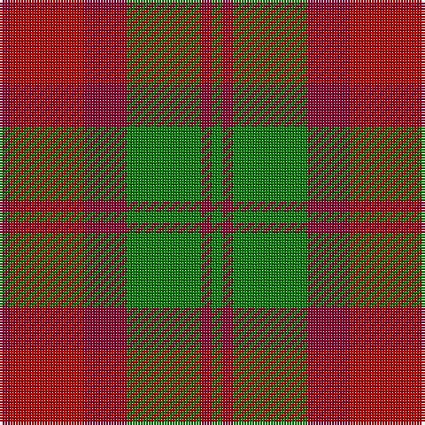

In pattern [GRGRRR](/stripes/grgrrr/).

This was sourced from weddslist.  It is a [6 stripe tartan](/stripes/stripes6/).

Original link http://www.weddslist.com/cgi-bin/tartans/pg.pl?source=sts

## Also known as

This cloth is also recorded under:

- MacNab, Variant

## Thread count
DR/4 R28 DR16 G28 DR4 G/4

## Palette
Each colour and the base-6 reference it is a variant of.

| Colour | Shade | Base |
|---|---|---|
| DR | <code style="background-color:#900030;">#900030</code> `oklch(41.6% 0.166 13.6)` <small>#900030</small> | R <code style="background-color:#CC0000;">#CC0000</code> |
| G | <code style="background-color:#008000;">#008000</code> `oklch(52.0% 0.177 142.5)` <small>#008000</small> | G <code style="background-color:#006100;">#006100</code> |
| R | <code style="background-color:#C00000;">#C00000</code> `oklch(50.7% 0.208 29.2)` <small>#C00000</small> | R <code style="background-color:#CC0000;">#CC0000</code> |

# Sample pattern

## Nearest tartans

The nearest existing variants by ΔTartan distance.

1. [MacNab #2](/setts/s6/g1m1g7m4r7m1~x4/) — ΔT 0.56
1. [Harmony 8](/setts/s5/dr2y10o15dr10y2~x4/) — ΔT 1.20
1. [Harmony 8](/setts/s5/dy2y10o15dy10y2~x4/) — ΔT 1.22
1. [Glen Esk (1993)](/setts/s7/dg2r1dg8r5y5r1y2~x4/) — ΔT 1.22
1. [Dewar (Name)](/setts/s6/dg1r1dg7r4r7r1~x6/) — ΔT 1.24
1. [Moray of Abercairney](/setts/s6/r8r1g4r1g1t2~x2/) — ΔT 1.27
1. [Moray of Abercairney](/setts/s5/r8r1g4r1db4~x2/) — ΔT 1.36
1. [Lennox](/setts/s7/r2r1r10r2g10lr1g2~x4/) — ΔT 1.38
1. [Unidentified 16](/setts/s6/r4g26r26p26r3p4~x2/) — ΔT 1.43
1. [Moray of Abercairney](/setts/s6/r8r1dg4r1dg1t2~x2/) — ΔT 1.45

## Neighbour map

Every grey dot is one of 14299 variants placed by the first two principal components of the ΔTartan feature space (44% of its variance). Red is this tartan; blue dots are its nearest — click one to open its page.

<svg viewBox="0 0 640 380" role="img" style="max-width:100%;height:auto;border:1px solid #e0e0e0;border-radius:4px;display:block" xmlns="http://www.w3.org/2000/svg"><image href="/nn/cloud.v1.png" width="640" height="380"/><a href="/setts/s6/g1m1g7m4r7m1~x4/"><circle cx="261.6" cy="251.4" r="4" fill="#3465a4"><title>MacNab #2</title></circle></a><a href="/setts/s5/dr2y10o15dr10y2~x4/"><circle cx="257.0" cy="276.7" r="4" fill="#3465a4"><title>Harmony 8</title></circle></a><a href="/setts/s5/dy2y10o15dy10y2~x4/"><circle cx="229.1" cy="262.0" r="4" fill="#3465a4"><title>Harmony 8</title></circle></a><a href="/setts/s7/dg2r1dg8r5y5r1y2~x4/"><circle cx="271.1" cy="257.8" r="4" fill="#3465a4"><title>Glen Esk (1993)</title></circle></a><a href="/setts/s6/dg1r1dg7r4r7r1~x6/"><circle cx="285.5" cy="263.6" r="4" fill="#3465a4"><title>Dewar (Name)</title></circle></a><a href="/setts/s6/r8r1g4r1g1t2~x2/"><circle cx="278.1" cy="214.5" r="4" fill="#3465a4"><title>Moray of Abercairney</title></circle></a><a href="/setts/s5/r8r1g4r1db4~x2/"><circle cx="242.3" cy="235.1" r="4" fill="#3465a4"><title>Moray of Abercairney</title></circle></a><a href="/setts/s7/r2r1r10r2g10lr1g2~x4/"><circle cx="285.0" cy="198.1" r="4" fill="#3465a4"><title>Lennox</title></circle></a><a href="/setts/s6/r4g26r26p26r3p4~x2/"><circle cx="240.3" cy="231.3" r="4" fill="#3465a4"><title>Unidentified 16</title></circle></a><a href="/setts/s6/r8r1dg4r1dg1t2~x2/"><circle cx="271.5" cy="208.2" r="4" fill="#3465a4"><title>Moray of Abercairney</title></circle></a><circle cx="251.9" cy="248.2" r="5" fill="#c00000"/></svg>

ID: /setts/s6/r1r7r4g7r1g1~x4/
