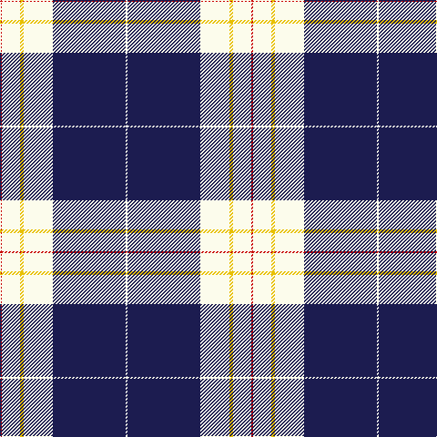

In pattern [RWYWBW](/stripes/rwywbw/).

This was sourced from tartans-authority.  It is a [6 stripe tartan](/stripes/stripes6/).

Original link http://www.tartansauthority.com/tartan-ferret/display/8018/

## Thread count
R/2 W20 Y4 W32 DB80 W/2

## Palette
Each colour and its ΔE from the base-6 reference it is a variant of.

| Colour | Shade | Base | ΔE (OKLab) |
|---|---|---|---|
| DB | <code style="background-color:#1C1C50;">#1C1C50</code> `#1C1C50` | B <code style="background-color:#2A418A;">#2A418A</code> | 0.14 |
| R | <code style="background-color:#C80000;">#C80000</code> `#C80000` | R <code style="background-color:#CC0000;">#CC0000</code> | 0.01 |
| W | <code style="background-color:#FCFCEC;">#FCFCEC</code> `#FCFCEC` | W <code style="background-color:#F7F7F7;">#F7F7F7</code> | 0.02 |
| Y | <code style="background-color:#E8C000;">#E8C000</code> `#E8C000` | Y <code style="background-color:#F2BF00;">#F2BF00</code> | 0.02 |

# Sample pattern

## Nearest tartans

The nearest existing variants by ΔTartan distance.

1. [MacPherson Dress (1842)](/setts/s7/w3r1w30k20w3k9ly1~x2/) — ΔT 1.10
1. [Gothenburg/Goteborg](/setts/s7/db26w28db14ly3k1ly2k1~x2/) — ΔT 1.16
1. [MacPherson Dress](/setts/s7/lb3r1lb30k20lb3k9ly1/) — ΔT 1.30
1. [Muir, John](/setts/s7/ly2w21db16b8db30w8db1~x2/) — ΔT 1.48
1. [Lochnagar Dress fashion Tartan Tartan Number: 8196. Earliest known date: Threadcount and colours aren't 100% original. Generated manually. See products available Copyright © Blair Urquhart, Comrie, 2015](/setts/s10/w8k1w40m1k16db16w6db3m3db6~x2/) — ΔT 1.50
1. [Richecourt, Baron of (Personal)](/setts/s7/w4k30r1k1r3w12ly3~x2/) — ΔT 1.54
1. [MacGregor Dress Blue Fancy Tartan Tartan Number: 6540. Earliest known date: 1975 A dancers tartan. See products available Copyright © Blair Urquhart, Comrie, 2015](/setts/s10/w52db22w6db8k1g3~x2/) — ΔT 1.59
1. [Gonzaga University’s True Blue and White](/setts/s7/w6db2w3db2g2db20r1~x2/) — ΔT 1.59
1. [NHS Grampian (Corporate)](/setts/s7/k4w1lb2w1k16t36lb4~x2/) — ΔT 1.62
1. [Baker Dress Family Tartan Tartan Number: 2180. Earliest known date: 1999 STS notes 'Sample in trade specimens file.' See products available Copyright © Blair Urquhart, Comrie, 2015](/setts/s8/db28ly3w1ly3db4w2r1w5~x4/) — ΔT 1.64

## Neighbour map

Every grey dot is one of 14299 variants placed by the first two principal components of the ΔTartan feature space (44% of its variance). Red is this tartan; blue dots are its nearest — click one to open its page.

<svg viewBox="0 0 640 380" role="img" style="max-width:100%;height:auto;border:1px solid #e0e0e0;border-radius:4px;display:block" xmlns="http://www.w3.org/2000/svg"><image href="/nn/cloud.v1.png" width="640" height="380"/><a href="/setts/s7/w3r1w30k20w3k9ly1~x2/"><circle cx="322.5" cy="120.7" r="4" fill="#3465a4"><title>MacPherson Dress (1842)</title></circle></a><a href="/setts/s7/db26w28db14ly3k1ly2k1~x2/"><circle cx="309.0" cy="132.3" r="4" fill="#3465a4"><title>Gothenburg/Goteborg</title></circle></a><a href="/setts/s7/lb3r1lb30k20lb3k9ly1/"><circle cx="322.7" cy="125.3" r="4" fill="#3465a4"><title>MacPherson Dress</title></circle></a><a href="/setts/s7/ly2w21db16b8db30w8db1~x2/"><circle cx="288.9" cy="150.0" r="4" fill="#3465a4"><title>Muir, John</title></circle></a><a href="/setts/s10/w8k1w40m1k16db16w6db3m3db6~x2/"><circle cx="297.4" cy="89.4" r="4" fill="#3465a4"><title>Lochnagar Dress fashion Tartan Tartan Number: 8196. Earliest known date: Threadcount and colours aren't 100% original. Generated manually. See products available Copyright © Blair Urquhart, Comrie, 2015</title></circle></a><a href="/setts/s7/w4k30r1k1r3w12ly3~x2/"><circle cx="329.8" cy="112.6" r="4" fill="#3465a4"><title>Richecourt, Baron of (Personal)</title></circle></a><a href="/setts/s10/w52db22w6db8k1g3~x2/"><circle cx="318.6" cy="82.0" r="4" fill="#3465a4"><title>MacGregor Dress Blue Fancy Tartan Tartan Number: 6540. Earliest known date: 1975 A dancers tartan. See products available Copyright © Blair Urquhart, Comrie, 2015</title></circle></a><a href="/setts/s7/w6db2w3db2g2db20r1~x2/"><circle cx="377.0" cy="138.7" r="4" fill="#3465a4"><title>Gonzaga University’s True Blue and White</title></circle></a><a href="/setts/s7/k4w1lb2w1k16t36lb4~x2/"><circle cx="349.1" cy="123.0" r="4" fill="#3465a4"><title>NHS Grampian (Corporate)</title></circle></a><a href="/setts/s8/db28ly3w1ly3db4w2r1w5~x4/"><circle cx="412.8" cy="112.5" r="4" fill="#3465a4"><title>Baker Dress Family Tartan Tartan Number: 2180. Earliest known date: 1999 STS notes 'Sample in trade specimens file.' See products available Copyright © Blair Urquhart, Comrie, 2015</title></circle></a><circle cx="353.4" cy="113.5" r="5" fill="#c00000"/></svg>

ID: /setts/s6/r1w10ly2w16db40w1~x2/
