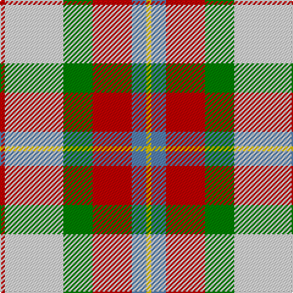

In pattern [RWGRBY](/patterns/rwgrby/).

This was sourced from weddslist.  It is a [6 stripes tartan](/stripes/stripes6/).

Original link http://www.weddslist.com/cgi-bin/tartans/pg.pl?source=sts

## Thread count
R/4 LN48 G24 R32 B12 Y/4

## Palette
Each colour and its ΔE from the base-6 reference it is a variant of.

| Colour | Shade | Base | ΔE (OKLab) |
|---|---|---|---|
| B | <code style="background-color:#5480B0;">#5480B0</code> `#5480B0` | B <code style="background-color:#2A418A;">#2A418A</code> | 0.19 |
| G | <code style="background-color:#008000;">#008000</code> `#008000` | G <code style="background-color:#006100;">#006100</code> | 0.10 |
| LN | <code style="background-color:#E0E0E0;">#E0E0E0</code> `#E0E0E0` | W <code style="background-color:#F7F7F7;">#F7F7F7</code> | 0.07 |
| R | <code style="background-color:#C00000;">#C00000</code> `#C00000` | R <code style="background-color:#CC0000;">#CC0000</code> | 0.03 |
| Y | <code style="background-color:#F0C000;">#F0C000</code> `#F0C000` | Y <code style="background-color:#F2BF00;">#F2BF00</code> | 0.00 |

# Sample pattern

## Nearest tartans

The nearest existing variants by ΔTartan distance.

1. [MacLean Dress (Lumsden)](/setts/s6/r1w12g6r8wa3y1x4~g006818-ra40000-wf8ece0-waa8ace8-yd09800/) — ΔT 0.39
1. [MacLachlan Dress Clan Tartan Tartan Number: 828. Earliest known date: 1990 Based on the MacLachlan pattern in Old And Rare See products available Copyright © Blair Urquhart, Comrie, 2015](/setts/s7/r34w3g4ga23w24k3g4x2~g006428-ga006818-k101010-rd05054-we0e0e0/) — ΔT 0.77
1. [MacKintosh Dress (Dance)](/setts/s6/g3r9ga18b8w33r3x2~b780078-g289c18-ga285800-rc80000-we0e0e0/) — ΔT 0.80
1. [MacLachlan, dress](/setts/s7/r34w3g4ga23w24k3g4x2~g006030-ga008000-k000000-rd03030-we0e0e0/) — ΔT 0.85
1. [Tombow 140th Anniversary, The](/setts/s7/g4y7r9y9b20w2b2x2~b1870a4-g006400-rfa4b00-wffffff-ye0a126/) — ΔT 1.06
1. [MacLachlan Dress](/setts/s7/r36w3y4g24w24k3y6x2~g006818-k101010-r880000-wf8f8f8-yd09800/) — ΔT 1.13
1. [Ball](/setts/s6/y13b8r5k3w2g1x4~b1474b4-g006818-k101010-rc80000-wfcfcfc-ydc943c/) — ΔT 1.14
1. [Samye](/setts/s5/y25r10g10b11w2x2~b2c2c80-g006818-rc80000-wf8f8f8-ye8c000/) — ΔT 1.15
1. [Ball Hunting](/setts/s6/y13g8k5w3wa2r1x4~g009468-k101010-rc80000-w98c8e8-waf8f8f8-ydc943c/) — ΔT 1.23
1. [MacKintosh, Arisaid](/setts/s7/r5w36b14r9g28r8b2x2~b800080-g008000-rc00000-we0e0e0/) — ΔT 1.25

## Neighbour map

Every grey dot is one of 15726 variants placed by the first two principal components of the ΔTartan feature space (44% of its variance). Red is this tartan; blue dots are its nearest — click one to open its page.

<svg viewBox="0 0 640 380" role="img" style="max-width:100%;height:auto;border:1px solid #e0e0e0;border-radius:4px;display:block" xmlns="http://www.w3.org/2000/svg"><image href="/nn/cloud.v1.png" width="640" height="380"/><a href="/setts/s6/r1w12g6r8wa3y1x4~g006818-ra40000-wf8ece0-waa8ace8-yd09800/"><circle cx="148.0" cy="162.2" r="4" fill="#3465a4"><title>MacLean Dress (Lumsden)</title></circle></a><a href="/setts/s7/r34w3g4ga23w24k3g4x2~g006428-ga006818-k101010-rd05054-we0e0e0/"><circle cx="152.8" cy="156.2" r="4" fill="#3465a4"><title>MacLachlan Dress Clan Tartan Tartan Number: 828. Earliest known date: 1990 Based on the MacLachlan pattern in Old And Rare See products available Copyright © Blair Urquhart, Comrie, 2015</title></circle></a><a href="/setts/s6/g3r9ga18b8w33r3x2~b780078-g289c18-ga285800-rc80000-we0e0e0/"><circle cx="174.5" cy="161.5" r="4" fill="#3465a4"><title>MacKintosh Dress (Dance)</title></circle></a><a href="/setts/s7/r34w3g4ga23w24k3g4x2~g006030-ga008000-k000000-rd03030-we0e0e0/"><circle cx="147.1" cy="152.9" r="4" fill="#3465a4"><title>MacLachlan, dress</title></circle></a><a href="/setts/s7/g4y7r9y9b20w2b2x2~b1870a4-g006400-rfa4b00-wffffff-ye0a126/"><circle cx="180.8" cy="181.0" r="4" fill="#3465a4"><title>Tombow 140th Anniversary, The</title></circle></a><a href="/setts/s7/r36w3y4g24w24k3y6x2~g006818-k101010-r880000-wf8f8f8-yd09800/"><circle cx="138.5" cy="149.4" r="4" fill="#3465a4"><title>MacLachlan Dress</title></circle></a><a href="/setts/s6/y13b8r5k3w2g1x4~b1474b4-g006818-k101010-rc80000-wfcfcfc-ydc943c/"><circle cx="149.5" cy="152.3" r="4" fill="#3465a4"><title>Ball</title></circle></a><a href="/setts/s5/y25r10g10b11w2x2~b2c2c80-g006818-rc80000-wf8f8f8-ye8c000/"><circle cx="158.4" cy="186.8" r="4" fill="#3465a4"><title>Samye</title></circle></a><a href="/setts/s6/y13g8k5w3wa2r1x4~g009468-k101010-rc80000-w98c8e8-waf8f8f8-ydc943c/"><circle cx="139.5" cy="153.3" r="4" fill="#3465a4"><title>Ball Hunting</title></circle></a><a href="/setts/s7/r5w36b14r9g28r8b2x2~b800080-g008000-rc00000-we0e0e0/"><circle cx="168.3" cy="157.5" r="4" fill="#3465a4"><title>MacKintosh, Arisaid</title></circle></a><circle cx="157.5" cy="166.8" r="5" fill="#c00000"/></svg>

ID: /setts/s6/r1w12g6r8b3y1x4~b5480b0-g008000-rc00000-we0e0e0-yf0c000/
