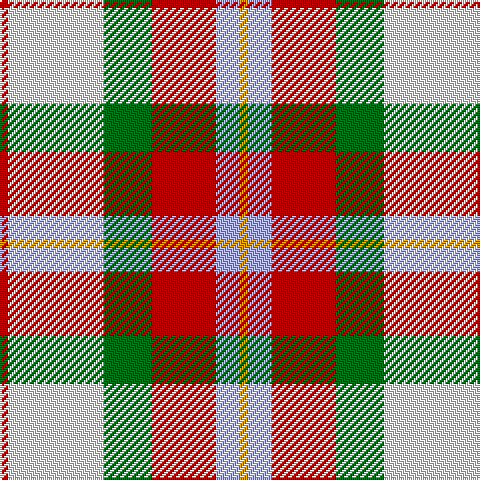

This page is one **sett** — a single exact thread-count. It belongs to the [tartan](/tartans/r1w12g6r8lb3lo1/)
(the same proportion at any scale), whose colour order is pattern [RWGRWY](/stripes/rwgrwy/).

Sourced from register-of-tartans.  It is a [6 stripe tartan](/stripes/stripes6/).

Original link https://www.tartanregister.gov.uk/tartanDetails.aspx?ref=2604

2 attestations — the source records this cloth was collapsed from (oldest owns this page)

<ul>
<li>01/01/2002 — MacLean Dress (Lumsden) (register-of-tartans, <a href="https://www.tartanregister.gov.uk/tartanDetails.aspx?ref=2604">record</a>)</li>
<li>pre 2002 — MacLean Dress (Lumsden) (tartans-authority, <a href="http://www.tartansauthority.com/tartan-ferret/display/1686/">record</a>)</li>
</ul>

## Register references

External register numbers recorded for this tartan.

- Scottish Register of Tartans: [2604](https://www.tartanregister.gov.uk/tartanDetails.aspx?ref=2604)
- Scottish Tartans Authority (ITI): 1686
- Scottish Tartans World Register: 1686

## Thread count
DR/4 LY48 G24 DR32 LP12 DY/4

## Palette

Palette: <strong>Tartan Register</strong> <small style="color:#888">(2 of 5 colours)</small>
<table><thead><tr><th>Colour</th><th>Threads</th><th>Shade</th><th>Base</th><th>OKLCh</th></tr></thead><tbody><tr><td>DR/</td><td style="text-align:right;font-variant-numeric:tabular-nums">4</td><td><code style="background-color:#A40000;">#A40000</code> <small style="color:#888">#A40000</small></td><td>R <code style="background-color:#CC0000;">#CC0000</code></td><td><small style="color:#888">oklch(45.1% 0.185 29.2)</small></td></tr><tr><td>LY</td><td style="text-align:right;font-variant-numeric:tabular-nums">48</td><td><code style="background-color:#F8ECE0;">#F8ECE0</code> <small style="color:#888">#F8ECE0</small></td><td>W <code style="background-color:#F7F7F7;">#F7F7F7</code></td><td><small style="color:#888">oklch(94.9% 0.021 67.6)</small></td></tr><tr><td>G</td><td style="text-align:right;font-variant-numeric:tabular-nums">24</td><td><code style="background-color:#006818;">#006818</code> <small style="color:#888">#006818</small></td><td>G <code style="background-color:#006100;">#006100</code></td><td><small style="color:#888">oklch(45.0% 0.142 145.0)</small></td></tr><tr><td>DR</td><td style="text-align:right;font-variant-numeric:tabular-nums">32</td><td><code style="background-color:#A40000;">#A40000</code> <small style="color:#888">#A40000</small></td><td>R <code style="background-color:#CC0000;">#CC0000</code></td><td><small style="color:#888">oklch(45.1% 0.185 29.2)</small></td></tr><tr><td>LP</td><td style="text-align:right;font-variant-numeric:tabular-nums">12</td><td><code style="background-color:#A8ACE8;">#A8ACE8</code> <small style="color:#888">#A8ACE8</small></td><td>W <code style="background-color:#F7F7F7;">#F7F7F7</code></td><td><small style="color:#888">oklch(76.3% 0.086 281.2)</small></td></tr><tr><td>DY/</td><td style="text-align:right;font-variant-numeric:tabular-nums">4</td><td><code style="background-color:#D09800;">#D09800</code> <small style="color:#888">#D09800</small></td><td>Y <code style="background-color:#F2BF00;">#F2BF00</code></td><td><small style="color:#888">oklch(71.4% 0.147 82.1)</small></td></tr></tbody></table>

# Sample pattern

## Nearest tartans

The nearest existing variants by ΔTartan distance, with this tartan at the top so the swatches line up against it.

ΔTartan

Tartan

Sett

—

<a href="/ttd/edit/#slug=r1w12g6r8lb3lo1~x4">MacLean Dress (Lumsden)</a> <a class="nn-out" href="/setts/s6/r1w12g6r8lb3lo1~x4/" title="open its dictionary page">↗</a>

0.39

<a href="/ttd/edit/#slug=r1w12g6r8t3ly1~x4">MacLean, dress</a> <a class="nn-out" href="/setts/s6/r1w12g6r8t3ly1~x4/" title="open its dictionary page">↗</a>

0.71

<a href="/ttd/edit/#slug=r3w33dp8dg18r9g3~x2">MacKintosh Dress (Dance)</a> <a class="nn-out" href="/setts/s6/r3w33dp8dg18r9g3~x2/" title="open its dictionary page">↗</a>

0.87

<a href="/ttd/edit/#slug=r34w3dg4g23w24k3dg4~x2">MacLachlan, dress</a> <a class="nn-out" href="/setts/s7/r34w3dg4g23w24k3dg4~x2/" title="open its dictionary page">↗</a>

0.90

<a href="/ttd/edit/#slug=r34w3gi4g23w24k3gi4~x2">MacLachlan Dress Clan Tartan Tartan Number: 828. Earliest known date: 1990 Based on the MacLachlan pattern in Old And Rare See products available Copyright © Blair Urquhart, Comrie, 2015</a> <a class="nn-out" href="/setts/s7/r34w3gi4g23w24k3gi4~x2/" title="open its dictionary page">↗</a>

1.02

<a href="/ttd/edit/#slug=r36w3lo4g24w24k3lo6~x2">MacLachlan Dress</a> <a class="nn-out" href="/setts/s7/r36w3lo4g24w24k3lo6~x2/" title="open its dictionary page">↗</a>

1.18

<a href="/ttd/edit/#slug=ly25r10g10db11w2~x2">Samye</a> <a class="nn-out" href="/setts/s5/ly25r10g10db11w2~x2/" title="open its dictionary page">↗</a>

1.19

<a href="/ttd/edit/#slug=lo13b8r5k3w2g1~x4">Ball</a> <a class="nn-out" href="/setts/s6/lo13b8r5k3w2g1~x4/" title="open its dictionary page">↗</a>

1.21

<a href="/ttd/edit/#slug=r5w36p14r9g28r8p2~x2">MacKintosh, Arisaid</a> <a class="nn-out" href="/setts/s7/r5w36p14r9g28r8p2~x2/" title="open its dictionary page">↗</a>

1.22

<a href="/setts/s8/wi4k13wi17lo2r2lo24wi2w2~x2/">Lalage (Personal)</a>

1.24

<a href="/ttd/edit/#slug=r5w2o20ly2k16w18k2w5~x2">Ailsa Craig</a> <a class="nn-out" href="/setts/s8/r5w2o20ly2k16w18k2w5~x2/" title="open its dictionary page">↗</a>

## Neighbour map

Every grey dot is one of 14359 variants placed by the first two principal components of the ΔTartan feature space (44% of its variance). Red is this tartan; blue dots are its nearest — click one to open its page.

<svg viewBox="0 0 640 380" role="img" style="max-width:100%;height:auto;border:1px solid #e0e0e0;border-radius:4px;display:block" xmlns="http://www.w3.org/2000/svg"><image href="/nn/cloud.v1.png" width="640" height="380"/><a href="/setts/s6/r1w12g6r8t3ly1~x4/"><circle cx="157.9" cy="165.6" r="4" fill="#3465a4"><title>MacLean, dress</title></circle></a><a href="/setts/s6/r3w33dp8dg18r9g3~x2/"><circle cx="175.2" cy="158.9" r="4" fill="#3465a4"><title>MacKintosh Dress (Dance)</title></circle></a><a href="/setts/s7/r34w3dg4g23w24k3dg4~x2/"><circle cx="148.0" cy="151.7" r="4" fill="#3465a4"><title>MacLachlan, dress</title></circle></a><a href="/setts/s7/r34w3gi4g23w24k3gi4~x2/"><circle cx="153.8" cy="156.1" r="4" fill="#3465a4"><title>MacLachlan Dress Clan Tartan Tartan Number: 828. Earliest known date: 1990 Based on the MacLachlan pattern in Old And Rare See products available Copyright © Blair Urquhart, Comrie, 2015</title></circle></a><a href="/setts/s7/r36w3lo4g24w24k3lo6~x2/"><circle cx="139.4" cy="147.3" r="4" fill="#3465a4"><title>MacLachlan Dress</title></circle></a><a href="/setts/s5/ly25r10g10db11w2~x2/"><circle cx="158.9" cy="184.5" r="4" fill="#3465a4"><title>Samye</title></circle></a><a href="/setts/s6/lo13b8r5k3w2g1~x4/"><circle cx="150.2" cy="152.3" r="4" fill="#3465a4"><title>Ball</title></circle></a><a href="/setts/s7/r5w36p14r9g28r8p2~x2/"><circle cx="169.1" cy="155.7" r="4" fill="#3465a4"><title>MacKintosh, Arisaid</title></circle></a><a href="/setts/s8/wi4k13wi17lo2r2lo24wi2w2~x2/"><circle cx="165.7" cy="134.7" r="4" fill="#3465a4"><title>Lalage (Personal)</title></circle></a><a href="/setts/s8/r5w2o20ly2k16w18k2w5~x2/"><circle cx="117.1" cy="148.0" r="4" fill="#3465a4"><title>Ailsa Craig</title></circle></a><circle cx="148.4" cy="159.7" r="5" fill="#c00000"/></svg>

ID: /setts/s6/r1w12g6r8lb3lo1~x4/
