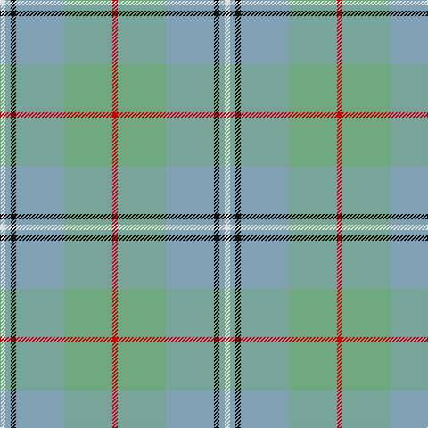

In pattern [RYYKYW](/patterns/ryykyw/).

This was sourced from tartans-authority.  It is a [6 stripes tartan](/stripes/stripes6/).

Original link http://www.tartansauthority.com/tartan-ferret/display/1460/

## Thread count
LN/6 B6 K6 B54 LG54 R/6

## Palette
Each colour and its ΔE from the base-6 reference it is a variant of.

| Colour | Shade | Base | ΔE (OKLab) |
|---|---|---|---|
| B | <code style="background-color:#80A0B4;">#80A0B4</code> `#80A0B4` | Y <code style="background-color:#F2BF00;">#F2BF00</code> | 0.25 |
| K | <code style="background-color:#101010;">#101010</code> `#101010` | K <code style="background-color:#000000;">#000000</code> | 0.17 |
| LG | <code style="background-color:#70A880;">#70A880</code> `#70A880` | Y <code style="background-color:#F2BF00;">#F2BF00</code> | 0.21 |
| LN | <code style="background-color:#E0E0E0;">#E0E0E0</code> `#E0E0E0` | W <code style="background-color:#F7F7F7;">#F7F7F7</code> | 0.07 |
| R | <code style="background-color:#C80000;">#C80000</code> `#C80000` | R <code style="background-color:#CC0000;">#CC0000</code> | 0.01 |

# Sample pattern

## Nearest tartans

The nearest existing variants by ΔTartan distance.

1. [Irving of Glentulchan (Personal)](/setts/s10/y9ya9k1ya1w1ya1k1ya9y9r1x6~k101010-rc80000-we0e0e0-y70a880-ya80a0b4/) — ΔT 1.28
1. [Chambers Bay](/setts/s7/g2b15y5g2b2g7w2x4~b5f749c-g408060-wffffff-yb0b0b0/) — ΔT 1.33
1. [Highland Road (Fashion)](/setts/s9/k3y15b3y4b3y4b10g30w3x2~b5c8ca8-g587478-k101010-we0e0e0-ya0a0a0/) — ΔT 1.52
1. [South Aiken Presby Church (Corporate](/setts/s6/y30g3b2w2b30ya4x2~b2888c4-g00a424-w98c8e8-yd0b06c-yad87c00/) — ΔT 1.54
1. [Organic](/setts/s9/g25b3g8b13y8ya2yb11g2b3x2~b9058d8-g669999-yc89800-yaa0a0a0-ybc4bc68/) — ΔT 1.61
1. [Dama Classic (Fashion)](/setts/s8/y30w3y3w3y12b30r3b5x2~b5c5c5c-r888888-wf0dcbc-ya0a0a0/) — ΔT 1.71
1. [Lochnagar Trade Tartan Tartan Number: 1771. Earliest known date: pre 2003 Colours represents the Scottish hills, the water, and the heather. See products available Copyright © Blair Urquhart, Comrie, 2015](/setts/s6/w1b1wa7r4wa1w1x4~b780078-r888888-we0e0e0-wac0c0c0/) — ΔT 1.76
1. [Irvine of Drum](/setts/s8/b3k3b21g49b21k3b3w3x2~b5c8ca8-g408060-k101010-wfcfcfc/) — ΔT 1.77
1. [Un-named (D C Dalgliesh) #2](/setts/s10/b5y2b2y9k3b9g3b3g25ya2x2~b1474b4-g408060-k101010-y84a8b0-yaacb0b8/) — ΔT 1.78
1. [Bagpipe Shop, The (Corporate)](/setts/s5/b10y3r3ra1g1x10~b5c5c5c-g289c18-r888888-rac80000-ya0a0a0/) — ΔT 1.84

## Neighbour map

Every grey dot is one of 15726 variants placed by the first two principal components of the ΔTartan feature space (44% of its variance). Red is this tartan; blue dots are its nearest — click one to open its page.

<svg viewBox="0 0 640 380" role="img" style="max-width:100%;height:auto;border:1px solid #e0e0e0;border-radius:4px;display:block" xmlns="http://www.w3.org/2000/svg"><image href="/nn/cloud.v1.png" width="640" height="380"/><a href="/setts/s10/y9ya9k1ya1w1ya1k1ya9y9r1x6~k101010-rc80000-we0e0e0-y70a880-ya80a0b4/"><circle cx="314.0" cy="198.9" r="4" fill="#3465a4"><title>Irving of Glentulchan (Personal)</title></circle></a><a href="/setts/s7/g2b15y5g2b2g7w2x4~b5f749c-g408060-wffffff-yb0b0b0/"><circle cx="304.0" cy="234.2" r="4" fill="#3465a4"><title>Chambers Bay</title></circle></a><a href="/setts/s9/k3y15b3y4b3y4b10g30w3x2~b5c8ca8-g587478-k101010-we0e0e0-ya0a0a0/"><circle cx="266.6" cy="189.1" r="4" fill="#3465a4"><title>Highland Road (Fashion)</title></circle></a><a href="/setts/s6/y30g3b2w2b30ya4x2~b2888c4-g00a424-w98c8e8-yd0b06c-yad87c00/"><circle cx="303.5" cy="171.6" r="4" fill="#3465a4"><title>South Aiken Presby Church (Corporate</title></circle></a><a href="/setts/s9/g25b3g8b13y8ya2yb11g2b3x2~b9058d8-g669999-yc89800-yaa0a0a0-ybc4bc68/"><circle cx="268.5" cy="182.0" r="4" fill="#3465a4"><title>Organic</title></circle></a><a href="/setts/s8/y30w3y3w3y12b30r3b5x2~b5c5c5c-r888888-wf0dcbc-ya0a0a0/"><circle cx="343.0" cy="202.1" r="4" fill="#3465a4"><title>Dama Classic (Fashion)</title></circle></a><a href="/setts/s6/w1b1wa7r4wa1w1x4~b780078-r888888-we0e0e0-wac0c0c0/"><circle cx="317.9" cy="224.8" r="4" fill="#3465a4"><title>Lochnagar Trade Tartan Tartan Number: 1771. Earliest known date: pre 2003 Colours represents the Scottish hills, the water, and the heather. See products available Copyright © Blair Urquhart, Comrie, 2015</title></circle></a><a href="/setts/s8/b3k3b21g49b21k3b3w3x2~b5c8ca8-g408060-k101010-wfcfcfc/"><circle cx="365.5" cy="190.9" r="4" fill="#3465a4"><title>Irvine of Drum</title></circle></a><a href="/setts/s10/b5y2b2y9k3b9g3b3g25ya2x2~b1474b4-g408060-k101010-y84a8b0-yaacb0b8/"><circle cx="284.2" cy="177.5" r="4" fill="#3465a4"><title>Un-named (D C Dalgliesh) #2</title></circle></a><a href="/setts/s5/b10y3r3ra1g1x10~b5c5c5c-g289c18-r888888-rac80000-ya0a0a0/"><circle cx="363.5" cy="229.2" r="4" fill="#3465a4"><title>Bagpipe Shop, The (Corporate)</title></circle></a><circle cx="298.1" cy="205.1" r="5" fill="#c00000"/></svg>

ID: /setts/s6/r1y9ya9k1ya1w1x6~k101010-rc80000-we0e0e0-y70a880-ya80a0b4/
