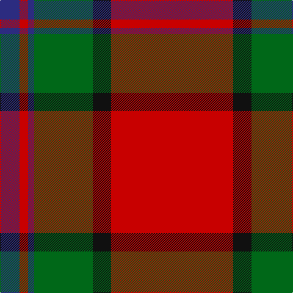

In pattern [BRBGKR](/patterns/brbgkr/).

This was sourced from register-of-tartans.  It is a [6 stripes tartan](/stripes/stripes6/).

Original link https://www.tartanregister.gov.uk/tartanDetails.aspx?ref=3348

## Attestations

This cloth appears in 2 source records; the oldest owns this page.

- 17/10/2000 — Plummer (Personal) (register-of-tartans, [record](https://www.tartanregister.gov.uk/tartanDetails.aspx?ref=3348))
- 2001 — Plummer (Name) (tartans-authority, [record](http://www.tartansauthority.com/tartan-ferret/display/5947/))

## Thread count
DB/32 R14 DB10 G96 K30 R/200

## Palette
Each colour and its ΔE from the base-6 reference it is a variant of.

| Colour | Shade | Base | ΔE (OKLab) |
|---|---|---|---|
| DB | <code style="background-color:#2C2C80;">#2C2C80</code> `#2C2C80` | B <code style="background-color:#2A418A;">#2A418A</code> | 0.06 |
| G | <code style="background-color:#006818;">#006818</code> `#006818` | G <code style="background-color:#006100;">#006100</code> | 0.02 |
| K | <code style="background-color:#101010;">#101010</code> `#101010` | K <code style="background-color:#000000;">#000000</code> | 0.17 |
| R | <code style="background-color:#C80000;">#C80000</code> `#C80000` | R <code style="background-color:#CC0000;">#CC0000</code> | 0.01 |

# Sample pattern

## Nearest tartans

The nearest existing variants by ΔTartan distance.

1. [Buccleuch](/setts/s7/r107k9r5b41r5g51r14-b304080-g008000-k000000-rc00000/) — ΔT 0.40
1. [Buccleuch Family Tartan Tartan Number: 1505. Earliest known date: c.1840 Reduced 50% proportionally. Described by Wilson as a 'Fancy' pattern, taking inspiration from the works of Sir Walter Scott. See products available Copyright © Blair Urquhart, Comrie, 2015](/setts/s7/r107k9r5b41r5g51r14-b2c2c80-g006818-k101010-rc80000/) — ΔT 0.43
1. [MacPhail Red Clan Tartan Tartan Number: 1031. Earliest known date: 1930-50 This sample comes from the MacGregor-Hastie collection which forms the basis of the cloth archive of the Scottish Tartans Society. Some of the samples, including this one, were unmarked. One can assume that the sample dates between 1930 and 1950. See products available Copyright © Blair Urquhart, Comrie, 2015](/setts/s6/r100k28r12g52b4k8-b5c8ca8-g006818-k101010-rc80000/) — ΔT 0.55
1. [MacPhail](/setts/s6/r100k28r12g52ga4k8-g006818-ga789484-k101010-rc80000/) — ΔT 0.56
1. [Fraser (1745)](/setts/s6/r4b24r4g24r48w2-b2c2c80-g006818-rc80000-wfcfcfc/) — ΔT 0.72
1. [Buccleuch](/setts/s7/r107k9r5b41r5g51r14-b780078-g006818-k000000-rc80000/) — ΔT 0.75
1. [Denny Hunting Clan Tartan Tartan Number: 518. Earliest known date: pre 2003 This tartan is remarkably similar to the Durham sett designed by Wilson's of Bannockburn around 1819. The variation in proportions may point to a deliberate modification suggested by the links between the names. See products available Copyright © Blair Urquhart, Comrie, 2015](/setts/s6/b2r32g12k2g12k2-b2c2c80-g006818-k101010-rc80000/) — ΔT 0.86
1. [McInally (Name)](/setts/s7/r6g32r8k12r56g4y6-g006818-k101010-rc80000-yd09800/) — ΔT 0.87
1. [Grant of Lurg](/setts/s6/r4b20r4g20r50w4-b2c2c80-g006818-rc80000-wf8f8f8/) — ΔT 0.94
1. [MacPhail Clan Tartan Tartan Number: 1028. Earliest known date: pre 1950 This sample comes from the MacGregor-Hastie collection which forms the basis of the cloth archive of the Scottish Tartans Society. Some of the samples, including this one, were unmarked. One can assume that the sample dates between 1930 and 1950. See products available Copyright © Blair Urquhart, Comrie, 2015](/setts/s6/r100b28r12g52ba4k8-b2c2c80-ba5c8ca8-g006818-k101010-rc80000/) — ΔT 0.95

## Neighbour map

Every grey dot is one of 15726 variants placed by the first two principal components of the ΔTartan feature space (44% of its variance). Red is this tartan; blue dots are its nearest — click one to open its page.

<svg viewBox="0 0 640 380" role="img" style="max-width:100%;height:auto;border:1px solid #e0e0e0;border-radius:4px;display:block" xmlns="http://www.w3.org/2000/svg"><image href="/nn/cloud.v1.png" width="640" height="380"/><a href="/setts/s7/r107k9r5b41r5g51r14-b304080-g008000-k000000-rc00000/"><circle cx="351.6" cy="153.5" r="4" fill="#3465a4"><title>Buccleuch</title></circle></a><a href="/setts/s7/r107k9r5b41r5g51r14-b2c2c80-g006818-k101010-rc80000/"><circle cx="359.9" cy="155.8" r="4" fill="#3465a4"><title>Buccleuch Family Tartan Tartan Number: 1505. Earliest known date: c.1840 Reduced 50% proportionally. Described by Wilson as a 'Fancy' pattern, taking inspiration from the works of Sir Walter Scott. See products available Copyright © Blair Urquhart, Comrie, 2015</title></circle></a><a href="/setts/s6/r100k28r12g52b4k8-b5c8ca8-g006818-k101010-rc80000/"><circle cx="351.0" cy="158.4" r="4" fill="#3465a4"><title>MacPhail Red Clan Tartan Tartan Number: 1031. Earliest known date: 1930-50 This sample comes from the MacGregor-Hastie collection which forms the basis of the cloth archive of the Scottish Tartans Society. Some of the samples, including this one, were unmarked. One can assume that the sample dates between 1930 and 1950. See products available Copyright © Blair Urquhart, Comrie, 2015</title></circle></a><a href="/setts/s6/r100k28r12g52ga4k8-g006818-ga789484-k101010-rc80000/"><circle cx="351.2" cy="158.5" r="4" fill="#3465a4"><title>MacPhail</title></circle></a><a href="/setts/s6/r4b24r4g24r48w2-b2c2c80-g006818-rc80000-wfcfcfc/"><circle cx="332.7" cy="163.3" r="4" fill="#3465a4"><title>Fraser (1745)</title></circle></a><a href="/setts/s7/r107k9r5b41r5g51r14-b780078-g006818-k000000-rc80000/"><circle cx="363.9" cy="153.1" r="4" fill="#3465a4"><title>Buccleuch</title></circle></a><a href="/setts/s6/b2r32g12k2g12k2-b2c2c80-g006818-k101010-rc80000/"><circle cx="342.8" cy="177.1" r="4" fill="#3465a4"><title>Denny Hunting Clan Tartan Tartan Number: 518. Earliest known date: pre 2003 This tartan is remarkably similar to the Durham sett designed by Wilson's of Bannockburn around 1819. The variation in proportions may point to a deliberate modification suggested by the links between the names. See products available Copyright © Blair Urquhart, Comrie, 2015</title></circle></a><a href="/setts/s7/r6g32r8k12r56g4y6-g006818-k101010-rc80000-yd09800/"><circle cx="345.7" cy="171.7" r="4" fill="#3465a4"><title>McInally (Name)</title></circle></a><a href="/setts/s6/r4b20r4g20r50w4-b2c2c80-g006818-rc80000-wf8f8f8/"><circle cx="328.6" cy="180.1" r="4" fill="#3465a4"><title>Grant of Lurg</title></circle></a><a href="/setts/s6/r100b28r12g52ba4k8-b2c2c80-ba5c8ca8-g006818-k101010-rc80000/"><circle cx="337.2" cy="145.5" r="4" fill="#3465a4"><title>MacPhail Clan Tartan Tartan Number: 1028. Earliest known date: pre 1950 This sample comes from the MacGregor-Hastie collection which forms the basis of the cloth archive of the Scottish Tartans Society. Some of the samples, including this one, were unmarked. One can assume that the sample dates between 1930 and 1950. See products available Copyright © Blair Urquhart, Comrie, 2015</title></circle></a><circle cx="355.9" cy="163.3" r="5" fill="#c00000"/></svg>

ID: /setts/s6/r200k30g96b10r14b32-b2c2c80-g006818-k101010-rc80000/
