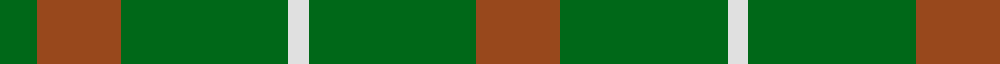

In pattern [GRGWGR](/patterns/grgwgr/).

This was sourced from register-of-tartans.  It is a [6 stripes tartan](/stripes/stripes6/).

Original link https://www.tartanregister.gov.uk/tartanDetails.aspx?ref=3248

## Thread count
G/18 T40 G80 LN10 G80 T/40

## Palette
Each colour and its ΔE from the base-6 reference it is a variant of.

| Colour | Shade | Base | ΔE (OKLab) |
|---|---|---|---|
| G | <code style="background-color:#006818;">#006818</code> `#006818` | G <code style="background-color:#006100;">#006100</code> | 0.02 |
| LN | <code style="background-color:#E0E0E0;">#E0E0E0</code> `#E0E0E0` | W <code style="background-color:#F7F7F7;">#F7F7F7</code> | 0.07 |
| T | <code style="background-color:#98481C;">#98481C</code> `#98481C` | R <code style="background-color:#CC0000;">#CC0000</code> | 0.11 |

# Sample pattern

## Nearest tartans

The nearest existing variants by ΔTartan distance.

1. [O'Neill, Red](/setts/s6/g46r20g9r20g46y5~g006818-rb84c00-y48a4c0~x2/) — ΔT 0.55
1. [O'Neill, Red (Corporate?)](/setts/s4/g9r20g46y5~g006818-rb84c00-y48a4c0~x2/) — ΔT 1.18
1. [O'Neill (Australia) (Name)](/setts/s4/g9r20g40w5~g006818-r98481c-we0e0e0~x2/) — ΔT 1.25
1. [Scott Autumn (Fashion)](/setts/s7/g16y3g14r16g2r2g3~g004c00-r8c0000-yc89800~x2/) — ΔT 1.53
1. [Confederate Artillery (Military)](/setts/s6/g2r14g8r3g12ra2~g006818-ra0783c-ra8c0000~x2/) — ΔT 1.62
1. [Ledford Family Tartan Tartan Number: 835. Earliest known date: 1987 A quantity of this cloth was woven in 1998 for a Ledford family in the USA. See products available Copyright © Blair Urquhart, Comrie, 2015](/setts/s3/g9r4y1~g006818-r888888-ye8c000~x4/) — ΔT 1.71
1. [Highland Spring (Green)](/setts/s4/g7r3g23ra7~g008000-rc00000-ra802040~x2/) — ΔT 1.73
1. [Ledford](/setts/s3/g9ga4y1~g005020-ga808080-yc89600~x8/) — ΔT 1.73
1. [O'Neill](/setts/s4/g9y20g40w5~g008000-we0e0e0-yd08010~x2/) — ΔT 1.76
1. [Colonial Marine (Corporate)](/setts/s4/g56ga13y13y5~g006818-ga604000-ybc8c00~x2/) — ΔT 1.79

## Neighbour map

Every grey dot is one of 15726 variants placed by the first two principal components of the ΔTartan feature space (44% of its variance). Red is this tartan; blue dots are its nearest — click one to open its page.

<svg viewBox="0 0 640 380" role="img" style="max-width:100%;height:auto;border:1px solid #e0e0e0;border-radius:4px;display:block" xmlns="http://www.w3.org/2000/svg"><image href="/nn/cloud.v1.png" width="640" height="380"/><a href="/setts/s6/g46r20g9r20g46y5~g006818-rb84c00-y48a4c0~x2/"><circle cx="454.9" cy="282.6" r="4" fill="#3465a4"><title>O'Neill, Red</title></circle></a><a href="/setts/s4/g9r20g46y5~g006818-rb84c00-y48a4c0~x2/"><circle cx="462.9" cy="285.8" r="4" fill="#3465a4"><title>O'Neill, Red (Corporate?)</title></circle></a><a href="/setts/s4/g9r20g40w5~g006818-r98481c-we0e0e0~x2/"><circle cx="412.1" cy="286.3" r="4" fill="#3465a4"><title>O'Neill (Australia) (Name)</title></circle></a><a href="/setts/s7/g16y3g14r16g2r2g3~g004c00-r8c0000-yc89800~x2/"><circle cx="405.6" cy="260.0" r="4" fill="#3465a4"><title>Scott Autumn (Fashion)</title></circle></a><a href="/setts/s6/g2r14g8r3g12ra2~g006818-ra0783c-ra8c0000~x2/"><circle cx="384.4" cy="290.3" r="4" fill="#3465a4"><title>Confederate Artillery (Military)</title></circle></a><a href="/setts/s3/g9r4y1~g006818-r888888-ye8c000~x4/"><circle cx="414.4" cy="301.3" r="4" fill="#3465a4"><title>Ledford Family Tartan Tartan Number: 835. Earliest known date: 1987 A quantity of this cloth was woven in 1998 for a Ledford family in the USA. See products available Copyright © Blair Urquhart, Comrie, 2015</title></circle></a><a href="/setts/s4/g7r3g23ra7~g008000-rc00000-ra802040~x2/"><circle cx="473.3" cy="289.3" r="4" fill="#3465a4"><title>Highland Spring (Green)</title></circle></a><a href="/setts/s3/g9ga4y1~g005020-ga808080-yc89600~x8/"><circle cx="420.1" cy="304.0" r="4" fill="#3465a4"><title>Ledford</title></circle></a><a href="/setts/s4/g9y20g40w5~g008000-we0e0e0-yd08010~x2/"><circle cx="404.5" cy="281.2" r="4" fill="#3465a4"><title>O'Neill</title></circle></a><a href="/setts/s4/g56ga13y13y5~g006818-ga604000-ybc8c00~x2/"><circle cx="458.5" cy="274.8" r="4" fill="#3465a4"><title>Colonial Marine (Corporate)</title></circle></a><circle cx="421.1" cy="291.4" r="5" fill="#c00000"/></svg>

ID: /setts/s6/r20g40w5g40r20g9~g006818-r98481c-we0e0e0~x2/
