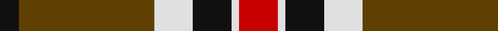

In pattern [KGWKWR](/patterns/kgwkwr/).

This was sourced from house-of-tartan.  It is a [6 stripes tartan](/stripes/stripes6/).

Original link http://www.house-of-tartan.scotland.net/house/TartanViewjs.asp?colr=Def&tnam=1219

## Thread count
K/10 T70 LN20 K20 LN4 R/20

## Palette
Each colour and its ΔE from the base-6 reference it is a variant of.

| Colour | Shade | Base | ΔE (OKLab) |
|---|---|---|---|
| K | <code style="background-color:#101010;">#101010</code> `#101010` | K <code style="background-color:#000000;">#000000</code> | 0.17 |
| LN | <code style="background-color:#E0E0E0;">#E0E0E0</code> `#E0E0E0` | W <code style="background-color:#F4F4F0;">#F4F4F0</code> | 0.06 |
| R | <code style="background-color:#C80000;">#C80000</code> `#C80000` | R <code style="background-color:#C80000;">#C80000</code> | 0.00 |
| T | <code style="background-color:#604000;">#604000</code> `#604000` | G <code style="background-color:#006400;">#006400</code> | 0.14 |

# Sample pattern

## Nearest tartans

The nearest existing variants by ΔTartan distance.

1. [Loch Ness](/setts/s6/r20w4k20w20g70k10-g503c14-k101010-rdc0000-we0e0e0/) — ΔT 0.22
1. [Loch Ness](/setts/s6/r20w4k20w20ra70k10-k000000-rc00000-ra806050-we0e0e0/) — ΔT 0.70
1. [Thomson Camel (Jedburgh Mill)](/setts/s6/r8k4w20k20g56k6-g8c7038-k101010-rc80000-wc0c0c0/) — ΔT 0.71
1. [Unidentified 12](/setts/s6/k12r4g34r32k2b4-b5480b0-g008000-k000000-rc00000/) — ΔT 0.91
1. [Ruthven (V.S.) (Name)](/setts/s6/w12g30b36r60g4r8-b202060-g006818-rc80000-we0e0e0/) — ΔT 0.92
1. [MacDuff](/setts/s7/r8k4r48k12b12g32r6-b304080-g008000-k000000-rc00000/) — ΔT 0.93
1. [Unidentified #15](/setts/s6/k12r4g34r32k2b4-b3c82af-g005020-k101010-rdc0000/) — ΔT 0.93
1. [Braemar or Blair Atholl](/setts/s8/b8w8k24b12k8r56k4r4-b441800-k101010-ra07c58-wffffff/) — ΔT 0.96
1. [Island of Innis, The](/setts/s8/k60g4k12r36g4r12y44k4-g285800-k101010-ra00000-yd09800/) — ΔT 0.97
1. [Merric Dark Camel.. Trade Tartan Tartan Number: 1688. Earliest known date: 1985 School colours. See products available Copyright © Blair Urquhart, Comrie, 2015](/setts/s7/r4w16k28g50w4k4w4-g604000-k101010-rc80000-we0e0e0/) — ΔT 0.99

## Neighbour map

Every grey dot is one of 15726 variants placed by the first two principal components of the ΔTartan feature space (44% of its variance). Red is this tartan; blue dots are its nearest — click one to open its page.

<svg viewBox="0 0 640 380" role="img" style="max-width:100%;height:auto;border:1px solid #e0e0e0;border-radius:4px;display:block" xmlns="http://www.w3.org/2000/svg"><image href="/nn/cloud.v1.png" width="640" height="380"/><a href="/setts/s6/r20w4k20w20g70k10-g503c14-k101010-rdc0000-we0e0e0/"><circle cx="251.5" cy="170.1" r="4" fill="#3465a4"><title>Loch Ness</title></circle></a><a href="/setts/s6/r20w4k20w20ra70k10-k000000-rc00000-ra806050-we0e0e0/"><circle cx="239.5" cy="162.9" r="4" fill="#3465a4"><title>Loch Ness</title></circle></a><a href="/setts/s6/r8k4w20k20g56k6-g8c7038-k101010-rc80000-wc0c0c0/"><circle cx="259.7" cy="177.5" r="4" fill="#3465a4"><title>Thomson Camel (Jedburgh Mill)</title></circle></a><a href="/setts/s6/k12r4g34r32k2b4-b5480b0-g008000-k000000-rc00000/"><circle cx="233.6" cy="171.5" r="4" fill="#3465a4"><title>Unidentified 12</title></circle></a><a href="/setts/s6/w12g30b36r60g4r8-b202060-g006818-rc80000-we0e0e0/"><circle cx="238.3" cy="184.7" r="4" fill="#3465a4"><title>Ruthven (V.S.) (Name)</title></circle></a><a href="/setts/s7/r8k4r48k12b12g32r6-b304080-g008000-k000000-rc00000/"><circle cx="260.6" cy="179.6" r="4" fill="#3465a4"><title>MacDuff</title></circle></a><a href="/setts/s6/k12r4g34r32k2b4-b3c82af-g005020-k101010-rdc0000/"><circle cx="257.1" cy="178.1" r="4" fill="#3465a4"><title>Unidentified #15</title></circle></a><a href="/setts/s8/b8w8k24b12k8r56k4r4-b441800-k101010-ra07c58-wffffff/"><circle cx="254.2" cy="155.3" r="4" fill="#3465a4"><title>Braemar or Blair Atholl</title></circle></a><a href="/setts/s8/k60g4k12r36g4r12y44k4-g285800-k101010-ra00000-yd09800/"><circle cx="231.7" cy="163.5" r="4" fill="#3465a4"><title>Island of Innis, The</title></circle></a><a href="/setts/s7/r4w16k28g50w4k4w4-g604000-k101010-rc80000-we0e0e0/"><circle cx="231.9" cy="164.0" r="4" fill="#3465a4"><title>Merric Dark Camel.. Trade Tartan Tartan Number: 1688. Earliest known date: 1985 School colours. See products available Copyright © Blair Urquhart, Comrie, 2015</title></circle></a><circle cx="254.5" cy="170.2" r="5" fill="#c00000"/></svg>

ID: /setts/s6/r20w4k20w20g70k10-g604000-k101010-rc80000-we0e0e0/
