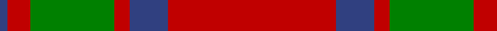
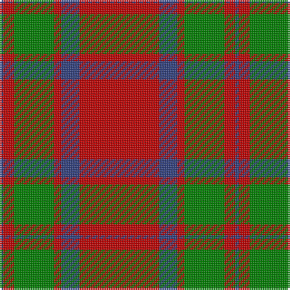

This page is one **sett** — a single exact thread-count. It belongs to the [tartan](/tartans/r22b5r2g11r3b1/)
(the same proportion at any scale), whose colour order is pattern [BRGRBR](/stripes/brgrbr/).

Sourced from weddslist.  It is a [6 stripe tartan](/stripes/stripes6/).

Original link http://www.weddslist.com/cgi-bin/tartans/pg.pl?source=sts

## Also known as

This cloth is also recorded under:

- MacKintosh

2 attestations — the source records this cloth was collapsed from (oldest owns this page)

<ul>
<li>undated — MacKintosh 1 (weddslist, <a href="http://www.weddslist.com/cgi-bin/tartans/pg.pl?source=sts">record</a>)</li>
<li>undated — MacKintosh Clan Tartan Tartan Number: 521. Earliest known date: 1815 D.C. Stewart wrote, "This is one of the few ancient tartans too well authenticated to admit of doubt or question." The earliest publication is attributed to Logan but he may well have known of the sample, sealed with signature of the chief, which existed in the collection of the Highland Society of London, dating around 1815. The chief of the MacKintoshes is also chief of Clan Chattan. Logan wrote, "The chief also wears a particular tartan of a very showy pattern", which has now been registered with Lord Lyon (1947) as 'Clan Chattan (Chief)'. The clan tartan has likewise been registered as 'Clan Chattan'. See products available Copyright © Blair Urquhart, Comrie, 2015 (house-of-tartan, <a href="http://www.house-of-tartan.scotland.net/house/TartanViewjs.asp?colr=Def&tnam=521">record</a>)</li>
</ul>

## Thread count
R/44 B10 R4 G22 R6 B/2

## Palette
Each colour and the base-6 reference it is a variant of.

| Colour | Shade | Base |
|---|---|---|
| B | <code style="background-color:#304080;">#304080</code> `oklch(39.4% 0.109 270.2)` <small>#304080</small> | B <code style="background-color:#2A418A;">#2A418A</code> |
| G | <code style="background-color:#008000;">#008000</code> `oklch(52.0% 0.177 142.5)` <small>#008000</small> | G <code style="background-color:#006100;">#006100</code> |
| R | <code style="background-color:#C00000;">#C00000</code> `oklch(50.7% 0.208 29.2)` <small>#C00000</small> | R <code style="background-color:#CC0000;">#CC0000</code> |

# Sample pattern

## Nearest tartans

The nearest existing variants by ΔTartan distance, with this tartan at the top so the swatches line up against it.

ΔTartan

Tartan

Sett

—

<a href="/ttd/edit/#slug=r22db5r2g11r3db1~x2">MacKintosh 1</a> <a class="nn-out" href="/setts/s6/r22db5r2g11r3db1~x2/" title="open its dictionary page">↗</a>

0.18

<a href="/ttd/edit/#slug=r68db18r9g34r9db3~x2">MacKintosh 3</a> <a class="nn-out" href="/setts/s6/r68db18r9g34r9db3~x2/" title="open its dictionary page">↗</a>

0.53

<a href="/ttd/edit/#slug=r70db20r10g40r10db3">MacKintosh</a> <a class="nn-out" href="/setts/s6/r70db20r10g40r10db3/" title="open its dictionary page">↗</a>

0.66

<a href="/ttd/edit/#slug=r1g10r1db4r18g1~x4">Robertson 6</a> <a class="nn-out" href="/setts/s6/r1g10r1db4r18g1~x4/" title="open its dictionary page">↗</a>

0.67

<a href="/ttd/edit/#slug=r16db6r2g6r2db1~x2">MacKintosh, Plaid</a> <a class="nn-out" href="/setts/s6/r16db6r2g6r2db1~x2/" title="open its dictionary page">↗</a>

0.67

<a href="/ttd/edit/#slug=r68db18r9dg34r9db3~x2">MacKintosh #2</a> <a class="nn-out" href="/setts/s6/r68db18r9dg34r9db3~x2/" title="open its dictionary page">↗</a>

0.74

<a href="/ttd/edit/#slug=r3g16r4k6r28g1r3~x2">Maxwell</a> <a class="nn-out" href="/setts/s7/r3g16r4k6r28g1r3~x2/" title="open its dictionary page">↗</a>

0.84

<a href="/ttd/edit/#slug=r2g6r2g6r16ly1~x4">Cameron (Clan)</a> <a class="nn-out" href="/setts/s6/r2g6r2g6r16ly1~x4/" title="open its dictionary page">↗</a>

0.87

<a href="/ttd/edit/#slug=r48db2r3g28r4db2~x2">MacKintosh 2</a> <a class="nn-out" href="/setts/s6/r48db2r3g28r4db2~x2/" title="open its dictionary page">↗</a>

0.89

<a href="/ttd/edit/#slug=r2dg6r2dg6r16ly1~x2">Cameron</a> <a class="nn-out" href="/setts/s6/r2dg6r2dg6r16ly1~x2/" title="open its dictionary page">↗</a>

0.90

<a href="/ttd/edit/#slug=r22db5r2dg11r3db1">MacKintosh D</a> <a class="nn-out" href="/setts/s6/r22db5r2dg11r3db1/" title="open its dictionary page">↗</a>

## Neighbour map

Every grey dot is one of 14299 variants placed by the first two principal components of the ΔTartan feature space (44% of its variance). Red is this tartan; blue dots are its nearest — click one to open its page.

<svg viewBox="0 0 640 380" role="img" style="max-width:100%;height:auto;border:1px solid #e0e0e0;border-radius:4px;display:block" xmlns="http://www.w3.org/2000/svg"><image href="/nn/cloud.v1.png" width="640" height="380"/><a href="/setts/s6/r68db18r9g34r9db3~x2/"><circle cx="419.1" cy="187.8" r="4" fill="#3465a4"><title>MacKintosh 3</title></circle></a><a href="/setts/s6/r70db20r10g40r10db3/"><circle cx="401.2" cy="187.7" r="4" fill="#3465a4"><title>MacKintosh</title></circle></a><a href="/setts/s6/r1g10r1db4r18g1~x4/"><circle cx="397.7" cy="186.3" r="4" fill="#3465a4"><title>Robertson 6</title></circle></a><a href="/setts/s6/r16db6r2g6r2db1~x2/"><circle cx="402.7" cy="201.7" r="4" fill="#3465a4"><title>MacKintosh, Plaid</title></circle></a><a href="/setts/s6/r68db18r9dg34r9db3~x2/"><circle cx="412.7" cy="180.5" r="4" fill="#3465a4"><title>MacKintosh #2</title></circle></a><a href="/setts/s7/r3g16r4k6r28g1r3~x2/"><circle cx="436.9" cy="163.2" r="4" fill="#3465a4"><title>Maxwell</title></circle></a><a href="/setts/s6/r2g6r2g6r16ly1~x4/"><circle cx="421.8" cy="202.2" r="4" fill="#3465a4"><title>Cameron (Clan)</title></circle></a><a href="/setts/s6/r48db2r3g28r4db2~x2/"><circle cx="466.9" cy="170.2" r="4" fill="#3465a4"><title>MacKintosh 2</title></circle></a><a href="/setts/s6/r2dg6r2dg6r16ly1~x2/"><circle cx="414.6" cy="198.6" r="4" fill="#3465a4"><title>Cameron</title></circle></a><a href="/setts/s6/r22db5r2dg11r3db1/"><circle cx="408.7" cy="177.4" r="4" fill="#3465a4"><title>MacKintosh D</title></circle></a><circle cx="425.0" cy="185.2" r="5" fill="#c00000"/></svg>

ID: /setts/s6/r22db5r2g11r3db1~x2/
