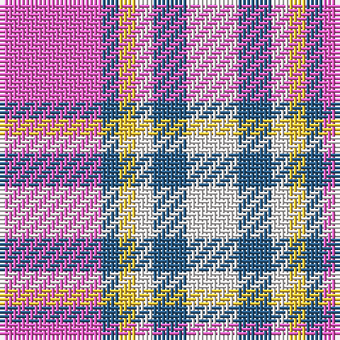

In pattern [RBYWBW](/patterns/rbywbw/).

This was sourced from register-of-tartans.  It is a [6 stripes tartan](/stripes/stripes6/).

Original link https://www.tartanregister.gov.uk/tartanDetails.aspx?ref=10758

## Thread count
LR/24 B4 Y4 W4 B8 W/12

## Palette
Each colour and its ΔE from the base-6 reference it is a variant of.

| Colour | Shade | Base | ΔE (OKLab) |
|---|---|---|---|
| B | <code style="background-color:#2B5E89;">#2B5E89</code> `#2B5E89` | B <code style="background-color:#2C4084;">#2C4084</code> | 0.09 |
| LR | <code style="background-color:#F261C6;">#F261C6</code> `#F261C6` | R <code style="background-color:#C80000;">#C80000</code> | 0.25 |
| W | <code style="background-color:#F5F1F0;">#F5F1F0</code> `#F5F1F0` | W <code style="background-color:#F4F4F0;">#F4F4F0</code> | 0.01 |
| Y | <code style="background-color:#FFC83C;">#FFC83C</code> `#FFC83C` | Y <code style="background-color:#E8C000;">#E8C000</code> | 0.05 |

# Sample pattern

## Nearest tartans

The nearest existing variants by ΔTartan distance.

1. [Meridia Dance](/setts/s8/w8k6w54b16r6b8r49w6-b2c2c80-k101010-rc04094-wfcfcfc/) — ΔT 1.50
1. [Winnipeg Embroiders' Guild (Corp.)](/setts/s6/r24b4y4w4b8w6-b003c64-re87878-we8ccb8-ye8c000/) — ΔT 1.58
1. [Think Pink (ICF)](/setts/s5/k16b8y52r52w8-b00008c-k000034-rdc5078-wc8c8c8-yc09898/) — ΔT 1.65
1. [Thompson, D.C. (Personal)](/setts/s6/k8b56r12w24r24w6-b5c8ca8-k101010-rc80000-we0e0e0/) — ΔT 1.68
1. [Culloden, Red (dress)](/setts/s8/g16b8r45w6b45w44b6w12-b800080-g008000-rc00000-we0e0e0/) — ΔT 1.69
1. [Drumfintley (Fashion)](/setts/s5/r60k14ra40y8k8-k101010-rb468ac-ra888888-yfccc00/) — ΔT 1.78
1. [MacRae - 2000 (Dress, Purple)](/setts/s4/k8w70b70r8-b780078-k101010-rb468ac-wf8f8f8/) — ΔT 1.82
1. [MacPherson Dress Purple](/setts/s7/w10k6w62b52w8b20ba8-b780078-ba5c8ca8-k101010-we0e0e0/) — ΔT 1.88
1. [MacPherson, dress (purple)](/setts/s7/w10k6w62b52w8b20ba8-b800080-ba5480b0-k000000-we0e0e0/) — ΔT 1.90
1. [Brunnbauer (2015)](/setts/s8/w8b64w24k10r18y16r8w8-b5f749c-k1c1714-rc8002c-wf8f8f8-ye0a126/) — ΔT 1.92

## Neighbour map

Every grey dot is one of 15726 variants placed by the first two principal components of the ΔTartan feature space (44% of its variance). Red is this tartan; blue dots are its nearest — click one to open its page.

<svg viewBox="0 0 640 380" role="img" style="max-width:100%;height:auto;border:1px solid #e0e0e0;border-radius:4px;display:block" xmlns="http://www.w3.org/2000/svg"><image href="/nn/cloud.v1.png" width="640" height="380"/><a href="/setts/s8/w8k6w54b16r6b8r49w6-b2c2c80-k101010-rc04094-wfcfcfc/"><circle cx="204.5" cy="153.0" r="4" fill="#3465a4"><title>Meridia Dance</title></circle></a><a href="/setts/s6/r24b4y4w4b8w6-b003c64-re87878-we8ccb8-ye8c000/"><circle cx="221.7" cy="203.5" r="4" fill="#3465a4"><title>Winnipeg Embroiders' Guild (Corp.)</title></circle></a><a href="/setts/s5/k16b8y52r52w8-b00008c-k000034-rdc5078-wc8c8c8-yc09898/"><circle cx="166.5" cy="203.3" r="4" fill="#3465a4"><title>Think Pink (ICF)</title></circle></a><a href="/setts/s6/k8b56r12w24r24w6-b5c8ca8-k101010-rc80000-we0e0e0/"><circle cx="202.8" cy="196.5" r="4" fill="#3465a4"><title>Thompson, D.C. (Personal)</title></circle></a><a href="/setts/s8/g16b8r45w6b45w44b6w12-b800080-g008000-rc00000-we0e0e0/"><circle cx="141.1" cy="182.6" r="4" fill="#3465a4"><title>Culloden, Red (dress)</title></circle></a><a href="/setts/s5/r60k14ra40y8k8-k101010-rb468ac-ra888888-yfccc00/"><circle cx="233.3" cy="219.5" r="4" fill="#3465a4"><title>Drumfintley (Fashion)</title></circle></a><a href="/setts/s4/k8w70b70r8-b780078-k101010-rb468ac-wf8f8f8/"><circle cx="224.6" cy="201.2" r="4" fill="#3465a4"><title>MacRae - 2000 (Dress, Purple)</title></circle></a><a href="/setts/s7/w10k6w62b52w8b20ba8-b780078-ba5c8ca8-k101010-we0e0e0/"><circle cx="250.7" cy="167.3" r="4" fill="#3465a4"><title>MacPherson Dress Purple</title></circle></a><a href="/setts/s7/w10k6w62b52w8b20ba8-b800080-ba5480b0-k000000-we0e0e0/"><circle cx="249.5" cy="166.3" r="4" fill="#3465a4"><title>MacPherson, dress (purple)</title></circle></a><a href="/setts/s8/w8b64w24k10r18y16r8w8-b5f749c-k1c1714-rc8002c-wf8f8f8-ye0a126/"><circle cx="149.7" cy="157.0" r="4" fill="#3465a4"><title>Brunnbauer (2015)</title></circle></a><circle cx="185.7" cy="203.4" r="5" fill="#c00000"/></svg>

ID: /setts/s6/r24b4y4w4b8w12-b2b5e89-rf261c6-wf5f1f0-yffc83c/
