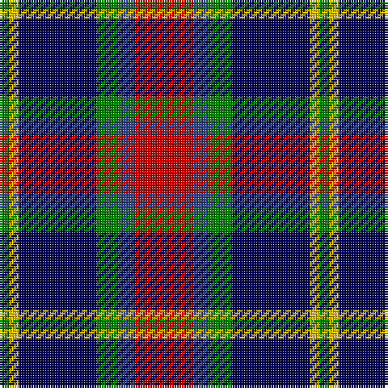

In pattern [GYBGBR](/patterns/gybgbr/).

This was sourced from weddslist.  It is a [6 stripes tartan](/stripes/stripes6/).

Original link http://www.weddslist.com/cgi-bin/tartans/pg.pl?source=sts

## Thread count
G/4 Y4 DB32 G10 B6 R/24

## Palette
Each colour and its ΔE from the base-6 reference it is a variant of.

| Colour | Shade | Base | ΔE (OKLab) |
|---|---|---|---|
| B | <code style="background-color:#304080;">#304080</code> `#304080` | B <code style="background-color:#2A418A;">#2A418A</code> | 0.02 |
| DB | <code style="background-color:#000050;">#000050</code> `#000050` | B <code style="background-color:#2A418A;">#2A418A</code> | 0.21 |
| G | <code style="background-color:#008000;">#008000</code> `#008000` | G <code style="background-color:#006100;">#006100</code> | 0.10 |
| R | <code style="background-color:#C00000;">#C00000</code> `#C00000` | R <code style="background-color:#CC0000;">#CC0000</code> | 0.03 |
| Y | <code style="background-color:#F0C000;">#F0C000</code> `#F0C000` | Y <code style="background-color:#F2BF00;">#F2BF00</code> | 0.00 |

# Sample pattern

## Nearest tartans

The nearest existing variants by ΔTartan distance.

1. [Jewell of Kernow (Personal)](/setts/s6/w12k58r58b14k6ra6-b600060-k101010-r888888-rac80000-we0e0e0/) — ΔT 0.68
1. [Wilson's, No 183](/setts/s6/k8b4ba24g24r4g4-b5480b0-ba800080-g008000-k000000-rc00000/) — ΔT 0.73
1. [Fife](/setts/s6/b62ba8b12k38r40y8-b304080-ba5480b0-k000000-rc00000-yf0c000/) — ΔT 0.75
1. [Dunbog Primary School Corporate Tartan Tartan Number: 954. Earliest known date: 1985 C. Armstrong is a pupil at the school. See products available Copyright © Blair Urquhart, Comrie, 2015](/setts/s6/r24b6g10ba32y4g4-b2c2c80-ba202060-g006818-rc80000-ye8c000/) — ΔT 0.80
1. [Thom(p)son's, Fancy](/setts/s6/r12ra48b12ba24k24ba6-b304080-ba5480b0-k000000-rc00000-ra806050/) — ΔT 0.85
1. [Wilson's, No 176](/setts/s5/k8b6g24ba26y4-b5480b0-ba800080-g008000-k000000-yf0c000/) — ΔT 0.87
1. [Commonwealth Games Council (Corp.)](/setts/s6/r6k34b22r4ra40w4-b484848-k101010-rb468ac-ra888888-we0e0e0/) — ΔT 0.88
1. [Stovell (2015)](/setts/s6/b90r36g48k12w12k12-b202060-g005020-k101010-rb03000-wf8f4d0/) — ΔT 0.91
1. [Kervegant, Suzanne (Personal)](/setts/s8/g12b22w16k8w16k54w8r8-b2c2c80-g006818-k101010-rc80000-wc0c0c0/) — ΔT 0.92
1. [Colquhoun](/setts/s7/b12k6b42k46w6g48r6-b800080-g008000-k000000-rc00000-we0e0e0/) — ΔT 0.93

## Neighbour map

Every grey dot is one of 15726 variants placed by the first two principal components of the ΔTartan feature space (44% of its variance). Red is this tartan; blue dots are its nearest — click one to open its page.

<svg viewBox="0 0 640 380" role="img" style="max-width:100%;height:auto;border:1px solid #e0e0e0;border-radius:4px;display:block" xmlns="http://www.w3.org/2000/svg"><image href="/nn/cloud.v1.png" width="640" height="380"/><a href="/setts/s6/w12k58r58b14k6ra6-b600060-k101010-r888888-rac80000-we0e0e0/"><circle cx="185.9" cy="177.7" r="4" fill="#3465a4"><title>Jewell of Kernow (Personal)</title></circle></a><a href="/setts/s6/k8b4ba24g24r4g4-b5480b0-ba800080-g008000-k000000-rc00000/"><circle cx="159.0" cy="205.5" r="4" fill="#3465a4"><title>Wilson's, No 183</title></circle></a><a href="/setts/s6/b62ba8b12k38r40y8-b304080-ba5480b0-k000000-rc00000-yf0c000/"><circle cx="168.9" cy="202.3" r="4" fill="#3465a4"><title>Fife</title></circle></a><a href="/setts/s6/r24b6g10ba32y4g4-b2c2c80-ba202060-g006818-rc80000-ye8c000/"><circle cx="177.9" cy="198.2" r="4" fill="#3465a4"><title>Dunbog Primary School Corporate Tartan Tartan Number: 954. Earliest known date: 1985 C. Armstrong is a pupil at the school. See products available Copyright © Blair Urquhart, Comrie, 2015</title></circle></a><a href="/setts/s6/r12ra48b12ba24k24ba6-b304080-ba5480b0-k000000-rc00000-ra806050/"><circle cx="132.6" cy="210.0" r="4" fill="#3465a4"><title>Thom(p)son's, Fancy</title></circle></a><a href="/setts/s5/k8b6g24ba26y4-b5480b0-ba800080-g008000-k000000-yf0c000/"><circle cx="133.4" cy="216.4" r="4" fill="#3465a4"><title>Wilson's, No 176</title></circle></a><a href="/setts/s6/r6k34b22r4ra40w4-b484848-k101010-rb468ac-ra888888-we0e0e0/"><circle cx="156.8" cy="190.0" r="4" fill="#3465a4"><title>Commonwealth Games Council (Corp.)</title></circle></a><a href="/setts/s6/b90r36g48k12w12k12-b202060-g005020-k101010-rb03000-wf8f4d0/"><circle cx="178.9" cy="208.3" r="4" fill="#3465a4"><title>Stovell (2015)</title></circle></a><a href="/setts/s8/g12b22w16k8w16k54w8r8-b2c2c80-g006818-k101010-rc80000-wc0c0c0/"><circle cx="142.1" cy="184.9" r="4" fill="#3465a4"><title>Kervegant, Suzanne (Personal)</title></circle></a><a href="/setts/s7/b12k6b42k46w6g48r6-b800080-g008000-k000000-rc00000-we0e0e0/"><circle cx="118.0" cy="185.9" r="4" fill="#3465a4"><title>Colquhoun</title></circle></a><circle cx="157.1" cy="193.2" r="5" fill="#c00000"/></svg>

ID: /setts/s6/r24b6g10ba32y4g4-b304080-ba000050-g008000-rc00000-yf0c000/
