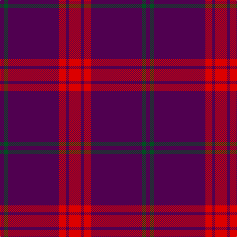

In pattern [BGBRBR](/patterns/bgbrbr/).

This was sourced from register-of-tartans.  It is a [6 stripes tartan](/stripes/stripes6/).

Original link https://www.tartanregister.gov.uk/tartanDetails.aspx?ref=2254

## Thread count
DP/8 G8 DP104 R14 DP6 R/24

## Palette
Each colour and its ΔE from the base-6 reference it is a variant of.

| Colour | Shade | Base | ΔE (OKLab) |
|---|---|---|---|
| DP | <code style="background-color:#500050;">#500050</code> `#500050` | B <code style="background-color:#2A418A;">#2A418A</code> | 0.17 |
| G | <code style="background-color:#005020;">#005020</code> `#005020` | G <code style="background-color:#006100;">#006100</code> | 0.07 |
| R | <code style="background-color:#DC0000;">#DC0000</code> `#DC0000` | R <code style="background-color:#CC0000;">#CC0000</code> | 0.03 |

# Sample pattern

## Nearest tartans

The nearest existing variants by ΔTartan distance.

1. [Inverness, Augustus](/setts/s7/r36g2k10g2k2g2r18-g008000-k000000-r802040/) — ΔT 1.65
1. [Bennet](/setts/s11/r128b36r4b6r4b6r28ba16r4ba8r4-b202060-ba2888c4-ra00048/) — ΔT 1.84
1. [Salt Lake County (District)](/setts/s7/k8r80k2r6k2w6k8-k101010-r800028-we0e0e0/) — ΔT 2.01
1. [Cairngorms National Park](/setts/s8/b114r10b4r16w4b6y4b28-b440044-ra00048-wc8c8c8-yf8e38c/) — ΔT 2.02
1. [Lynch Family Tartan Tartan Number: 2163. Earliest known date: 1994 Information from Dr. Phil Smith, Narvon, USA. See products available Copyright © Blair Urquhart, Comrie, 2015](/setts/s6/r19b6r14b101g7b7-b2c2c80-g006818-rc80000/) — ΔT 2.07
1. [Highland Spring (1988) (Corporate)](/setts/s4/b12g4b36r12-b440044-g006818-rc80000/) — ΔT 2.08
1. [Lyon College (Corporate)](/setts/s6/r160b32r4w8r4b32-b1474b4-r880000-wf8f8f8/) — ΔT 2.09
1. [Carolina University, Western](/setts/s5/g2k4b54k4y2-b780078-g003820-k101010-ye8c000/) — ΔT 2.10
1. [Masai Shuka 23 (Artefact)](/setts/s10/r60b16r4b4r4b4r4b4r4b4-b2c2c80-rc80000/) — ΔT 2.11
1. [Masai Shuka 27 (Artefact)](/setts/s10/r60b16r4k2r4k2r4k2r4b16-b2c2c80-k101010-rc80000/) — ΔT 2.13

## Neighbour map

Every grey dot is one of 15726 variants placed by the first two principal components of the ΔTartan feature space (44% of its variance). Red is this tartan; blue dots are its nearest — click one to open its page.

<svg viewBox="0 0 640 380" role="img" style="max-width:100%;height:auto;border:1px solid #e0e0e0;border-radius:4px;display:block" xmlns="http://www.w3.org/2000/svg"><image href="/nn/cloud.v1.png" width="640" height="380"/><a href="/setts/s7/r36g2k10g2k2g2r18-g008000-k000000-r802040/"><circle cx="509.3" cy="180.5" r="4" fill="#3465a4"><title>Inverness, Augustus</title></circle></a><a href="/setts/s11/r128b36r4b6r4b6r28ba16r4ba8r4-b202060-ba2888c4-ra00048/"><circle cx="548.7" cy="128.1" r="4" fill="#3465a4"><title>Bennet</title></circle></a><a href="/setts/s7/k8r80k2r6k2w6k8-k101010-r800028-we0e0e0/"><circle cx="595.4" cy="131.8" r="4" fill="#3465a4"><title>Salt Lake County (District)</title></circle></a><a href="/setts/s8/b114r10b4r16w4b6y4b28-b440044-ra00048-wc8c8c8-yf8e38c/"><circle cx="614.5" cy="143.3" r="4" fill="#3465a4"><title>Cairngorms National Park</title></circle></a><a href="/setts/s6/r19b6r14b101g7b7-b2c2c80-g006818-rc80000/"><circle cx="530.0" cy="195.2" r="4" fill="#3465a4"><title>Lynch Family Tartan Tartan Number: 2163. Earliest known date: 1994 Information from Dr. Phil Smith, Narvon, USA. See products available Copyright © Blair Urquhart, Comrie, 2015</title></circle></a><a href="/setts/s4/b12g4b36r12-b440044-g006818-rc80000/"><circle cx="504.7" cy="273.8" r="4" fill="#3465a4"><title>Highland Spring (1988) (Corporate)</title></circle></a><a href="/setts/s6/r160b32r4w8r4b32-b1474b4-r880000-wf8f8f8/"><circle cx="529.3" cy="144.4" r="4" fill="#3465a4"><title>Lyon College (Corporate)</title></circle></a><a href="/setts/s5/g2k4b54k4y2-b780078-g003820-k101010-ye8c000/"><circle cx="623.7" cy="158.9" r="4" fill="#3465a4"><title>Carolina University, Western</title></circle></a><a href="/setts/s10/r60b16r4b4r4b4r4b4r4b4-b2c2c80-rc80000/"><circle cx="533.7" cy="161.8" r="4" fill="#3465a4"><title>Masai Shuka 23 (Artefact)</title></circle></a><a href="/setts/s10/r60b16r4k2r4k2r4k2r4b16-b2c2c80-k101010-rc80000/"><circle cx="496.0" cy="121.0" r="4" fill="#3465a4"><title>Masai Shuka 27 (Artefact)</title></circle></a><circle cx="530.8" cy="188.9" r="5" fill="#c00000"/></svg>

ID: /setts/s6/r24b6r14b104g8b8-b500050-g005020-rdc0000/
