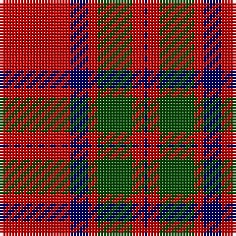

This page is one **sett** — a single exact thread-count. It belongs to the [tartan](/tartans/r24db6r3g12r4db1/)
(the same proportion at any scale), whose colour order is pattern [BRGRBR](/stripes/brgrbr/).

Sourced from weddslist.  It is a [6 stripe tartan](/stripes/stripes6/).

Original link http://www.weddslist.com/cgi-bin/tartans/pg.pl?source=rb

2 attestations — the source records this cloth was collapsed from (oldest owns this page)

<ul>
<li>undated — MacKintosh (weddslist, <a href="http://www.weddslist.com/cgi-bin/tartans/pg.pl?source=rb">record</a>)</li>
<li>undated — MacKintosh (weddslist, <a href="http://www.weddslist.com/cgi-bin/tartans/pg.pl?source=x">record</a>)</li>
</ul>

## Thread count
R/24 DB6 R3 G12 R4 DB/1

## Palette
Each colour and the base-6 reference it is a variant of.

| Colour | Shade | Base |
|---|---|---|
| DB | <code style="background-color:#000064;">#000064</code> `oklch(22.7% 0.158 264.1)` <small>#000064</small> | B <code style="background-color:#2A418A;">#2A418A</code> |
| G | <code style="background-color:#004C00;">#004C00</code> `oklch(36.1% 0.123 142.5)` <small>#004C00</small> | G <code style="background-color:#006100;">#006100</code> |
| R | <code style="background-color:#C80000;">#C80000</code> `oklch(52.3% 0.215 29.2)` <small>#C80000</small> | R <code style="background-color:#CC0000;">#CC0000</code> |

# Sample pattern

## Nearest tartans

The nearest existing variants by ΔTartan distance, with this tartan at the top so the swatches line up against it.

ΔTartan

Tartan

Sett

—

<a href="/ttd/edit/#slug=r24db6r3dg12r4db1">MacKintosh</a> <a class="nn-out" href="/setts/s6/r24db6r3dg12r4db1/" title="open its dictionary page">↗</a>

0.24

<a href="/ttd/edit/#slug=r22db5r2dg11r3db1">MacKintosh D</a> <a class="nn-out" href="/setts/s6/r22db5r2dg11r3db1/" title="open its dictionary page">↗</a>

0.62

<a href="/ttd/edit/#slug=r68db18r9dg34r9db3~x2">MacKintosh #2</a> <a class="nn-out" href="/setts/s6/r68db18r9dg34r9db3~x2/" title="open its dictionary page">↗</a>

0.74

<a href="/ttd/edit/#slug=r70db20r10g40r10db3">MacKintosh</a> <a class="nn-out" href="/setts/s6/r70db20r10g40r10db3/" title="open its dictionary page">↗</a>

0.78

<a href="/ttd/edit/#slug=r3dg16r4k6r28dg1r3~x2">Maxwell Ancient</a> <a class="nn-out" href="/setts/s7/r3dg16r4k6r28dg1r3~x2/" title="open its dictionary page">↗</a>

0.80

<a href="/ttd/edit/#slug=r24db6r3dg12r4db1~x2">MacKintosh</a> <a class="nn-out" href="/setts/s6/r24db6r3dg12r4db1~x2/" title="open its dictionary page">↗</a>

0.86

<a href="/ttd/edit/#slug=r22db5r2dg11r3db1~x2">MacKintosh D</a> <a class="nn-out" href="/setts/s6/r22db5r2dg11r3db1~x2/" title="open its dictionary page">↗</a>

0.88

<a href="/ttd/edit/#slug=r3g16r4k6r28g1r3~x2">Maxwell</a> <a class="nn-out" href="/setts/s7/r3g16r4k6r28g1r3~x2/" title="open its dictionary page">↗</a>

0.90

<a href="/ttd/edit/#slug=r68db18r9g34r9db3~x2">MacKintosh 3</a> <a class="nn-out" href="/setts/s6/r68db18r9g34r9db3~x2/" title="open its dictionary page">↗</a>

0.94

<a href="/ttd/edit/#slug=r5g20r25db1r25db20r5db1~x4">Franklin Museum Unidentified 2</a> <a class="nn-out" href="/setts/s8/r5g20r25db1r25db20r5db1~x4/" title="open its dictionary page">↗</a>

0.95

<a href="/ttd/edit/#slug=r22db5r2g11r3db1~x2">MacKintosh 1</a> <a class="nn-out" href="/setts/s6/r22db5r2g11r3db1~x2/" title="open its dictionary page">↗</a>

## Neighbour map

Every grey dot is one of 14299 variants placed by the first two principal components of the ΔTartan feature space (44% of its variance). Red is this tartan; blue dots are its nearest — click one to open its page.

<svg viewBox="0 0 640 380" role="img" style="max-width:100%;height:auto;border:1px solid #e0e0e0;border-radius:4px;display:block" xmlns="http://www.w3.org/2000/svg"><image href="/nn/cloud.v1.png" width="640" height="380"/><a href="/setts/s6/r22db5r2dg11r3db1/"><circle cx="408.7" cy="177.4" r="4" fill="#3465a4"><title>MacKintosh D</title></circle></a><a href="/setts/s6/r68db18r9dg34r9db3~x2/"><circle cx="412.7" cy="180.5" r="4" fill="#3465a4"><title>MacKintosh #2</title></circle></a><a href="/setts/s6/r70db20r10g40r10db3/"><circle cx="401.2" cy="187.7" r="4" fill="#3465a4"><title>MacKintosh</title></circle></a><a href="/setts/s7/r3dg16r4k6r28dg1r3~x2/"><circle cx="428.6" cy="156.0" r="4" fill="#3465a4"><title>Maxwell Ancient</title></circle></a><a href="/setts/s6/r24db6r3dg12r4db1~x2/"><circle cx="430.6" cy="192.7" r="4" fill="#3465a4"><title>MacKintosh</title></circle></a><a href="/setts/s6/r22db5r2dg11r3db1~x2/"><circle cx="428.4" cy="191.6" r="4" fill="#3465a4"><title>MacKintosh D</title></circle></a><a href="/setts/s7/r3g16r4k6r28g1r3~x2/"><circle cx="436.9" cy="163.2" r="4" fill="#3465a4"><title>Maxwell</title></circle></a><a href="/setts/s6/r68db18r9g34r9db3~x2/"><circle cx="419.1" cy="187.8" r="4" fill="#3465a4"><title>MacKintosh 3</title></circle></a><a href="/setts/s8/r5g20r25db1r25db20r5db1~x4/"><circle cx="381.1" cy="180.5" r="4" fill="#3465a4"><title>Franklin Museum Unidentified 2</title></circle></a><a href="/setts/s6/r22db5r2g11r3db1~x2/"><circle cx="425.0" cy="185.2" r="4" fill="#3465a4"><title>MacKintosh 1</title></circle></a><circle cx="411.0" cy="178.6" r="5" fill="#c00000"/></svg>

ID: /setts/s6/r24db6r3dg12r4db1/
