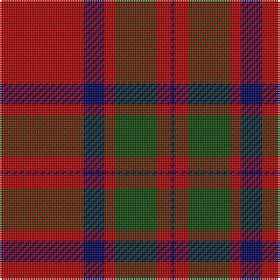

In pattern [BRGRBR](/stripes/brgrbr/).

This was sourced from weddslist.  It is a [6 stripe tartan](/stripes/stripes6/).

Original link http://www.weddslist.com/cgi-bin/tartans/pg.pl?source=tinsel

## Register references

External register numbers recorded for this tartan.

- Scottish Register of Tartans: [1166](https://www.tartanregister.gov.uk/tartanDetails.aspx?ref=1166)
- Scottish Register of Tartans: [1510](https://www.tartanregister.gov.uk/tartanDetails.aspx?ref=1510)
- Scottish Register of Tartans: [1758](https://www.tartanregister.gov.uk/tartanDetails.aspx?ref=1758)
- Scottish Register of Tartans: [2307](https://www.tartanregister.gov.uk/tartanDetails.aspx?ref=2307)
- Scottish Register of Tartans: [2349](https://www.tartanregister.gov.uk/tartanDetails.aspx?ref=2349)
- Scottish Register of Tartans: [2540](https://www.tartanregister.gov.uk/tartanDetails.aspx?ref=2540)
- Scottish Register of Tartans: [2582](https://www.tartanregister.gov.uk/tartanDetails.aspx?ref=2582)
- Scottish Register of Tartans: [2585](https://www.tartanregister.gov.uk/tartanDetails.aspx?ref=2585)
- Scottish Register of Tartans: [2625](https://www.tartanregister.gov.uk/tartanDetails.aspx?ref=2625)
- Scottish Register of Tartans: [2730](https://www.tartanregister.gov.uk/tartanDetails.aspx?ref=2730)
- Scottish Register of Tartans: [2862](https://www.tartanregister.gov.uk/tartanDetails.aspx?ref=2862)
- Scottish Register of Tartans: [3072](https://www.tartanregister.gov.uk/tartanDetails.aspx?ref=3072)
- Scottish Register of Tartans: [3555](https://www.tartanregister.gov.uk/tartanDetails.aspx?ref=3555)
- Scottish Register of Tartans: [4925](https://www.tartanregister.gov.uk/tartanDetails.aspx?ref=4925)
- Scottish Register of Tartans: [696](https://www.tartanregister.gov.uk/tartanDetails.aspx?ref=696)
- Scottish Register of Tartans: [697](https://www.tartanregister.gov.uk/tartanDetails.aspx?ref=697)
- Scottish Register of Tartans: [982](https://www.tartanregister.gov.uk/tartanDetails.aspx?ref=982)
- Scottish Tartans Authority (ITI): 1277
- Scottish Tartans Authority (ITI): 1429
- Scottish Tartans Authority (ITI): 218
- Scottish Tartans Authority (ITI): 977
- Scottish Tartans World Register: 1042
- Scottish Tartans World Register: 127
- Scottish Tartans World Register: 1277
- Scottish Tartans World Register: 1399
- Scottish Tartans World Register: 1429
- Scottish Tartans World Register: 1593
- Scottish Tartans World Register: 218
- Scottish Tartans World Register: 2218
- Scottish Tartans World Register: 3061
- Scottish Tartans World Register: 441
- Scottish Tartans World Register: 737
- Scottish Tartans World Register: 858
- Scottish Tartans World Register: 864
- Scottish Tartans World Register: 873
- Scottish Tartans World Register: 897
- Scottish Tartans World Register: 977
- Scottish Tartans World Register: 978

## Thread count
DR/48 DB12 DR6 DG24 DR8 DB/2

## Palette
Each colour and its ΔE from the base-6 reference it is a variant of.

| Colour | Shade | Base | ΔE (OKLab) |
|---|---|---|---|
| DB | <code style="background-color:#000052;">#000052</code> `#000052` | B <code style="background-color:#2A418A;">#2A418A</code> | 0.20 |
| DG | <code style="background-color:#11450D;">#11450D</code> `#11450D` | G <code style="background-color:#006100;">#006100</code> | 0.09 |
| DR | <code style="background-color:#AA0000;">#AA0000</code> `#AA0000` | R <code style="background-color:#CC0000;">#CC0000</code> | 0.07 |

# Sample pattern

## Nearest tartans

The nearest existing variants by ΔTartan distance.

1. [MacKintosh D](/setts/s6/r22db5r2dg11r3db1~x2/) — ΔT 0.24
1. [MacKintosh](/setts/s6/r70db20r10g40r10db3/) — ΔT 0.80
1. [MacKintosh](/setts/s6/r24db6r3dg12r4db1/) — ΔT 0.80
1. [MacKintosh D](/setts/s6/r22db5r2dg11r3db1/) — ΔT 0.82
1. [MacKintosh 3](/setts/s6/r68db18r9g34r9db3~x2/) — ΔT 0.91
1. [MacKintosh Plaid](/setts/s6/r16db6r2dg6r2db1~x2/) — ΔT 0.96
1. [MacKintosh 1](/setts/s6/r22db5r2g11r3db1~x2/) — ΔT 0.97
1. [MacKintosh #2](/setts/s6/r68db18r9dg34r9db3~x2/) — ΔT 0.98
1. [MacKintosh, Plaid](/setts/s6/r16db6r2g6r2db1~x2/) — ΔT 0.99
1. [Franklin Museum Unidentified 2](/setts/s8/r5g20r25db1r25db20r5db1~x4/) — ΔT 1.07

## Neighbour map

Every grey dot is one of 14299 variants placed by the first two principal components of the ΔTartan feature space (44% of its variance). Red is this tartan; blue dots are its nearest — click one to open its page.

<svg viewBox="0 0 640 380" role="img" style="max-width:100%;height:auto;border:1px solid #e0e0e0;border-radius:4px;display:block" xmlns="http://www.w3.org/2000/svg"><image href="/nn/cloud.v1.png" width="640" height="380"/><a href="/setts/s6/r22db5r2dg11r3db1~x2/"><circle cx="428.4" cy="191.6" r="4" fill="#3465a4"><title>MacKintosh D</title></circle></a><a href="/setts/s6/r70db20r10g40r10db3/"><circle cx="401.2" cy="187.7" r="4" fill="#3465a4"><title>MacKintosh</title></circle></a><a href="/setts/s6/r24db6r3dg12r4db1/"><circle cx="411.0" cy="178.6" r="4" fill="#3465a4"><title>MacKintosh</title></circle></a><a href="/setts/s6/r22db5r2dg11r3db1/"><circle cx="408.7" cy="177.4" r="4" fill="#3465a4"><title>MacKintosh D</title></circle></a><a href="/setts/s6/r68db18r9g34r9db3~x2/"><circle cx="419.1" cy="187.8" r="4" fill="#3465a4"><title>MacKintosh 3</title></circle></a><a href="/setts/s6/r16db6r2dg6r2db1~x2/"><circle cx="402.9" cy="199.9" r="4" fill="#3465a4"><title>MacKintosh Plaid</title></circle></a><a href="/setts/s6/r22db5r2g11r3db1~x2/"><circle cx="425.0" cy="185.2" r="4" fill="#3465a4"><title>MacKintosh 1</title></circle></a><a href="/setts/s6/r68db18r9dg34r9db3~x2/"><circle cx="412.7" cy="180.5" r="4" fill="#3465a4"><title>MacKintosh #2</title></circle></a><a href="/setts/s6/r16db6r2g6r2db1~x2/"><circle cx="402.7" cy="201.7" r="4" fill="#3465a4"><title>MacKintosh, Plaid</title></circle></a><a href="/setts/s8/r5g20r25db1r25db20r5db1~x4/"><circle cx="381.1" cy="180.5" r="4" fill="#3465a4"><title>Franklin Museum Unidentified 2</title></circle></a><circle cx="430.6" cy="192.7" r="5" fill="#c00000"/></svg>

ID: /setts/s6/r24db6r3dg12r4db1~x2/
