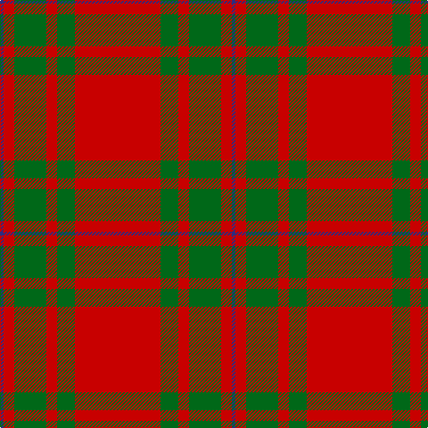

**Bands:** [BRGRGR](/stripes/brgrgr/) · **Stripes:** [DB R G R G R](/stripes/stripes6/) DB R G R G R

This was sourced from register-of-tartans.  It is a [6 band tartan](/bands/bands6/).

Original link https://www.tartanregister.gov.uk/tartanDetails.aspx?ref=2576

## Attestations

This cloth appears in 2 source records; the oldest owns this page.

- 01/01/1951 — MacKintosh, Red (register-of-tartans, [record](https://www.tartanregister.gov.uk/tartanDetails.aspx?ref=2576))
- undated — MacKintosh, Red Clan/Family Tartan Tartan Number: 5889. Earliest known date: 1951 This is the count for Red MacKintosh as decided by Lord Lyon and sent to Vice Admiral The Mackintosh of Mackintosh on 20th March 1951. It differs from No.521 (MacKintosh Clan) in that here the narrow bands outwith the broad green bands are also green: in No.521 they are blue. Lyon and Mr Kinloch Anderson had readjusted the setts of this and the Hunting tartan to correct discrepancies which they believed to have crept in over the years. It is generally regarded that the Chief of the Clan is the final arbiter of the sett of the Clan tartan, rather than the Lord Lyon. See products available Copyright © Blair Urquhart, Comrie, 2015 (house-of-tartan, [record](http://www.house-of-tartan.scotland.net/house/TartanViewjs.asp?colr=Def&tnam=5889))

## Register references

External register numbers recorded for this tartan.

- Scottish Register of Tartans: [2576](https://www.tartanregister.gov.uk/tartanDetails.aspx?ref=2576)
- Scottish Tartans Authority (ITI): 5889

## Thread count
DB/4 R12 G36 R12 G20 R/96

## Palette
Each colour and its ΔE from the base-6 reference it is a variant of.

| Colour | Shade | Base | ΔE (OKLab) |
|---|---|---|---|
| DB | <code style="background-color:#2C2C80;">#2C2C80</code> `#2C2C80` | B <code style="background-color:#2A418A;">#2A418A</code> | 0.06 |
| G | <code style="background-color:#006818;">#006818</code> `#006818` | G <code style="background-color:#006100;">#006100</code> | 0.02 |
| R | <code style="background-color:#C80000;">#C80000</code> `#C80000` | R <code style="background-color:#CC0000;">#CC0000</code> | 0.01 |

# Sample pattern

## Nearest tartans

The nearest existing variants by ΔTartan distance.

1. [Cameron, Ancient](/setts/s7/r58ly3r6g16r12g16r6/) — ΔT 0.68
1. [MacKintosh 2](/setts/s6/r48db2r3g28r4db2~x2/) — ΔT 0.79
1. [MacKintosh #3](/setts/s6/r48db2r3dg28r4db2~x2/) — ΔT 0.88
1. [Cameron Ancient](/setts/s7/r58ly3r6dg16r12dg16r6/) — ΔT 0.98
1. [Monica](/setts/s6/r3o10r3o4r20lb1~x4/) — ΔT 1.00
1. [Maxwell](/setts/s7/r3g16r4k6r28g1r3~x2/) — ΔT 1.04
1. [Cameron (Clan)](/setts/s6/r2g6r2g6r16ly1~x4/) — ΔT 1.05
1. [MacKintosh 1](/setts/s6/r22db5r2g11r3db1~x2/) — ΔT 1.06
1. [Cameron](/setts/s6/r2dg6r2dg6r16ly1~x2/) — ΔT 1.14
1. [Crawford](/setts/s7/r6lb2r30dg12r3dg12r3/) — ΔT 1.14

## Neighbour map

Every grey dot is one of 14313 variants placed by the first two principal components of the ΔTartan feature space (44% of its variance). Red is this tartan; blue dots are its nearest — click one to open its page.

<svg viewBox="0 0 640 380" role="img" style="max-width:100%;height:auto;border:1px solid #e0e0e0;border-radius:4px;display:block" xmlns="http://www.w3.org/2000/svg"><image href="/nn/cloud.v1.png" width="640" height="380"/><a href="/setts/s7/r58ly3r6g16r12g16r6/"><circle cx="496.5" cy="181.6" r="4" fill="#3465a4"><title>Cameron, Ancient</title></circle></a><a href="/setts/s6/r48db2r3g28r4db2~x2/"><circle cx="467.4" cy="170.5" r="4" fill="#3465a4"><title>MacKintosh 2</title></circle></a><a href="/setts/s6/r48db2r3dg28r4db2~x2/"><circle cx="461.1" cy="162.9" r="4" fill="#3465a4"><title>MacKintosh #3</title></circle></a><a href="/setts/s7/r58ly3r6dg16r12dg16r6/"><circle cx="489.5" cy="173.3" r="4" fill="#3465a4"><title>Cameron Ancient</title></circle></a><a href="/setts/s6/r3o10r3o4r20lb1~x4/"><circle cx="462.4" cy="199.3" r="4" fill="#3465a4"><title>Monica</title></circle></a><a href="/setts/s7/r3g16r4k6r28g1r3~x2/"><circle cx="437.3" cy="163.5" r="4" fill="#3465a4"><title>Maxwell</title></circle></a><a href="/setts/s6/r2g6r2g6r16ly1~x4/"><circle cx="422.2" cy="202.4" r="4" fill="#3465a4"><title>Cameron (Clan)</title></circle></a><a href="/setts/s6/r22db5r2g11r3db1~x2/"><circle cx="425.4" cy="185.4" r="4" fill="#3465a4"><title>MacKintosh 1</title></circle></a><a href="/setts/s6/r2dg6r2dg6r16ly1~x2/"><circle cx="415.0" cy="198.8" r="4" fill="#3465a4"><title>Cameron</title></circle></a><a href="/setts/s7/r6lb2r30dg12r3dg12r3/"><circle cx="417.6" cy="193.7" r="4" fill="#3465a4"><title>Crawford</title></circle></a><circle cx="490.4" cy="183.9" r="5" fill="#c00000"/></svg>

ID: /setts/s6/r24g5r3g9r3db1~x4/
