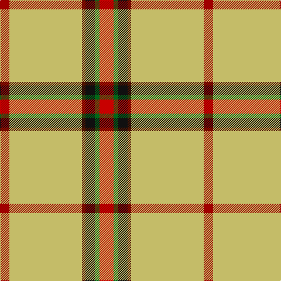

In pattern [RGKBYR](/patterns/rgkbyr/).

This was sourced from tartans-authority.  It is a [6 stripes tartan](/stripes/stripes6/).

Original link http://www.tartansauthority.com/tartan-ferret/display/10900/

## Thread count
DRa/16 LG124 DR6 K16 G8 R/24

## Palette
Each colour and its ΔE from the base-6 reference it is a variant of.

| Colour | Shade | Base | ΔE (OKLab) |
|---|---|---|---|
| DR | <code style="background-color:#501400;">#501400</code> `#501400` | B <code style="background-color:#2C4084;">#2C4084</code> | 0.22 |
| DRa | <code style="background-color:#A00000;">#A00000</code> `#A00000` | R <code style="background-color:#C80000;">#C80000</code> | 0.09 |
| G | <code style="background-color:#006818;">#006818</code> `#006818` | G <code style="background-color:#006400;">#006400</code> | 0.02 |
| K | <code style="background-color:#101010;">#101010</code> `#101010` | K <code style="background-color:#000000;">#000000</code> | 0.17 |
| LG | <code style="background-color:#C4BC68;">#C4BC68</code> `#C4BC68` | Y <code style="background-color:#E8C000;">#E8C000</code> | 0.07 |
| R | <code style="background-color:#C80000;">#C80000</code> `#C80000` | R <code style="background-color:#C80000;">#C80000</code> | 0.00 |

# Sample pattern

## Nearest tartans

The nearest existing variants by ΔTartan distance.

1. [Shawn Jones Afghan Memorial, The](/setts/s6/r24g8k16b6y124ra16-b5d321f-g649848-k1c1714-rca2625-rab62531-yf5d38b/) — ΔT 0.86
1. [Port Moresby City Pipes & Drums](/setts/s5/g4w6k24y72r4-g006818-k101010-rc80000-we0e0e0-ye8c000/) — ΔT 1.44
1. [Saskatchewan Dress (Dance)](/setts/s8/w4k2g12ga22w52r4w2y4-g006818-ga604000-k101010-rc80000-we0e0e0-ye8c000/) — ΔT 1.70
1. [Murison, Ina](/setts/s12/k8y22k8g6k8r12y6g6y8g2y60g6-g006818-k101010-rc80000-ye8c000/) — ΔT 1.83
1. [McAleavy (2014)](/setts/s11/g112w12y12ya4wa4ya4wa32w20wa4g12r6-g606000-rc80000-wc0c0c0-wafcfcfc-yc4bc68-yafccc00/) — ΔT 1.87
1. [Saskatchewan District Tartan Tartan Number: 1817. Earliest known date: 1959 The colours chosen are the same as those for the flag. Red for the Blood of Christ, blue for the Heavenly Father, yellow for Fire of the Holy Spirit when tongues of fire symbolized his presence at Penticost. See products available Copyright © Blair Urquhart, Comrie, 2015](/setts/s8/w4k2g12ga22y52r4y2y4-g006818-ga604000-k101010-rc80000-we0e0e0-ye8c000/) — ΔT 1.90
1. [Hoa Sen](/setts/s8/y16k4r46k2r34k2g8w6-g007800-k101010-re87878-wffffff-yffe600/) — ΔT 1.91
1. [McAleavy (2014)](/setts/s11/g112y12w12ya4wa4ya4wa32y20wa4g12r6-g5c6428-ra00000-wf8f4d0-waffffff-ya0a0a0-yaf8e38c/) — ΔT 2.00
1. [Bell's Whisky](/setts/s9/r12w20g64y8g4y160w24ra12r8-g604000-rc40000-ra888888-wf8f8f8-ybc8c00/) — ΔT 2.05
1. [Port Moresby City Pipes and Drums](/setts/s5/g4w6k10y66r4-g309c18-k101010-rdc0000-we0e0e0-ye8c000/) — ΔT 2.07

## Neighbour map

Every grey dot is one of 15726 variants placed by the first two principal components of the ΔTartan feature space (44% of its variance). Red is this tartan; blue dots are its nearest — click one to open its page.

<svg viewBox="0 0 640 380" role="img" style="max-width:100%;height:auto;border:1px solid #e0e0e0;border-radius:4px;display:block" xmlns="http://www.w3.org/2000/svg"><image href="/nn/cloud.v1.png" width="640" height="380"/><a href="/setts/s6/r24g8k16b6y124ra16-b5d321f-g649848-k1c1714-rca2625-rab62531-yf5d38b/"><circle cx="334.0" cy="95.5" r="4" fill="#3465a4"><title>Shawn Jones Afghan Memorial, The</title></circle></a><a href="/setts/s5/g4w6k24y72r4-g006818-k101010-rc80000-we0e0e0-ye8c000/"><circle cx="348.6" cy="131.9" r="4" fill="#3465a4"><title>Port Moresby City Pipes &amp; Drums</title></circle></a><a href="/setts/s8/w4k2g12ga22w52r4w2y4-g006818-ga604000-k101010-rc80000-we0e0e0-ye8c000/"><circle cx="279.0" cy="78.0" r="4" fill="#3465a4"><title>Saskatchewan Dress (Dance)</title></circle></a><a href="/setts/s12/k8y22k8g6k8r12y6g6y8g2y60g6-g006818-k101010-rc80000-ye8c000/"><circle cx="309.2" cy="62.9" r="4" fill="#3465a4"><title>Murison, Ina</title></circle></a><a href="/setts/s11/g112w12y12ya4wa4ya4wa32w20wa4g12r6-g606000-rc80000-wc0c0c0-wafcfcfc-yc4bc68-yafccc00/"><circle cx="290.3" cy="59.6" r="4" fill="#3465a4"><title>McAleavy (2014)</title></circle></a><a href="/setts/s8/w4k2g12ga22y52r4y2y4-g006818-ga604000-k101010-rc80000-we0e0e0-ye8c000/"><circle cx="252.6" cy="68.8" r="4" fill="#3465a4"><title>Saskatchewan District Tartan Tartan Number: 1817. Earliest known date: 1959 The colours chosen are the same as those for the flag. Red for the Blood of Christ, blue for the Heavenly Father, yellow for Fire of the Holy Spirit when tongues of fire symbolized his presence at Penticost. See products available Copyright © Blair Urquhart, Comrie, 2015</title></circle></a><a href="/setts/s8/y16k4r46k2r34k2g8w6-g007800-k101010-re87878-wffffff-yffe600/"><circle cx="384.7" cy="114.5" r="4" fill="#3465a4"><title>Hoa Sen</title></circle></a><a href="/setts/s11/g112y12w12ya4wa4ya4wa32y20wa4g12r6-g5c6428-ra00000-wf8f4d0-waffffff-ya0a0a0-yaf8e38c/"><circle cx="289.1" cy="60.1" r="4" fill="#3465a4"><title>McAleavy (2014)</title></circle></a><a href="/setts/s9/r12w20g64y8g4y160w24ra12r8-g604000-rc40000-ra888888-wf8f8f8-ybc8c00/"><circle cx="337.6" cy="81.1" r="4" fill="#3465a4"><title>Bell's Whisky</title></circle></a><a href="/setts/s5/g4w6k10y66r4-g309c18-k101010-rdc0000-we0e0e0-ye8c000/"><circle cx="423.3" cy="132.2" r="4" fill="#3465a4"><title>Port Moresby City Pipes and Drums</title></circle></a><circle cx="339.2" cy="104.4" r="5" fill="#c00000"/></svg>

ID: /setts/s6/r24g8k16b6y124ra16-b501400-g006818-k101010-rc80000-raa00000-yc4bc68/
