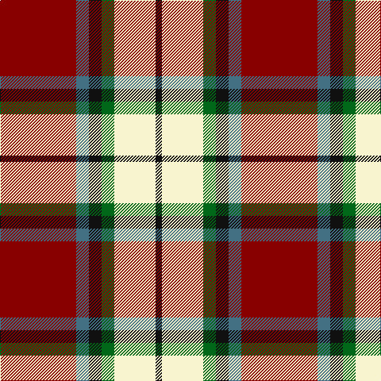

In pattern [KWGKBR](/stripes/kwgkbr/).

This was sourced from register-of-tartans.  It is a [6 stripe tartan](/stripes/stripes6/).

Original link https://www.tartanregister.gov.uk/tartanDetails.aspx?ref=3549

## Attestations

This cloth appears in 2 source records; the oldest owns this page.

- 01/01/1950 — Rose White Dress (register-of-tartans, [record](https://www.tartanregister.gov.uk/tartanDetails.aspx?ref=3549))
- pre 1950 — Rose White Dress (tartans-authority, [record](http://www.tartansauthority.com/tartan-ferret/display/1227/))

## Register references

External register numbers recorded for this tartan.

- Scottish Register of Tartans: [3549](https://www.tartanregister.gov.uk/tartanDetails.aspx?ref=3549)
- Scottish Tartans Authority (ITI): 1227
- Scottish Tartans World Register: 1227

## Thread count
DR/96 B16 K16 G16 LY52 K/8

## Palette
Each colour and its ΔE from the base-6 reference it is a variant of.

| Colour | Shade | Base | ΔE (OKLab) |
|---|---|---|---|
| B | <code style="background-color:#447084;">#447084</code> `#447084` | B <code style="background-color:#2A418A;">#2A418A</code> | 0.15 |
| DR | <code style="background-color:#880000;">#880000</code> `#880000` | R <code style="background-color:#CC0000;">#CC0000</code> | 0.15 |
| G | <code style="background-color:#006818;">#006818</code> `#006818` | G <code style="background-color:#006100;">#006100</code> | 0.02 |
| K | <code style="background-color:#101010;">#101010</code> `#101010` | K <code style="background-color:#000000;">#000000</code> | 0.17 |
| LY | <code style="background-color:#F8F4D0;">#F8F4D0</code> `#F8F4D0` | W <code style="background-color:#F7F7F7;">#F7F7F7</code> | 0.05 |

# Sample pattern

## Nearest tartans

The nearest existing variants by ΔTartan distance.

1. [Rose, White dress](/setts/s6/r32db6k6g6w18k3/) — ΔT 0.54
1. [Caledonian Brewery (Corporate)](/setts/s7/w4dg20dg10r25b2r2dg2~x2/) — ΔT 1.02
1. [Orange Fanaticos (Corporate)](/setts/s7/t12lo75k22w12k22w16t8/) — ΔT 1.16
1. [Glasgow](/setts/s7/dg20r3y3r15w19dg3t2~x2/) — ΔT 1.18
1. [MacLachlan #4](/setts/s7/r24w2ly3dg16k16w2ly3~x2/) — ΔT 1.21
1. [Loch Ness](/setts/s6/r10w2k10w10o35k5~x2/) — ΔT 1.23
1. [Cornish National #2](/setts/s6/w2k11ly11db3k1r1~x2/) — ΔT 1.23
1. [Hearts Football Club (Corporate)](/setts/s9/db3w12k11r4w2r2w2r24ly3~x2/) — ΔT 1.24
1. [Ballater Victoria Week](/setts/s5/dp8ly6k2o1w1~x8/) — ΔT 1.25
1. [Shiel, Claret (Dance)](/setts/s7/w8r5dp10r24w30r2db2~x2/) — ΔT 1.27

## Neighbour map

Every grey dot is one of 14299 variants placed by the first two principal components of the ΔTartan feature space (44% of its variance). Red is this tartan; blue dots are its nearest — click one to open its page.

<svg viewBox="0 0 640 380" role="img" style="max-width:100%;height:auto;border:1px solid #e0e0e0;border-radius:4px;display:block" xmlns="http://www.w3.org/2000/svg"><image href="/nn/cloud.v1.png" width="640" height="380"/><a href="/setts/s6/r32db6k6g6w18k3/"><circle cx="180.3" cy="154.9" r="4" fill="#3465a4"><title>Rose, White dress</title></circle></a><a href="/setts/s7/w4dg20dg10r25b2r2dg2~x2/"><circle cx="203.0" cy="153.8" r="4" fill="#3465a4"><title>Caledonian Brewery (Corporate)</title></circle></a><a href="/setts/s7/t12lo75k22w12k22w16t8/"><circle cx="198.6" cy="172.1" r="4" fill="#3465a4"><title>Orange Fanaticos (Corporate)</title></circle></a><a href="/setts/s7/dg20r3y3r15w19dg3t2~x2/"><circle cx="134.8" cy="157.9" r="4" fill="#3465a4"><title>Glasgow</title></circle></a><a href="/setts/s7/r24w2ly3dg16k16w2ly3~x2/"><circle cx="154.2" cy="152.5" r="4" fill="#3465a4"><title>MacLachlan #4</title></circle></a><a href="/setts/s6/r10w2k10w10o35k5~x2/"><circle cx="241.0" cy="160.8" r="4" fill="#3465a4"><title>Loch Ness</title></circle></a><a href="/setts/s6/w2k11ly11db3k1r1~x2/"><circle cx="174.5" cy="158.9" r="4" fill="#3465a4"><title>Cornish National #2</title></circle></a><a href="/setts/s9/db3w12k11r4w2r2w2r24ly3~x2/"><circle cx="212.2" cy="125.3" r="4" fill="#3465a4"><title>Hearts Football Club (Corporate)</title></circle></a><a href="/setts/s5/dp8ly6k2o1w1~x8/"><circle cx="177.9" cy="180.6" r="4" fill="#3465a4"><title>Ballater Victoria Week</title></circle></a><a href="/setts/s7/w8r5dp10r24w30r2db2~x2/"><circle cx="211.6" cy="130.9" r="4" fill="#3465a4"><title>Shiel, Claret (Dance)</title></circle></a><circle cx="202.2" cy="151.4" r="5" fill="#c00000"/></svg>

ID: /setts/s6/r24n4k4g4w13k2~x4/
