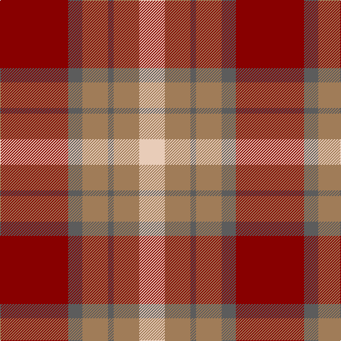

**Bands:** [RBRBRW](/stripes/rbrbrw/) · **Stripes:** [R N O N O LB](/stripes/stripes6/) R N O N O LB

This was sourced from register-of-tartans.  It is a [6 band tartan](/bands/bands6/).

Original link https://www.tartanregister.gov.uk/tartanDetails.aspx?ref=3345

## Register references

External register numbers recorded for this tartan.

- Scottish Register of Tartans: [3345](https://www.tartanregister.gov.uk/tartanDetails.aspx?ref=3345)
- Scottish Tartans Authority (ITI): 5502

## Thread count
DR/96 N20 LT36 N8 LT36 LR/36

## Palette
Each colour and its ΔE from the base-6 reference it is a variant of.

| Colour | Shade | Base | ΔE (OKLab) |
|---|---|---|---|
| DR | <code style="background-color:#880000;">#880000</code> `#880000` | R <code style="background-color:#CC0000;">#CC0000</code> | 0.15 |
| LR | <code style="background-color:#E8CCB8;">#E8CCB8</code> `#E8CCB8` | W <code style="background-color:#F7F7F7;">#F7F7F7</code> | 0.12 |
| LT | <code style="background-color:#A07C58;">#A07C58</code> `#A07C58` | R <code style="background-color:#CC0000;">#CC0000</code> | 0.19 |
| N | <code style="background-color:#5C5C5C;">#5C5C5C</code> `#5C5C5C` | B <code style="background-color:#2A418A;">#2A418A</code> | 0.15 |

# Sample pattern

## Nearest tartans

The nearest existing variants by ΔTartan distance.

1. [Manhattan Ethnic](/setts/s7/o72dr30o18lr62y10dr7lr32/) — ΔT 0.78
1. [St Andrews](/setts/s8/r11db1r11db1w10o11db1o11~x2/) — ΔT 0.84
1. [Moray of Abercairney](/setts/s5/r8r1g4r1db4~x2/) — ΔT 0.91
1. [Moray of Abercairney #2](/setts/s5/r8r1dg4r1db4~x2/) — ΔT 1.03
1. [Manhattan Ethnic](/setts/s7/lo36do15lo9r31lo5do4r16~x2/) — ΔT 1.09
1. [St. Andrews (Queens University) (Cor](/setts/s8/dy11db1dy11w10db1r11db1r11~x2/) — ΔT 1.13
1. [Logan, Light](/setts/s7/p9r4p1r4g15r4p1~x2/) — ΔT 1.14
1. [Moray of Abercairney](/setts/s6/r8r1dg4r1dg1t2~x2/) — ΔT 1.14
1. [MacBean/MacElvain](/setts/s7/k2r12db6r3dg12r4db1~x2/) — ΔT 1.16
1. [Geddes](/setts/s7/dp1r5g15r3dp9r10w1~x4/) — ΔT 1.17

## Neighbour map

Every grey dot is one of 14299 variants placed by the first two principal components of the ΔTartan feature space (44% of its variance). Red is this tartan; blue dots are its nearest — click one to open its page.

<svg viewBox="0 0 640 380" role="img" style="max-width:100%;height:auto;border:1px solid #e0e0e0;border-radius:4px;display:block" xmlns="http://www.w3.org/2000/svg"><image href="/nn/cloud.v1.png" width="640" height="380"/><a href="/setts/s7/o72dr30o18lr62y10dr7lr32/"><circle cx="227.1" cy="203.8" r="4" fill="#3465a4"><title>Manhattan Ethnic</title></circle></a><a href="/setts/s8/r11db1r11db1w10o11db1o11~x2/"><circle cx="217.7" cy="198.1" r="4" fill="#3465a4"><title>St Andrews</title></circle></a><a href="/setts/s5/r8r1g4r1db4~x2/"><circle cx="242.3" cy="235.1" r="4" fill="#3465a4"><title>Moray of Abercairney</title></circle></a><a href="/setts/s5/r8r1dg4r1db4~x2/"><circle cx="239.8" cy="231.3" r="4" fill="#3465a4"><title>Moray of Abercairney #2</title></circle></a><a href="/setts/s7/lo36do15lo9r31lo5do4r16~x2/"><circle cx="245.0" cy="220.1" r="4" fill="#3465a4"><title>Manhattan Ethnic</title></circle></a><a href="/setts/s8/dy11db1dy11w10db1r11db1r11~x2/"><circle cx="200.6" cy="190.2" r="4" fill="#3465a4"><title>St. Andrews (Queens University) (Cor</title></circle></a><a href="/setts/s7/p9r4p1r4g15r4p1~x2/"><circle cx="218.8" cy="173.5" r="4" fill="#3465a4"><title>Logan, Light</title></circle></a><a href="/setts/s6/r8r1dg4r1dg1t2~x2/"><circle cx="271.5" cy="208.2" r="4" fill="#3465a4"><title>Moray of Abercairney</title></circle></a><a href="/setts/s7/k2r12db6r3dg12r4db1~x2/"><circle cx="260.0" cy="198.1" r="4" fill="#3465a4"><title>MacBean/MacElvain</title></circle></a><a href="/setts/s7/dp1r5g15r3dp9r10w1~x4/"><circle cx="243.5" cy="187.3" r="4" fill="#3465a4"><title>Geddes</title></circle></a><circle cx="234.3" cy="206.4" r="5" fill="#c00000"/></svg>

ID: /setts/s6/r24n5o9n2o9lb9~x4/
