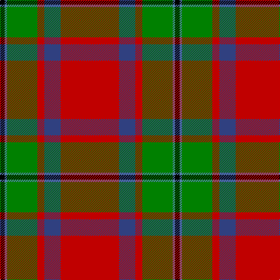

In pattern [KBGRBR](/patterns/kbgrbr/).

This was sourced from weddslist.  It is a [6 stripes tartan](/stripes/stripes6/).

Original link http://www.weddslist.com/cgi-bin/tartans/pg.pl?source=sts

## Thread count
K/8 Ba4 G52 R12 B28 R/100

## Palette
Each colour and its ΔE from the base-6 reference it is a variant of.

| Colour | Shade | Base | ΔE (OKLab) |
|---|---|---|---|
| B | <code style="background-color:#304080;">#304080</code> `#304080` | B <code style="background-color:#2A418A;">#2A418A</code> | 0.02 |
| Ba | <code style="background-color:#5480B0;">#5480B0</code> `#5480B0` | B <code style="background-color:#2A418A;">#2A418A</code> | 0.19 |
| G | <code style="background-color:#008000;">#008000</code> `#008000` | G <code style="background-color:#006100;">#006100</code> | 0.10 |
| K | <code style="background-color:#000000;">#000000</code> `#000000` | K <code style="background-color:#000000;">#000000</code> | 0.00 |
| R | <code style="background-color:#C00000;">#C00000</code> `#C00000` | R <code style="background-color:#CC0000;">#CC0000</code> | 0.03 |

# Sample pattern

## Nearest tartans

The nearest existing variants by ΔTartan distance.

1. [MacPhail Clan Tartan Tartan Number: 1028. Earliest known date: pre 1950 This sample comes from the MacGregor-Hastie collection which forms the basis of the cloth archive of the Scottish Tartans Society. Some of the samples, including this one, were unmarked. One can assume that the sample dates between 1930 and 1950. See products available Copyright © Blair Urquhart, Comrie, 2015](/setts/s6/r25b7r3g13ba1k2~b2c2c80-ba5c8ca8-g006818-k101010-rc80000~x4/) — ΔT 0.41
1. [Livingstone MacLay MacLeay Clan Tartan Tartan Number: 1488. Earliest known date: 1934 Nothing See products available Copyright © Blair Urquhart, Comrie, 2015](/setts/s7/r28g4k4g4k4b6y1~b5c8ca8-g006818-k101010-rc80000-ye8c000~x2/) — ΔT 0.75
1. [MacPhail (Blue Bands)](/setts/s6/r40b8r6g24ba1k4~b1474b4-ba5c8ca8-g006818-k101010-rc80000~x2/) — ΔT 0.82
1. [MacGleish Formal (Personal)](/setts/s5/r50k25g10ra5y2~g006818-k101010-rc80000-ra888888-ye8c000~x2/) — ΔT 0.85
1. [MacLeay (Clan)](/setts/s7/r27g4k4g4k4b6y1~b2c2c80-g006818-k101010-rc80000-yd09800~x4/) — ΔT 0.87
1. [MacDuff](/setts/s7/r96b16g34ga48r18k6r9~b304080-g003000-ga008000-k000000-rc00000/) — ΔT 0.88
1. [MacGleish Formal (Personal)](/setts/s5/r50k25g10ra5y2~g285800-k101010-ra03400-ra888888-yc4a868~x2/) — ΔT 0.89
1. [MacLeay](/setts/s7/r27g4k4g4k4b6y1~b5c8ca8-g789484-k101010-rc80000-yd09800~x4/) — ΔT 0.92
1. [MacDuff](/setts/s7/r96b16g34ga48r18k6r9~b2c4084-g002814-ga005020-k101010-rdc0000/) — ΔT 0.92
1. [MacPhail Red Clan Tartan Tartan Number: 1031. Earliest known date: 1930-50 This sample comes from the MacGregor-Hastie collection which forms the basis of the cloth archive of the Scottish Tartans Society. Some of the samples, including this one, were unmarked. One can assume that the sample dates between 1930 and 1950. See products available Copyright © Blair Urquhart, Comrie, 2015](/setts/s6/r25k7r3g13b1k2~b5c8ca8-g006818-k101010-rc80000~x4/) — ΔT 0.94

## Neighbour map

Every grey dot is one of 15726 variants placed by the first two principal components of the ΔTartan feature space (44% of its variance). Red is this tartan; blue dots are its nearest — click one to open its page.

<svg viewBox="0 0 640 380" role="img" style="max-width:100%;height:auto;border:1px solid #e0e0e0;border-radius:4px;display:block" xmlns="http://www.w3.org/2000/svg"><image href="/nn/cloud.v1.png" width="640" height="380"/><a href="/setts/s6/r25b7r3g13ba1k2~b2c2c80-ba5c8ca8-g006818-k101010-rc80000~x4/"><circle cx="338.0" cy="147.3" r="4" fill="#3465a4"><title>MacPhail Clan Tartan Tartan Number: 1028. Earliest known date: pre 1950 This sample comes from the MacGregor-Hastie collection which forms the basis of the cloth archive of the Scottish Tartans Society. Some of the samples, including this one, were unmarked. One can assume that the sample dates between 1930 and 1950. See products available Copyright © Blair Urquhart, Comrie, 2015</title></circle></a><a href="/setts/s7/r28g4k4g4k4b6y1~b5c8ca8-g006818-k101010-rc80000-ye8c000~x2/"><circle cx="330.7" cy="117.6" r="4" fill="#3465a4"><title>Livingstone MacLay MacLeay Clan Tartan Tartan Number: 1488. Earliest known date: 1934 Nothing See products available Copyright © Blair Urquhart, Comrie, 2015</title></circle></a><a href="/setts/s6/r40b8r6g24ba1k4~b1474b4-ba5c8ca8-g006818-k101010-rc80000~x2/"><circle cx="364.2" cy="131.5" r="4" fill="#3465a4"><title>MacPhail (Blue Bands)</title></circle></a><a href="/setts/s5/r50k25g10ra5y2~g006818-k101010-rc80000-ra888888-ye8c000~x2/"><circle cx="322.1" cy="150.1" r="4" fill="#3465a4"><title>MacGleish Formal (Personal)</title></circle></a><a href="/setts/s7/r27g4k4g4k4b6y1~b2c2c80-g006818-k101010-rc80000-yd09800~x4/"><circle cx="325.5" cy="122.4" r="4" fill="#3465a4"><title>MacLeay (Clan)</title></circle></a><a href="/setts/s7/r96b16g34ga48r18k6r9~b304080-g003000-ga008000-k000000-rc00000/"><circle cx="293.2" cy="160.8" r="4" fill="#3465a4"><title>MacDuff</title></circle></a><a href="/setts/s5/r50k25g10ra5y2~g285800-k101010-ra03400-ra888888-yc4a868~x2/"><circle cx="341.3" cy="164.9" r="4" fill="#3465a4"><title>MacGleish Formal (Personal)</title></circle></a><a href="/setts/s7/r27g4k4g4k4b6y1~b5c8ca8-g789484-k101010-rc80000-yd09800~x4/"><circle cx="325.3" cy="118.9" r="4" fill="#3465a4"><title>MacLeay</title></circle></a><a href="/setts/s7/r96b16g34ga48r18k6r9~b2c4084-g002814-ga005020-k101010-rdc0000/"><circle cx="293.8" cy="157.8" r="4" fill="#3465a4"><title>MacDuff</title></circle></a><a href="/setts/s6/r25k7r3g13b1k2~b5c8ca8-g006818-k101010-rc80000~x4/"><circle cx="351.2" cy="161.2" r="4" fill="#3465a4"><title>MacPhail Red Clan Tartan Tartan Number: 1031. Earliest known date: 1930-50 This sample comes from the MacGregor-Hastie collection which forms the basis of the cloth archive of the Scottish Tartans Society. Some of the samples, including this one, were unmarked. One can assume that the sample dates between 1930 and 1950. See products available Copyright © Blair Urquhart, Comrie, 2015</title></circle></a><circle cx="328.0" cy="144.6" r="5" fill="#c00000"/></svg>

ID: /setts/s6/r25b7r3g13ba1k2~b304080-ba5480b0-g008000-k000000-rc00000~x4/
