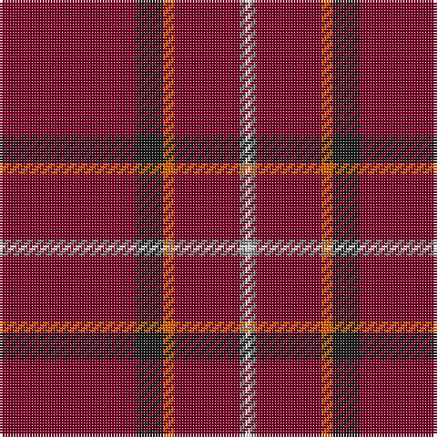

In pattern [RBRRRW](/stripes/rbrrrw/).

This was sourced from register-of-tartans.  It is a [6 stripe tartan](/stripes/stripes6/).

Original link https://www.tartanregister.gov.uk/tartanDetails.aspx?ref=4870

## Register references

External register numbers recorded for this tartan.

- Scottish Register of Tartans: [4870](https://www.tartanregister.gov.uk/tartanDetails.aspx?ref=4870)
- Scottish Tartans Authority (ITI): 3089

## Thread count
DR/50 K10 O4 DR24 N2 W/2

## Palette
Each colour and the base-6 reference it is a variant of.

| Colour | Shade | Base |
|---|---|---|
| DR | <code style="background-color:#800028;">#800028</code> `oklch(38.2% 0.152 14.5)` <small>#800028</small> | R <code style="background-color:#CC0000;">#CC0000</code> |
| K | <code style="background-color:#1C1C1C;">#1C1C1C</code> `oklch(22.6% 0.000 89.9)` <small>#1C1C1C</small> | B <code style="background-color:#2A418A;">#2A418A</code> |
| N | <code style="background-color:#888888;">#888888</code> `oklch(62.7% 0.000 89.9)` <small>#888888</small> | R <code style="background-color:#CC0000;">#CC0000</code> |
| O | <code style="background-color:#E86000;">#E86000</code> `oklch(65.3% 0.187 44.9)` <small>#E86000</small> | R <code style="background-color:#CC0000;">#CC0000</code> |
| W | <code style="background-color:#FCFCFC;">#FCFCFC</code> `oklch(99.1% 0.000 89.9)` <small>#FCFCFC</small> | W <code style="background-color:#F7F7F7;">#F7F7F7</code> |

# Sample pattern

## Nearest tartans

The nearest existing variants by ΔTartan distance, with this tartan at the top so the swatches line up against it.

ΔTartan

Tartan

Sett

—

<a href="/ttd/edit/#slug=r25dt5o2r12o1w1~x2">Fernie (Personal)</a> <a class="nn-out" href="/setts/s6/r25dt5o2r12o1w1~x2/" title="open its dictionary page">↗</a>

1.41

<a href="/setts/s10/r25dt5o2r12o1w1~x2/">Fernie (Personal)</a>

1.57

<a href="/ttd/edit/#slug=r92db10r8w3r8g4r8r4~x2">Burnett of Leys Hunting</a> <a class="nn-out" href="/setts/s8/r92db10r8w3r8g4r8r4~x2/" title="open its dictionary page">↗</a>

1.71

<a href="/ttd/edit/#slug=o45k5o28k5r5w2do6~x2">Leiato of American Samoa (Personal)</a> <a class="nn-out" href="/setts/s7/o45k5o28k5r5w2do6~x2/" title="open its dictionary page">↗</a>

1.71

<a href="/ttd/edit/#slug=r36db3w1db6g1k1g1r9~x2">Inverness</a> <a class="nn-out" href="/setts/s8/r36db3w1db6g1k1g1r9~x2/" title="open its dictionary page">↗</a>

1.79

<a href="/ttd/edit/#slug=r68db26r5ly3r5g3r13o3~x2">De Nardi (Personal)</a> <a class="nn-out" href="/setts/s8/r68db26r5ly3r5g3r13o3~x2/" title="open its dictionary page">↗</a>

1.84

<a href="/ttd/edit/#slug=r36db3w1db6g1k1g1r9~x4">Inverness - 1829 (District)</a> <a class="nn-out" href="/setts/s8/r36db3w1db6g1k1g1r9~x4/" title="open its dictionary page">↗</a>

1.88

<a href="/ttd/edit/#slug=dg2r28db6r5db2r2db2r11lr2~x2">Rose</a> <a class="nn-out" href="/setts/s9/dg2r28db6r5db2r2db2r11lr2~x2/" title="open its dictionary page">↗</a>

1.88

<a href="/ttd/edit/#slug=dg2r28db6r5db2r2db2r11lr2">Rose</a> <a class="nn-out" href="/setts/s9/dg2r28db6r5db2r2db2r11lr2/" title="open its dictionary page">↗</a>

1.88

<a href="/ttd/edit/#slug=r51lr2k11lo3r11lo3r11g3~x2">Hackston (Green stripe) (Portrait)</a> <a class="nn-out" href="/setts/s8/r51lr2k11lo3r11lo3r11g3~x2/" title="open its dictionary page">↗</a>

1.94

<a href="/ttd/edit/#slug=r42db4ly1db6g1db1g1r12~x2">Inverness, Earl of</a> <a class="nn-out" href="/setts/s8/r42db4ly1db6g1db1g1r12~x2/" title="open its dictionary page">↗</a>

## Neighbour map

Every grey dot is one of 14299 variants placed by the first two principal components of the ΔTartan feature space (44% of its variance). Red is this tartan; blue dots are its nearest — click one to open its page.

<svg viewBox="0 0 640 380" role="img" style="max-width:100%;height:auto;border:1px solid #e0e0e0;border-radius:4px;display:block" xmlns="http://www.w3.org/2000/svg"><image href="/nn/cloud.v1.png" width="640" height="380"/><a href="/setts/s10/r25dt5o2r12o1w1~x2/"><circle cx="509.1" cy="139.3" r="4" fill="#3465a4"><title>Fernie (Personal)</title></circle></a><a href="/setts/s8/r92db10r8w3r8g4r8r4~x2/"><circle cx="626.0" cy="126.3" r="4" fill="#3465a4"><title>Burnett of Leys Hunting</title></circle></a><a href="/setts/s7/o45k5o28k5r5w2do6~x2/"><circle cx="525.4" cy="163.4" r="4" fill="#3465a4"><title>Leiato of American Samoa (Personal)</title></circle></a><a href="/setts/s8/r36db3w1db6g1k1g1r9~x2/"><circle cx="563.0" cy="96.6" r="4" fill="#3465a4"><title>Inverness</title></circle></a><a href="/setts/s8/r68db26r5ly3r5g3r13o3~x2/"><circle cx="489.9" cy="118.0" r="4" fill="#3465a4"><title>De Nardi (Personal)</title></circle></a><a href="/setts/s8/r36db3w1db6g1k1g1r9~x4/"><circle cx="557.0" cy="91.9" r="4" fill="#3465a4"><title>Inverness - 1829 (District)</title></circle></a><a href="/setts/s9/dg2r28db6r5db2r2db2r11lr2~x2/"><circle cx="507.9" cy="156.5" r="4" fill="#3465a4"><title>Rose</title></circle></a><a href="/setts/s9/dg2r28db6r5db2r2db2r11lr2/"><circle cx="507.9" cy="156.5" r="4" fill="#3465a4"><title>Rose</title></circle></a><a href="/setts/s8/r51lr2k11lo3r11lo3r11g3~x2/"><circle cx="522.8" cy="115.3" r="4" fill="#3465a4"><title>Hackston (Green stripe) (Portrait)</title></circle></a><a href="/setts/s8/r42db4ly1db6g1db1g1r12~x2/"><circle cx="623.0" cy="116.0" r="4" fill="#3465a4"><title>Inverness, Earl of</title></circle></a><circle cx="573.5" cy="161.4" r="5" fill="#c00000"/></svg>

ID: /setts/s6/r25dt5o2r12o1w1~x2/
