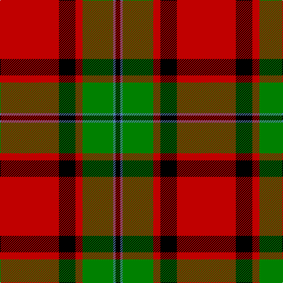

In pattern [KBGRKR](/stripes/kbgrkr/).

This was sourced from weddslist.  It is a [6 stripe tartan](/stripes/stripes6/).

Original link http://www.weddslist.com/cgi-bin/tartans/pg.pl?source=sts

## Also known as

This cloth is also recorded under:

- MacPhail Red

## Attestations

This cloth appears in 2 source records; the oldest owns this page.

- undated — MacPhail (weddslist, [record](http://www.weddslist.com/cgi-bin/tartans/pg.pl?source=sts))
- undated — MacPhail Red Clan Tartan Tartan Number: 1031. Earliest known date: 1930-50 This sample comes from the MacGregor-Hastie collection which forms the basis of the cloth archive of the Scottish Tartans Society. Some of the samples, including this one, were unmarked. One can assume that the sample dates between 1930 and 1950. See products available Copyright © Blair Urquhart, Comrie, 2015 (house-of-tartan, [record](http://www.house-of-tartan.scotland.net/house/TartanViewjs.asp?colr=Def&tnam=1031))

## Thread count
R/100 K28 R12 G52 B4 K/8

## Palette
Each colour and the base-6 reference it is a variant of.

| Colour | Shade | Base |
|---|---|---|
| B | <code style="background-color:#5480B0;">#5480B0</code> `oklch(58.8% 0.089 251.5)` <small>#5480B0</small> | B <code style="background-color:#2A418A;">#2A418A</code> |
| G | <code style="background-color:#008000;">#008000</code> `oklch(52.0% 0.177 142.5)` <small>#008000</small> | G <code style="background-color:#006100;">#006100</code> |
| K | <code style="background-color:#000000;">#000000</code> `oklch(0.0% 0.000 0.0)` <small>#000000</small> | K <code style="background-color:#000000;">#000000</code> |
| R | <code style="background-color:#C00000;">#C00000</code> `oklch(50.7% 0.208 29.2)` <small>#C00000</small> | R <code style="background-color:#CC0000;">#CC0000</code> |

# Sample pattern

## Nearest tartans

The nearest existing variants by ΔTartan distance.

1. [MacPhail](/setts/s6/r25k7r3g13y1k2~x4/) — ΔT 0.92
1. [MacKintosh 6](/setts/s6/r5w2r28k12g16r3~x2/) — ΔT 1.02
1. [Dunbar](/setts/s6/r6g21k8r28k1r4~x2/) — ΔT 1.04
1. [MacAulay](/setts/s6/k2r16dg6r3dg8lb1/) — ΔT 1.09
1. [Dunbar](/setts/s6/r6dg21k8r28dg1r4~x2/) — ΔT 1.10
1. [MacKillop](/setts/s10/g4r4k2r20t1k7r2g10r3k2~x2/) — ΔT 1.12
1. [Fraser](/setts/s6/r2db12r2dg12r24w1~x2/) — ΔT 1.15
1. [Livingstone, MacLay MacLeay](/setts/s7/r28g4k4g4k4t6ly1~x2/) — ΔT 1.17
1. [Buccleuch](/setts/s7/r107k9r5db41r5g51r14/) — ΔT 1.20
1. [Denny, hunting](/setts/s6/k1g6k1g6r16db1~x2/) — ΔT 1.21

## Neighbour map

Every grey dot is one of 14299 variants placed by the first two principal components of the ΔTartan feature space (44% of its variance). Red is this tartan; blue dots are its nearest — click one to open its page.

<svg viewBox="0 0 640 380" role="img" style="max-width:100%;height:auto;border:1px solid #e0e0e0;border-radius:4px;display:block" xmlns="http://www.w3.org/2000/svg"><image href="/nn/cloud.v1.png" width="640" height="380"/><a href="/setts/s6/r25k7r3g13y1k2~x4/"><circle cx="351.6" cy="158.2" r="4" fill="#3465a4"><title>MacPhail</title></circle></a><a href="/setts/s6/r5w2r28k12g16r3~x2/"><circle cx="284.0" cy="177.6" r="4" fill="#3465a4"><title>MacKintosh 6</title></circle></a><a href="/setts/s6/r6g21k8r28k1r4~x2/"><circle cx="354.8" cy="171.3" r="4" fill="#3465a4"><title>Dunbar</title></circle></a><a href="/setts/s6/k2r16dg6r3dg8lb1/"><circle cx="322.2" cy="183.6" r="4" fill="#3465a4"><title>MacAulay</title></circle></a><a href="/setts/s6/r6dg21k8r28dg1r4~x2/"><circle cx="366.5" cy="175.3" r="4" fill="#3465a4"><title>Dunbar</title></circle></a><a href="/setts/s10/g4r4k2r20t1k7r2g10r3k2~x2/"><circle cx="292.9" cy="133.4" r="4" fill="#3465a4"><title>MacKillop</title></circle></a><a href="/setts/s6/r2db12r2dg12r24w1~x2/"><circle cx="322.0" cy="161.5" r="4" fill="#3465a4"><title>Fraser</title></circle></a><a href="/setts/s7/r28g4k4g4k4t6ly1~x2/"><circle cx="310.0" cy="107.1" r="4" fill="#3465a4"><title>Livingstone, MacLay MacLeay</title></circle></a><a href="/setts/s7/r107k9r5db41r5g51r14/"><circle cx="352.2" cy="153.4" r="4" fill="#3465a4"><title>Buccleuch</title></circle></a><a href="/setts/s6/k1g6k1g6r16db1~x2/"><circle cx="323.7" cy="169.3" r="4" fill="#3465a4"><title>Denny, hunting</title></circle></a><circle cx="325.8" cy="147.8" r="5" fill="#c00000"/></svg>

ID: /setts/s6/r25k7r3g13t1k2~x4/
