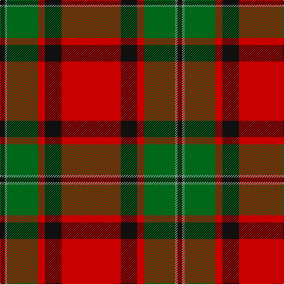

**Bands:** [KGGRKR](/stripes/kggrkr/) · **Stripes:** [K Y G R K R](/stripes/stripes6/) K Y G R K R

This was sourced from register-of-tartans.  It is a [6 band tartan](/bands/bands6/).

Original link https://www.tartanregister.gov.uk/tartanDetails.aspx?ref=2695

## Attestations

This cloth appears in 2 source records; the oldest owns this page.

- 01/01/1950 — MacPhail (register-of-tartans, [record](https://www.tartanregister.gov.uk/tartanDetails.aspx?ref=2695))
- pre 1950 — MacPhail (Clan) (tartans-authority, [record](http://www.tartansauthority.com/tartan-ferret/display/1031/))

## Register references

External register numbers recorded for this tartan.

- Scottish Register of Tartans: [2695](https://www.tartanregister.gov.uk/tartanDetails.aspx?ref=2695)
- Scottish Tartans Authority (ITI): 1031
- Scottish Tartans World Register: 1031

## Thread count
K/8 LG4 G52 R12 K28 R/100

## Palette
Each colour and its ΔE from the base-6 reference it is a variant of.

| Colour | Shade | Base | ΔE (OKLab) |
|---|---|---|---|
| G | <code style="background-color:#006818;">#006818</code> `#006818` | G <code style="background-color:#006100;">#006100</code> | 0.02 |
| K | <code style="background-color:#101010;">#101010</code> `#101010` | K <code style="background-color:#000000;">#000000</code> | 0.17 |
| LG | <code style="background-color:#789484;">#789484</code> `#789484` | G <code style="background-color:#006100;">#006100</code> | 0.24 |
| R | <code style="background-color:#C80000;">#C80000</code> `#C80000` | R <code style="background-color:#CC0000;">#CC0000</code> | 0.01 |

# Sample pattern

## Nearest tartans

The nearest existing variants by ΔTartan distance.

1. [Plummer (Personal)](/setts/s6/r100k15g48db5r7db16~x2/) — ΔT 0.56
1. [Buccleuch](/setts/s7/r107k9r5db41r5g51r14/) — ΔT 0.60
1. [Fraser (1745)](/setts/s6/r2db12r2g12r24w1~x2/) — ΔT 0.84
1. [MacPhail](/setts/s6/r25k7r3g13t1k2~x4/) — ΔT 0.92
1. [MacPhail](/setts/s6/r25db7r3g13t1k2~x4/) — ΔT 0.95
1. [MacAulay](/setts/s6/k2r16dg6r3dg8lb1/) — ΔT 0.97
1. [Buccleuch](/setts/s7/r107k9r5dp41r5g51r14/) — ΔT 1.03
1. [McInally (Name)](/setts/s7/lo3g2r28k6r4g16r3~x2/) — ΔT 1.04
1. [MacAulay (Clan)](/setts/s6/k2r16g6r3g8w1~x4/) — ΔT 1.06
1. [Caledonian - 1819 (Fashion?)](/setts/s6/r60dp20r8g45r8dp2/) — ΔT 1.07

## Neighbour map

Every grey dot is one of 14313 variants placed by the first two principal components of the ΔTartan feature space (44% of its variance). Red is this tartan; blue dots are its nearest — click one to open its page.

<svg viewBox="0 0 640 380" role="img" style="max-width:100%;height:auto;border:1px solid #e0e0e0;border-radius:4px;display:block" xmlns="http://www.w3.org/2000/svg"><image href="/nn/cloud.v1.png" width="640" height="380"/><a href="/setts/s6/r100k15g48db5r7db16~x2/"><circle cx="356.6" cy="163.5" r="4" fill="#3465a4"><title>Plummer (Personal)</title></circle></a><a href="/setts/s7/r107k9r5db41r5g51r14/"><circle cx="352.5" cy="153.5" r="4" fill="#3465a4"><title>Buccleuch</title></circle></a><a href="/setts/s6/r2db12r2g12r24w1~x2/"><circle cx="333.7" cy="163.4" r="4" fill="#3465a4"><title>Fraser (1745)</title></circle></a><a href="/setts/s6/r25k7r3g13t1k2~x4/"><circle cx="326.1" cy="148.0" r="4" fill="#3465a4"><title>MacPhail</title></circle></a><a href="/setts/s6/r25db7r3g13t1k2~x4/"><circle cx="328.7" cy="142.7" r="4" fill="#3465a4"><title>MacPhail</title></circle></a><a href="/setts/s6/k2r16dg6r3dg8lb1/"><circle cx="322.5" cy="183.8" r="4" fill="#3465a4"><title>MacAulay</title></circle></a><a href="/setts/s7/r107k9r5dp41r5g51r14/"><circle cx="364.3" cy="153.1" r="4" fill="#3465a4"><title>Buccleuch</title></circle></a><a href="/setts/s7/lo3g2r28k6r4g16r3~x2/"><circle cx="345.8" cy="171.5" r="4" fill="#3465a4"><title>McInally (Name)</title></circle></a><a href="/setts/s6/k2r16g6r3g8w1~x4/"><circle cx="331.9" cy="187.8" r="4" fill="#3465a4"><title>MacAulay (Clan)</title></circle></a><a href="/setts/s6/r60dp20r8g45r8dp2/"><circle cx="379.1" cy="179.1" r="4" fill="#3465a4"><title>Caledonian - 1819 (Fashion?)</title></circle></a><circle cx="351.9" cy="158.3" r="5" fill="#c00000"/></svg>

ID: /setts/s6/r25k7r3g13y1k2~x4/
