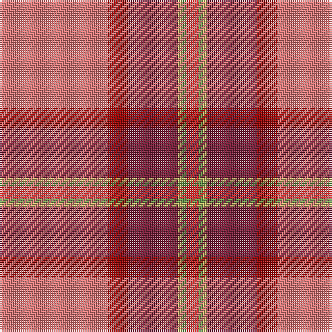

**Bands:** [RRRYGR](/stripes/rrrygr/) · **Stripes:** [R R M LY G R](/stripes/stripes6/) R R M LY G R

This was sourced from register-of-tartans.  It is a [6 band tartan](/bands/bands6/).

Original link https://www.tartanregister.gov.uk/tartanDetails.aspx?ref=11330

## Register references

External register numbers recorded for this tartan.

- Scottish Register of Tartans: [11330](https://www.tartanregister.gov.uk/tartanDetails.aspx?ref=11330)

## Thread count
LR/52 DR10 DRa24 LG2 LGa2 R/6

## Palette
Each colour and its ΔE from the base-6 reference it is a variant of.

| Colour | Shade | Base | ΔE (OKLab) |
|---|---|---|---|
| DR | <code style="background-color:#960000;">#960000</code> `#960000` | R <code style="background-color:#CC0000;">#CC0000</code> | 0.12 |
| DRa | <code style="background-color:#781C38;">#781C38</code> `#781C38` | R <code style="background-color:#CC0000;">#CC0000</code> | 0.18 |
| LG | <code style="background-color:#C4BC68;">#C4BC68</code> `#C4BC68` | Y <code style="background-color:#F2BF00;">#F2BF00</code> | 0.08 |
| LGa | <code style="background-color:#649848;">#649848</code> `#649848` | G <code style="background-color:#006100;">#006100</code> | 0.20 |
| LR | <code style="background-color:#E87878;">#E87878</code> `#E87878` | R <code style="background-color:#CC0000;">#CC0000</code> | 0.19 |
| R | <code style="background-color:#C82828;">#C82828</code> `#C82828` | R <code style="background-color:#CC0000;">#CC0000</code> | 0.03 |

# Sample pattern

## Nearest tartans

The nearest existing variants by ΔTartan distance.

1. [Mason, David Elsworth (Personal)](/setts/s6/k7w2dg2r31r35lo2~x2/) — ΔT 1.62
1. [Virginia Military Institute, New Market](/setts/s9/w6r25o2g3o30k3o2r30ly6~x2/) — ΔT 1.64
1. [Mason (Personal)](/setts/s6/k7w2dg2o31r35lo2~x2/) — ΔT 1.71
1. [Snelgrove (Name)](/setts/s7/k2g6dy4t1r18dy5lo1~x4/) — ΔT 1.76
1. [Barbour - Cardinal Red](/setts/s7/r3ly2r18db8w1r18r2~x2/) — ΔT 1.76
1. [Queens University Alumni (Corporate)](/setts/s12/r50lo8r15lo2dp3w3dp3r31r13lo3k5w2~x2/) — ΔT 1.77
1. [Perthshire or Drummond District Tartan Tartan Number: 1670. Earliest known date: c.1819 Perthshire is known as the gateway to the Highlands. The Perthshire tartan is similar to a the Drummond sett, the tartan of a Drummond clan who had extensive lands in the district. The first record of this tartan is in the early nineteenth century account book of Wilson's of Bannockburn where it is referred to as the 'Perthshire Rock and Wheel' being an early type of soft tartan. See products available Copyright © Blair Urquhart, Comrie, 2015](/setts/s9/r41w2dp5ly2g21r9dp5db3w2~x2/) — ΔT 1.81
1. [Virginia Military Institute, New Market](/setts/s9/w6r25y2g3y30k3y2r30ly6~x2/) — ΔT 1.82
1. [MacQueen of Dalmagarry (Clan?)](/setts/s8/g3r4k1r26y14r4dp16w2~x2/) — ΔT 1.82
1. [Haughey (2015)](/setts/s5/do5r21lo21w2db1~x2/) — ΔT 1.88

## Neighbour map

Every grey dot is one of 14299 variants placed by the first two principal components of the ΔTartan feature space (44% of its variance). Red is this tartan; blue dots are its nearest — click one to open its page.

<svg viewBox="0 0 640 380" role="img" style="max-width:100%;height:auto;border:1px solid #e0e0e0;border-radius:4px;display:block" xmlns="http://www.w3.org/2000/svg"><image href="/nn/cloud.v1.png" width="640" height="380"/><a href="/setts/s6/k7w2dg2r31r35lo2~x2/"><circle cx="281.7" cy="132.5" r="4" fill="#3465a4"><title>Mason, David Elsworth (Personal)</title></circle></a><a href="/setts/s9/w6r25o2g3o30k3o2r30ly6~x2/"><circle cx="282.2" cy="125.3" r="4" fill="#3465a4"><title>Virginia Military Institute, New Market</title></circle></a><a href="/setts/s6/k7w2dg2o31r35lo2~x2/"><circle cx="304.9" cy="150.1" r="4" fill="#3465a4"><title>Mason (Personal)</title></circle></a><a href="/setts/s7/k2g6dy4t1r18dy5lo1~x4/"><circle cx="288.4" cy="138.8" r="4" fill="#3465a4"><title>Snelgrove (Name)</title></circle></a><a href="/setts/s7/r3ly2r18db8w1r18r2~x2/"><circle cx="304.9" cy="162.2" r="4" fill="#3465a4"><title>Barbour - Cardinal Red</title></circle></a><a href="/setts/s12/r50lo8r15lo2dp3w3dp3r31r13lo3k5w2~x2/"><circle cx="367.3" cy="93.1" r="4" fill="#3465a4"><title>Queens University Alumni (Corporate)</title></circle></a><a href="/setts/s9/r41w2dp5ly2g21r9dp5db3w2~x2/"><circle cx="316.1" cy="97.2" r="4" fill="#3465a4"><title>Perthshire or Drummond District Tartan Tartan Number: 1670. Earliest known date: c.1819 Perthshire is known as the gateway to the Highlands. The Perthshire tartan is similar to a the Drummond sett, the tartan of a Drummond clan who had extensive lands in the district. The first record of this tartan is in the early nineteenth century account book of Wilson's of Bannockburn where it is referred to as the 'Perthshire Rock and Wheel' being an early type of soft tartan. See products available Copyright © Blair Urquhart, Comrie, 2015</title></circle></a><a href="/setts/s9/w6r25y2g3y30k3y2r30ly6~x2/"><circle cx="274.2" cy="122.8" r="4" fill="#3465a4"><title>Virginia Military Institute, New Market</title></circle></a><a href="/setts/s8/g3r4k1r26y14r4dp16w2~x2/"><circle cx="272.1" cy="112.8" r="4" fill="#3465a4"><title>MacQueen of Dalmagarry (Clan?)</title></circle></a><a href="/setts/s5/do5r21lo21w2db1~x2/"><circle cx="302.1" cy="161.9" r="4" fill="#3465a4"><title>Haughey (2015)</title></circle></a><circle cx="350.9" cy="122.5" r="5" fill="#c00000"/></svg>

ID: /setts/s6/r26r5m12ly1g1r3~x2/
