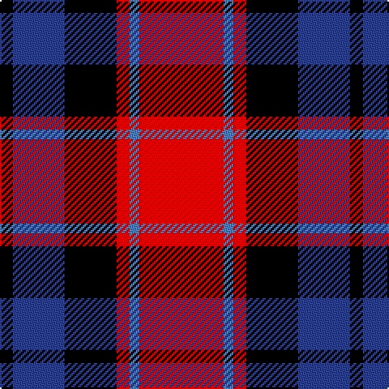

In pattern [KBKRBR](/stripes/kbkrbr/).

This was sourced from weddslist.  It is a [6 stripe tartan](/stripes/stripes6/).

Original link http://www.weddslist.com/cgi-bin/tartans/pg.pl?source=sts

## Thread count
R/52 Ba6 R8 K32 B32 K/8

## Palette
Each colour and the base-6 reference it is a variant of.

| Colour | Shade | Base |
|---|---|---|
| B | <code style="background-color:#304080;">#304080</code> `oklch(39.4% 0.109 270.2)` <small>#304080</small> | B <code style="background-color:#2A418A;">#2A418A</code> |
| Ba | <code style="background-color:#5480B0;">#5480B0</code> `oklch(58.8% 0.089 251.5)` <small>#5480B0</small> | B <code style="background-color:#2A418A;">#2A418A</code> |
| K | <code style="background-color:#000000;">#000000</code> `oklch(0.0% 0.000 0.0)` <small>#000000</small> | K <code style="background-color:#000000;">#000000</code> |
| R | <code style="background-color:#C00000;">#C00000</code> `oklch(50.7% 0.208 29.2)` <small>#C00000</small> | R <code style="background-color:#CC0000;">#CC0000</code> |

# Sample pattern

## Nearest tartans

The nearest existing variants by ΔTartan distance.

1. [Wcwm 759-2](/setts/s6/lb5r34k22r4o24r4~x2/) — ΔT 0.71
1. [Wounded Warriors Canada](/setts/s7/r9k4r9k25ly3dp18k4~x2/) — ΔT 0.73
1. [MacTavish](/setts/s6/b2r12db2b6k6b1~x2/) — ΔT 0.85
1. [MacTavish](/setts/s6/b2r12db2b6k6b1/) — ΔT 0.85
1. [Aberdeen University](/setts/s5/ly2r15k7db8ly2~x4/) — ΔT 0.98
1. [Wallace Red Dress Tartan Tartan Number: 8186. Earliest known date: See products available Copyright © Blair Urquhart, Comrie, 2015](/setts/s5/k3r29k11k29t3~x2/) — ΔT 1.00
1. [Biffy Clyro](/setts/s7/ly3db22k3db3k11r20ly3~x2/) — ΔT 1.03
1. [Graham of Menteith (Red)](/setts/s6/r36lb3r5k21db24k3~x2/) — ΔT 1.04
1. [Inder (Corporate)](/setts/s5/r2dp8k8w1r2~x2/) — ΔT 1.09
1. [Unidentified #65](/setts/s6/dg3k20k20r20k3r3~x2/) — ΔT 1.11

## Neighbour map

Every grey dot is one of 14299 variants placed by the first two principal components of the ΔTartan feature space (44% of its variance). Red is this tartan; blue dots are its nearest — click one to open its page.

<svg viewBox="0 0 640 380" role="img" style="max-width:100%;height:auto;border:1px solid #e0e0e0;border-radius:4px;display:block" xmlns="http://www.w3.org/2000/svg"><image href="/nn/cloud.v1.png" width="640" height="380"/><a href="/setts/s6/lb5r34k22r4o24r4~x2/"><circle cx="206.4" cy="202.6" r="4" fill="#3465a4"><title>Wcwm 759-2</title></circle></a><a href="/setts/s7/r9k4r9k25ly3dp18k4~x2/"><circle cx="229.9" cy="209.8" r="4" fill="#3465a4"><title>Wounded Warriors Canada</title></circle></a><a href="/setts/s6/b2r12db2b6k6b1~x2/"><circle cx="210.5" cy="195.6" r="4" fill="#3465a4"><title>MacTavish</title></circle></a><a href="/setts/s6/b2r12db2b6k6b1/"><circle cx="210.5" cy="195.6" r="4" fill="#3465a4"><title>MacTavish</title></circle></a><a href="/setts/s5/ly2r15k7db8ly2~x4/"><circle cx="185.9" cy="213.6" r="4" fill="#3465a4"><title>Aberdeen University</title></circle></a><a href="/setts/s5/k3r29k11k29t3~x2/"><circle cx="204.5" cy="211.1" r="4" fill="#3465a4"><title>Wallace Red Dress Tartan Tartan Number: 8186. Earliest known date: See products available Copyright © Blair Urquhart, Comrie, 2015</title></circle></a><a href="/setts/s7/ly3db22k3db3k11r20ly3~x2/"><circle cx="163.9" cy="191.2" r="4" fill="#3465a4"><title>Biffy Clyro</title></circle></a><a href="/setts/s6/r36lb3r5k21db24k3~x2/"><circle cx="249.2" cy="194.7" r="4" fill="#3465a4"><title>Graham of Menteith (Red)</title></circle></a><a href="/setts/s5/r2dp8k8w1r2~x2/"><circle cx="203.7" cy="221.9" r="4" fill="#3465a4"><title>Inder (Corporate)</title></circle></a><a href="/setts/s6/dg3k20k20r20k3r3~x2/"><circle cx="165.0" cy="226.5" r="4" fill="#3465a4"><title>Unidentified #65</title></circle></a><circle cx="205.9" cy="207.4" r="5" fill="#c00000"/></svg>

ID: /setts/s6/r26t3r4k16db16k4~x2/
